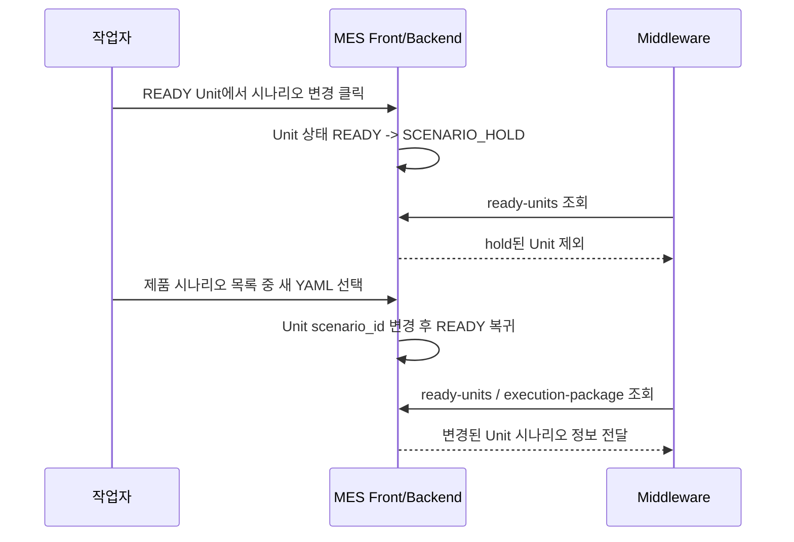
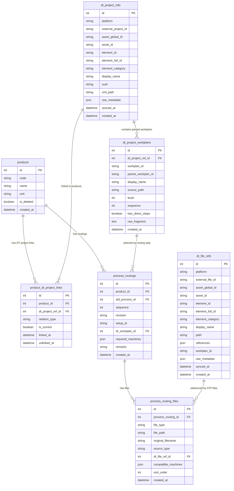
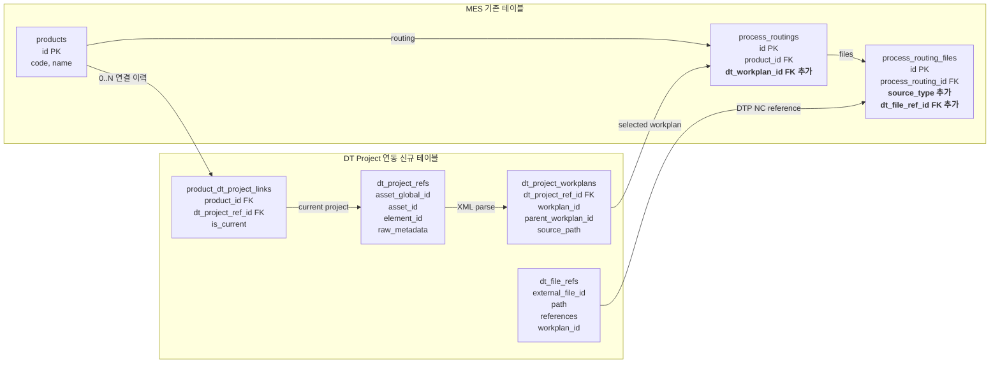
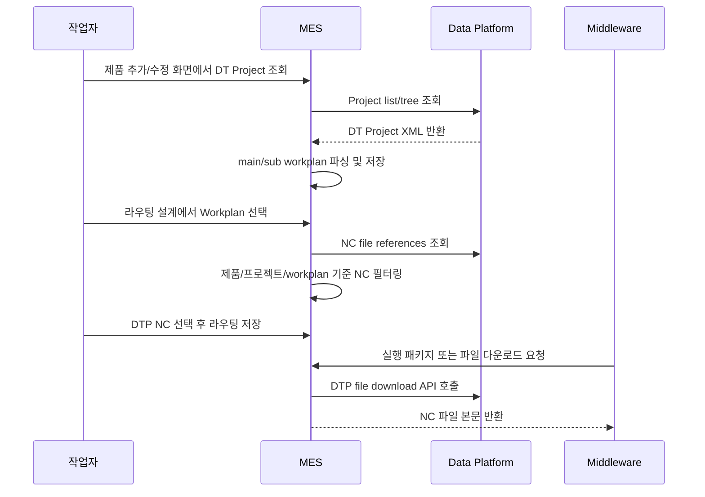

# Cell-MES 변경 이력

이 문서는 Cell-MES 모듈에 가해진 커스텀 변경 사항을 날짜별로 기록합니다.
다른 베이스 소스에 변경분을 다시 적용(cherry-pick / 수동 패치)해야 할 때 이 문서를 참고하세요.

> **규칙**: 파일을 수정할 때마다 아래에 날짜 섹션을 추가하고,
> 변경 파일 경로 + 변경 이유 + 변경 내용(Before/After 코드 스니펫 포함)을 기록합니다.

---

## 2026-09-29 - 제품별 허용 Cell 및 라우팅 시간 편집

### 사용 방법과 범위

1. 기준정보 > 라우팅 설계에서 제품을 선택한다.
2. `제품 허용 Cell`에서 복수 선택 후 `Cell 저장`한다. 선택 없음은 미지정이며 전체 Cell 허용이 아니다.
3. 공정별 `표준시간 사용` 또는 `직접 입력`을 선택하고 상단 `저장`으로 라우팅을 저장한다. 숫자는 제품 1개당 정수 초(sec), 0 이상이다.
4. 제품을 변경하거나 브라우저를 닫을 때 미저장 내용을 경고한다. Cell 저장과 라우팅 저장은 독립적이다.

현재 제품 전체에 허용 Cell을 연결한다. 라우팅 revision별 별도 허용 목록, 과거 스냅샷, 시나리오 YAML 변경,
작업지시의 실제 Cell/설비 확정 및 미들웨어 실행 변경은 추가하지 않았다.
내부 스케줄러는 이번에 시간 우선순위만 변경하며 허용 Cell을 자원 필터로 사용하도록 변경하지 않는다.

### DB와 API

- `src/app/models/master.py`, `models/__init__.py`: `ProductCell` 모델 등록.
- `alembic/versions/012_add_product_cells.py`: `product_cells` 신규 테이블. `id`, `product_id`, `cell_id`, `created_at`; 제품/Cell 조합 UNIQUE 및 양쪽 조회 인덱스. 제품 ID는 FK, Cell 삭제는 RESTRICT.
- `schemas/product_cell.py`, `services/product_cell_service.py`, `api/v1/endpoints/routings.py`: 인증 사용자용 제품 Cell 조회/전체 목록 저장. 기존 라우팅 편집 권한과 동일. 미존재 Cell/제품, 삭제 제품, 중복 ID 검증.
- `services/cell_service.py`: 제품 허용 Cell로 연결된 Cell의 삭제도 차단. 제품을 삭제하기 전에 불필요한 Cell 연결을 해제한다.

```http
GET /api/v1/masters/products/{product_id}/cells
PUT /api/v1/masters/products/{product_id}/cells
```

```json
{"cell_ids": [1, 2]}
```

응답은 `{"product_id": 1, "cell_ids": [1, 2]}`. `cell_ids: []`는 연결 전체 해제이다.
기존 제품의 실제 허용 Cell은 운영자가 지정하며 마이그레이션에서 임의 생성하지 않는다.

### 시간 적용 규칙

- `api/v1/endpoints/routings.py`, `schemas/master.py`: 기존 시간 필드를 활용하며 신규 컬럼 없음.
- Before: 미입력/null 모두 이전값 또는 표준공정 값을 복사하여 저장. 표준시간으로 복귀 불가.
- After: Pydantic `model_fields_set`으로 필드 누락과 명시적 null을 구분.

```text
cycle_time_sec 필드 생략 -> 기존 값 유지 (신규 라우팅은 NULL)
cycle_time_sec: null     -> 표준시간 참조, 기존 산정 근거 제거
cycle_time_sec: 0 이상   -> 직접 지정값 사용
```

- 수동 시간 변경 시 이전 `cycle_time_breakdown` 제거. API가 새 산정 근거를 명시하면 함께 저장 가능.
- 이전 마이그레이션(011)에서 복사된 숫자도 보존. 표준값을 따라가야 할 공정은 화면에서 명시적으로 `표준시간 사용`을 선택한다.
- `services/scheduling/projector.py`: Before는 표준공정 시간만 사용, After는 라우팅 값 우선/NULL 시 표준시간. 0을 기본값으로 덮어쓰지 않음.
- `frontend/services/master.ts`, `frontend/components/master/ProductCellsEditor.tsx`, `frontend/app/(main)/master/routings/page.tsx`: Cell 선택, 오류/저장 상태, 시간 모드와 숫자 입력, 기존 revision 보존. 라우팅 자동 리비전 생성 기능은 없음.

### APS 제공 및 배포

- `mes_if.if_product_cells`는 기존 자동 View 기능으로 생성. 원본 테이블이 없는 이전 설치본에는 아직 해당 View가 없으므로 백엔드 마이그레이션 및 동기화 후 사용한다.
- `if_product_cells.product_id = if_products.id`, `if_product_cells.cell_id = if_cells.id`로 조인한다.
- 기존 `if_process_routings.cycle_time_sec`는 원본값 그대로이며 APS는 표준공정과 조인해 `COALESCE(r.cycle_time_sec, s.cycle_time_sec)`로 유효 시간을 구한다.
- 공개 명세: `agents/mes-interface-db/APS_ACCESS_GUIDE.md` 8절. 시간은 모두 초 단위이며 준비시간은 별도이다.
- SQLite 백업 후 프로젝트 루트에서 `docker compose up -d --build --no-deps cell-mes frontend` 실행. 컨테이너 시작 명령이 Alembic 012를 적용한다. 원본 SQLite/볼륨 초기화 불필요.
- 프록시가 재생성된 컨테이너의 이전 IP를 참조하면 `docker compose exec mes-proxy nginx -s reload` 실행.
- `docker compose exec mes-interface-sync python -m mes_interface_sync.main sync-once`로 즉시 반영 가능. 배치 성공 전까지 APS에는 이전 스냅샷이 보인다.
- 별도 로컬 프론트 서버를 사용하지 않으며 Compose 포트/네트워크/.env 변경 없음.

### 검증

- `tests/test_api/test_product_cells.py`: 복수 지정/교체/해제, 라우팅 저장 독립성, 잘못된 ID/중복/권한, Cell 삭제 보호.
- `tests/test_api/test_routing_timing.py`, `test_routings.py`: NULL 복귀, 0초, 누락 유지, revision 보존, 산정근거 제거, 입력 검증, 표준시간 변경 후 스케줄러 반영.
- `agents/mes-interface-sync/tests/test_view_config.py`: 배포 YAML의 자동 View가 product_cells와 메타 컬럼을 제공하는지 확인.
- `frontend/__tests__/unit/components/ProductCellsEditor.test.tsx`: 복수 지정/해제, 저장 오류 시 편집 보존, 조회 실패 시 저장 차단.
- 실행 결과: 백엔드 관련 190개, 동기화 20개, 프론트 단위 3개 통과(총 213개). TypeScript 및 변경 프론트 파일 ESLint 검사 통과.
- Docker 프론트 대상 Playwright 검증: 테스트 API 응답으로 복수 Cell 저장/실패 후 재시도, 0초/NULL 전환, 빈 숫자 저장 차단, 기존 revision 유지 확인. 1440px/390px 화면 캡처 및 모바일 문서 넘침 없음 확인. 실제 제품 설정은 변경하지 않음.
- 로컬 Docker 적용 완료: SQLite `012`, 무결성 검사 `ok`. 백업 파일 `data/mes.before-product-cells-20260929.db` 생성. 별도 임시 복사본에서 upgrade/downgrade 검증.
- 즉시 동기화 성공: batch `da169474-7cf6-4b70-a346-31d0dae0af65`, 28개 테이블/2748행. `aps_user`로 `if_product_cells`와 가이드 조인 SQL 조회 성공. 제품 허용 Cell은 아직 0건으로 운영자 지정 대기 상태.

## 2026-09-29 - Cell 관리 및 설비 소속 지정

### 사용 방법

- 기준정보 > Cell 관리(`/master/cells`)에서 Cell과 소속 설비를 조회한다.
- 관리자는 Cell을 등록/수정하고, `설비 할당` 탭에서 기존 설비를 선택 Cell에 연결한다.
- 다른 Cell 소속 설비는 이동 확인 후 변경한다. `소속 설비` 탭에서 연결을 해제한다.
- 실장비/가상장비 필터와 검색을 제공한다. 삭제된 설비는 신규 할당할 수 없으며, `삭제 설비 포함`으로 조회 후 기존 소속만 해제할 수 있다.
- 장비가 연결된 Cell은 삭제할 수 없다. 소속 변경은 관리자 권한이 필요하다.

### 변경 파일 및 구조

- `src/app/services/cell_service.py`: Cell 수정, 빈 Cell 삭제 검증, 기존 소속을 비교하는 원자적 설비 할당.
- `src/app/api/v1/endpoints/cells.py`: `PUT /api/v1/masters/cells/{cell_id}` 추가, 삭제 시 연결 설비 검사.
- `src/app/api/v1/endpoints/equipments.py`, `src/app/schemas/equipment.py`: 관리자용 `PATCH /api/v1/masters/equipments/{equipment_id}/cell` 추가.
- `frontend/services/cell.ts`, `frontend/app/(main)/master/cells/page.tsx`: Cell 관리 API 클라이언트와 화면.
- `frontend/components/ui/Sidebar.tsx`: 기준정보 메뉴 추가.
- `frontend/app/(main)/layout.tsx`: 데스크톱 사이드바를 유지하고 작은 화면에서는 메뉴 열기/닫기로 본문 공간 확보.
- `frontend/types/index.ts`, `frontend/__tests__/unit/components/equipment/EquipmentCard.test.tsx`: `cell_id` 타입을 실제 API와 같은 `number | null`로 정정.
- `tests/test_api/test_cell_assignments.py`: 할당/이동/해제, 오래된 요청 충돌, 권한, 삭제 설비 및 중복 코드 검증.

Before: 소속 Cell ID 조회만 가능하며 기존 설비의 소속 수정 API가 없음.

After: 현재 소속을 함께 전달하여 변경한다. 두 필드는 모두 필수이고 `null`은 미할당을 뜻한다.

```json
{"cell_id": 2, "expected_cell_id": 1}
```

동시에 다른 사용자가 소속을 변경했으면 409를 반환하고 최신 목록을 다시 조회한다.
기존 `cells`/`equipments.cell_id`를 사용하므로 마이그레이션이나 초기 데이터 변경은 없다.
Interface DB는 다음 성공한 동기화 때 `mes_if.if_cells`와 `mes_if.if_equipments.cell_id`에 반영한다. 화면 저장이 즉시 PostgreSQL 동기화를 실행하지는 않는다.
공유 장비의 사용 가능 Cell, 제품별 허용 Cell, 공정별 자원 요구, 작업지시 및 미들웨어 실행 변경은 이번 범위에 포함하지 않는다.

### 검증

- Cell/설비 API 테스트 30개, Interface DB 동기화 테스트 19개 통과.
- 프론트 TypeScript 검사 통과. 변경 화면/서비스는 Next core-web-vitals 규칙으로 lint 통과. 프로젝트 기본 lint는 기존 `next/typescript` 설정이 설치된 Next 14와 맞지 않아 별도 설정으로 검사했다.
- Playwright의 테스트용 API 응답으로 Cell 생성 및 장비 할당/이동/해제를 검증하고 데스크톱/모바일 화면을 확인했다. 실제 설비 소속값은 변경하지 않았다.
- 실행 중인 로컬 백엔드 OpenAPI에서 새 엔드포인트 확인. 프론트 컨테이너는 소스 마운트가 없으므로 컨테이너 적용 시 이미지를 다시 빌드해야 한다.

### Docker 적용

Compose 파일이 있는 workspace 루트에서 실행한다.

```sh
docker compose up -d --build --no-deps frontend
docker compose up -d --no-deps mes-proxy
```

현재 API 주소가 상대 경로(`/`)이면 프록시 주소 `http://localhost:18880/master/cells`로 접속한다. 외부/다른 PC에서는 기존 프록시 주소를 사용한다.
백엔드 소스 마운트 및 `--reload`를 사용하지 않는 다른 설치 환경은 `cell-mes` 이미지도 재빌드해야 한다.
화면 검증용 로컬 Next 개발 서버는 종료했다. 로컬 실행을 위한 Compose/Dockerfile/환경설정 변경은 없으며 3001 포트는 임시 실행 명령으로만 사용했다.

---

## 2026-09-10 — `RACK_01` 공용 6슬롯 BUFFER 기준정보 정정

### 변경 파일

- `agents/cell-mes/scripts/add_cell2_p4r_aasx_submodels.py`
- `agents/cell-mes/tests/services/test_p4r_adapter.py`
- `agents/cell-mes/docs/p4r-cell1-runtime-timing-report.html`
- `agents/cell-mes/docs/CHANGES.md`
- `/Users/beomhwanham/Desktop/kitech/robot/middleware/am-middleware/aasx/assets.aasx`
- `/Users/beomhwanham/Desktop/kitech/robot/middleware/am-middleware/aasx/assets.aasx.bak-cell2-p4r-20260910105412`

### 변경 이유

`RACK_01`은 input/output 슬롯이 분리된 버퍼가 아니라 소재와 제품을 함께 보관하는 6개 공용 슬롯 rack이다. 이전 Cell2 AASX 반영 스크립트에는 `capacity=20`, `input_slot_capacity=10`, `output_slot_capacity=10`이 들어가 있어 P4R `BUFFER_TYPE.CAPACITY` 의미와 맞지 않았다.

### Before

```xml
<property>
  <idShort>capacity</idShort>
  <value>20</value>
</property>
<property>
  <idShort>input_slot_capacity</idShort>
  <value>10</value>
</property>
<property>
  <idShort>output_slot_capacity</idShort>
  <value>10</value>
</property>
```

### After

```xml
<property>
  <idShort>capacity</idShort>
  <value>6</value>
</property>
<property>
  <idShort>slot_mode</idShort>
  <value>SHARED</value>
</property>
```

### 구현 상세

- AASX 반영 스크립트의 `RACK_01.DtSimulationProfile`을 `capacity=6`, `slot_mode=SHARED`로 수정했다.
- 실제 AASX도 스크립트로 재반영하여 `input_slot_capacity`, `output_slot_capacity`를 제거했다.
- 현재 MES P4R adapter는 `slot_mode`를 P4R raw JSON에 직접 출력하지 않고, `capacity`만 `BUFFER_TYPE.CAPACITY`로 사용한다.
- 현재 점유 슬롯 수는 미들웨어/AAS view가 `RACK_01.HttpGateway.Status.allSlots`를 내려주면 `_occupied_slot_count()`가 점유 슬롯 개수를 계산해 `BUFFER_INSTANCE.WORK_IN_PROCESS_STATUS[].WORK_IN_PROCESS_NUM`에 넣는다.

### 영향 범위

- `RACK_01`의 P4R `BUFFER_TYPE.CAPACITY`가 `6`으로 정정된다.
- Feeder의 `BT_FEEDER_IN/OUT` 분리 버퍼 로직에는 영향이 없다.
- 스케줄러, DB schema, 프론트엔드 API contract는 변경하지 않았다.

### 검증

```bash
uv run black tests/services/test_p4r_adapter.py scripts/add_cell2_p4r_aasx_submodels.py
uv run pytest tests/services/test_p4r_adapter.py
unzip -t /Users/beomhwanham/Desktop/kitech/robot/middleware/am-middleware/aasx/assets.aasx
```

결과:

- `test_p4r_adapter.py`: `23 passed`
- AASX zip 무결성 `No errors detected`
- AASX XML에서 `RACK_01.capacity=6`, `slot_mode=SHARED` 확인

## 2026-09-08 — Cell2 `scenario_1.yaml` P4R process mapping 적용

### 변경 파일

- `agents/cell-mes/data/scenario_1.yaml`
- `agents/cell-mes/tests/services/test_p4r_adapter.py`
- `agents/cell-mes/docs/p4r-cell1-runtime-timing-report.html`
- `agents/cell-mes/docs/CHANGES.md`

### 변경 이유

Cell2 제품 라우팅에 `INSP` 공정이 추가되어, `scenario_1.yaml`의 `OP-A01~OP-A04`를 P4R `PROCESS_INFO` 생성 기준인 MES 표준공정 코드에 명시적으로 매핑할 수 있게 되었다. 기존에는 scenario step에 `op_id`가 있어도 `p4r_process_mapping`이 없어서 P4R preview는 라우팅 cycle time fallback만 사용했다.

### Before

```yaml
assets:
  - id: "NC1"
    name: "DH400"
  - id: "AMR"
    name: "DOOSAN_MOMA"
  - id: "RACK"
    name: "RACK_01"
  - id: "EQ1"
    name: "EQUATOR_01"

steps:
  - id: "0"
    op_id: "OP-A01"
```

### After

```yaml
p4r_process_mapping:
  - process_code: "LOAD"
    op_ids: ["OP-A01"]
    time_mode: "ACTION_PROFILE"
  - process_code: "MILL"
    op_ids: ["OP-A02"]
    time_mode: "ROUTING_CYCLE"
    routing_cycle_time_role: "PROCESS_CORE_TIME"
  - process_code: "UNLOAD"
    op_ids: ["OP-A03"]
    time_mode: "ACTION_PROFILE"
  - process_code: "INSP"
    op_ids: ["OP-A04"]
    time_mode: "ACTION_PROFILE"
```

### 구현 상세

- `LOAD`는 `OP-A01` 전체 action profile 합산으로 계산한다.
- `MILL`은 `OP-A02`의 polling action이 아니라 MES 라우팅의 `process_routings.cycle_time_sec`를 사용한다. 이 값은 NC/가공 본 시간으로 보는 것이 맞다.
- `UNLOAD`는 `OP-A03` 전체 action profile 합산으로 계산한다. 시나리오상 `OP-A03`은 CNC 반출 후 검사 사이클을 사이에 두고 RACK 반납까지 이어진다.
- `INSP`는 `OP-A04` action profile 합산으로 계산한다. `EQUATOR_01.measure=300`과 clamp/open 및 AMR 이동/상하차 동작이 포함된다.
- 스텝별 action 목록은 매핑에 중복 작성하지 않는다. `scenario_step_actions()`가 YAML step을 읽어 asset/gateway/action을 자동 추출한다.

### 현재 기준 예상 PROCESSING_TIME

| Process | Scenario op_id | Time mode | 예상 시간 |
| --- | --- | --- | --- |
| `LOAD` | `OP-A01` | `ACTION_PROFILE` | `735초` |
| `MILL` | `OP-A02` | `ROUTING_CYCLE` | 라우팅 `cycle_time_sec` |
| `INSP` | `OP-A04` | `ACTION_PROFILE` | `780초` |
| `UNLOAD` | `OP-A03` | `ACTION_PROFILE` | `655초` |

위 예상 시간은 2026-09-08에 AASX에 추가한 Cell2 `P4RActionTimingProfile` 기준이다. `MILL`은 테스트에서 라우팅 cycle time `417초`를 넣어 그대로 출력되는 것을 확인했다.

### 영향 범위

- 적용 범위는 `scenario_1.yaml`을 사용하는 작업지시의 P4R preview `PROCESSING_TIME` 계산이다.
- scenario가 없으면 기존처럼 에러를 유지한다.
- scenario는 있지만 `p4r_process_mapping`이 없는 다른 YAML은 기존 fallback 동작을 유지한다.
- 스케줄러, DB schema, 프론트엔드 API contract는 변경하지 않았다.

### 검증

```bash
uv run black tests/services/test_p4r_adapter.py
uv run pytest tests/services/test_p4r_adapter.py
```

결과: `21 passed`

## 2026-09-08 — Cell2 P4R AASX 기준정보 및 QCM machine type 지원

### 변경 파일

- `agents/cell-mes/src/app/services/digital_twin/p4r_adapter.py`
- `agents/cell-mes/src/app/services/digital_twin/failure_rules.py`
- `agents/cell-mes/config/p4r_failure_rules.json`
- `agents/cell-mes/tests/services/test_p4r_adapter.py`
- `agents/cell-mes/scripts/add_cell2_p4r_aasx_submodels.py`
- `agents/cell-mes/docs/p4r-cell1-runtime-timing-report.html`
- `/Users/beomhwanham/Desktop/kitech/robot/middleware/am-middleware/aasx/assets.aasx`
- `/Users/beomhwanham/Desktop/kitech/robot/middleware/am-middleware/aasx/assets.aasx.bak-cell2-p4r-20260908153514`

### 변경 이유

Cell2 시나리오 `scenario_1.yaml`은 `DH400`, `DOOSAN_MOMA`, `EQUATOR_01`, `RACK_01`을 사용하지만, 기존 AASX에는 해당 장비들의 `DtSimulationProfile`, `P4RActionTimingProfile`이 없었다. 이 상태에서는 P4R preview가 Cell2 장비 타입/용량/행동시간 기준정보를 안정적으로 만들 수 없고, 검사 장비 `EQUATOR_01`도 QCM으로 분류되지 않았다.

### Before

```xml
<aas:assetAdministrationShell>
  <aas:idShort>EQUATOR_01</aas:idShort>
  <aas:submodels>
    <aas:reference>.../EQUATOR_01/RobotGateway</aas:reference>
    <aas:reference>.../EQUATOR_01/schedulerInfo</aas:reference>
  </aas:submodels>
</aas:assetAdministrationShell>
```

```python
if resource_type in {"CNC", "FEEDER", "MACHINE"}:
    machine_types.append(...)
```

### After

```xml
<aas:reference>.../EQUATOR_01/DtSimulationProfile</aas:reference>
<aas:reference>.../EQUATOR_01/P4RActionTimingProfile</aas:reference>
```

```python
QCM_RESOURCE_TYPES = {"QCM", "QUALITY_CONTROL_MACHINE", "QUALITY_CONTROLL_MACHINE"}

if resource_type in {"CNC", "FEEDER", "MACHINE"} | QCM_RESOURCE_TYPES:
    machine_types.append(
        {
            "RESOURCE_TYPE": _p4r_machine_resource_type(resource_type),
            ...
        }
    )
```

### AASX 추가 기준정보

| Asset | `dt_resource_type` | `dt_type_id` | 주요 capacity |
| --- | --- | --- | --- |
| `DH400` | `CNC` | `CNC_DH400` | `capacity=1` |
| `DOOSAN_MOMA` | `MM` | `MM_DOOSAN_MOMA` | `capacity=1`, `handling_batch_size=1` |
| `EQUATOR_01` | `QCM` | `QCM_EQUATOR` | `capacity=1` |
| `RACK_01` | `BUFFER` | `BT_RACK_01` | `capacity=6`, `slot_mode=SHARED` |

| Asset | Action | `defaultDurationSec` |
| --- | --- | --- |
| `DH400` | `ClampVise`, `UnClampVise` | `10`, `10` |
| `DH400` | `excute_main_program` | `5` |
| `DOOSAN_MOMA` | `move` | `60` |
| `DOOSAN_MOMA` | `pick`, `place` | `120`, `120` |
| `DOOSAN_MOMA` | `detect_cnc` | `40` |
| `DOOSAN_MOMA` | `open_cnc`, `tray1_to_cnc`, `cnc_to_tray2`, `close_cnc` | `120` each |
| `DOOSAN_MOMA` | `start_process` | `60` |
| `EQUATOR_01` | `close_clamp`, `measure`, `open_clamp` | `60`, `300`, `60` |
| `RACK_01` | `input`, `output` | `5`, `5` |

`DOOSAN_MOMA.move=60`은 목적지/거리 파라미터별 시간이 아직 없을 때 쓰는 평균 기본값이다. 향후 `params.location`, from/to, 거리 기반 override가 생기면 기본값은 fallback으로 유지하고, 상세 계산값으로 덮어쓰는 구조가 적절하다.

### 구현 상세

- `QCM`, `QUALITY_CONTROL_MACHINE`, `QUALITY_CONTROLL_MACHINE`을 같은 장비 계열로 정규화했다.
- P4R 샘플의 표기와 맞추기 위해 QCM machine type의 `RESOURCE_TYPE`은 `QUALITY_CONTROLL_MACHINE`으로 출력한다.
- 검사 공정 코드가 `INSP`, `INSPECT`, `QC`이거나 equipment type이 검사 계열이면 QCM asset을 우선 선택한다.
- QCM도 machine instance에 속하므로 `MACHINE_INSTANCE.FAILURE_STATUS` 대상에 포함한다.
- 기본 failure rule에 `qcm_error`를 추가해 QCM `ALARM/ERROR/FAULT` 또는 `alarm/error` 필드를 `QCM_ERROR`, `600초`로 정규화한다.
- AASX는 `add_cell2_p4r_aasx_submodels.py`로 백업 후 `aasx/data.xml`만 upsert했다. 같은 스크립트를 다시 실행해도 target submodel을 교체하므로 중복 생성되지 않는다.
- 이 시점에는 `scenario_1.yaml`의 `p4r_process_mapping`을 추가하지 않았다. Cell2 제품 라우팅에 `INSP` 공정을 정식 추가한 뒤, 위 2026-09-08 섹션에서 별도 적용했다.

### 영향 범위

- P4R preview payload에서 QCM 타입을 인식할 수 있게 된 변경이다.
- 스케줄러, DB schema, 라우팅 저장 API, 프론트엔드 API contract는 변경하지 않았다.
- `P4RActionTimingProfile`은 기준정보 추가이며, YAML `p4r_process_mapping`이 없는 시나리오는 기존 라우팅 cycle time fallback 동작을 유지한다.

### 검증

```bash
python3 agents/cell-mes/scripts/add_cell2_p4r_aasx_submodels.py --dry-run
unzip -t /Users/beomhwanham/Desktop/kitech/robot/middleware/am-middleware/aasx/assets.aasx
python3 -m py_compile agents/cell-mes/scripts/add_cell2_p4r_aasx_submodels.py
uv run pytest tests/services/test_p4r_adapter.py
```

결과:

- dry-run 기준 `references_to_add=8`, `submodels_to_replace=0`
- AASX zip 무결성 `No errors detected`
- `test_p4r_adapter.py`: `20 passed`

## 2026-09-04 — P4R PROCESSING_TIME YAML mapping + AAS action profile 합산 적용

### 변경 파일

- `agents/cell-mes/data/scenario_cell1_m20.yaml`
- `agents/cell-mes/src/app/services/digital_twin/scenario_asset_parser.py`
- `agents/cell-mes/src/app/services/digital_twin/p4r_action_timing.py`
- `agents/cell-mes/src/app/services/digital_twin/p4r_adapter.py`
- `agents/cell-mes/tests/services/test_p4r_adapter.py`
- `agents/cell-mes/docs/p4r-cell1-action-timing-implementation-plan.md`
- `agents/cell-mes/docs/p4r-cell1-runtime-timing-report.html`
- `agents/cell-mes/docs/CHANGES.md`

### 변경 이유

P4R preview의 `PROCESS_INFO.PROCESS_OPERATION_INFO[].PROCESSING_TIME`이 기존에는 라우팅 cycle time만 사용했다. 하지만 Cell1 시나리오처럼 CNC door/vise/UR tending action이 공정 장비를 점유한 상태에서 실제 공정 준비/해제 시간을 구성하는 경우, 과기대 최신 샘플 구조상 해당 시간이 `PROCESSING_TIME`에 합산되어야 한다.

다만 모든 시나리오에 무조건 적용하면 기존 payload 결과가 바뀔 수 있으므로, YAML에 `p4r_process_mapping`이 명시된 경우에만 action profile 합산을 활성화했다. 작업지시에 scenario가 없으면 기존처럼 에러를 유지하고, scenario는 있지만 `p4r_process_mapping`이 없으면 기존 라우팅 cycle time 방식 그대로 동작한다.

### Before

```python
"PROCESSING_TIME": _int_string(
    _routing_cycle_time(routing),
    default=0,
)
```

Cell1 YAML에는 P4R process mapping이 없어서 `LOAD/MILL/UNLOAD`가 모두 라우팅 cycle time만 사용했다.

### After

```python
timing = calculate_processing_time(
    process_code=code,
    routing_cycle_time=_routing_cycle_time(routing),
    routing_cycle_time_source=_routing_cycle_time_source(routing),
    mapping_by_process=mapping_lookup,
    scenario_actions_by_op=actions_by_op,
    action_timing_catalog=timing_catalog,
)

"PROCESSING_TIME": _int_string(timing.value, default=0)
```

Cell1 YAML에는 최소 매핑만 추가했다.

```yaml
p4r_process_mapping:
  - process_code: "LOAD"
    op_ids: ["OP-B01"]
    time_mode: "ACTION_PROFILE"
  - process_code: "MILL"
    op_ids: ["OP-B02", "OP-B03"]
    time_mode: "ROUTING_CYCLE_PLUS_ACTION_PROFILE"
    routing_cycle_time_role: "PROCESS_CORE_TIME"
  - process_code: "UNLOAD"
    op_ids: ["OP-B04"]
    time_mode: "ACTION_PROFILE"
```

### 구현 상세

- `scenario_asset_parser.py`에 `p4r_process_mappings()`를 추가해 YAML의 `p4r_process_mapping` 또는 `p4rProcessMapping`을 읽는다.
- `scenario_step_actions()`를 추가해 YAML step의 `op_id`, asset, gateway, action을 추출한다. `{{acq.main}}` 같은 acquire alias는 해당 시점의 점유 자산으로 해석한다.
- YAML `routing.then.release`는 성공/실패/재시도 분기별 실행 결과라 정적 action 수집에는 적용하지 않는다. 조건 분기의 release 때문에 성공 경로 alias가 조기 삭제되는 문제를 피하기 위함이다.
- `p4r_action_timing.py`를 추가해 AAS `P4RActionTimingProfile`을 `{asset, action}` lookup catalog로 만든다.
- `canContributeToRoutingCycleTime=true`이고 `defaultDurationSec`가 있는 action만 `PROCESSING_TIME` 합산 대상으로 사용한다.
- query/polling, trigger, material handling 등은 AAS profile에서 `canContributeToRoutingCycleTime=false`로 두면 자동 제외된다.
- 계산 결과와 제외 사유는 raw P4R payload가 아니라 wrapper의 `sources.p4r_processing_time.items`에 trace로 남긴다.
- `time_mode=ACTION_PROFILE`은 action profile 합계를 사용하고 매칭이 없으면 기존 routing cycle time으로 fallback한다.
- `time_mode=ROUTING_CYCLE_PLUS_ACTION_PROFILE`은 라우팅 cycle time을 NC/가공 본 시간으로 보고 action profile 합계를 더한다.
- `time_mode=ROUTING_CYCLE_OR_ACTION_PROFILE`은 라우팅 시간이 있으면 우선 사용하고, 없으면 action profile 합계로 fallback한다.
- 매핑이 없는 표준공정은 기존처럼 `process_routings.cycle_time_sec` 우선, 없으면 `std_processes.cycle_time_sec` fallback이다.

### 영향 범위

- 적용 범위는 P4R preview payload 생성 API에 한정한다.
- DB schema, 라우팅 저장 API, 스케줄러, 프론트엔드, 미들웨어는 변경하지 않았다.
- 표준공정 종류는 하드코딩하지 않는다. YAML mapping의 `process_code`와 MES 라우팅의 `std_process.code`가 맞으면 `LOAD/MILL/UNLOAD` 외 공정도 같은 방식으로 적용 가능하다.

### 검증

```bash
uv run pytest tests/services/test_p4r_adapter.py -q
```

결과: `16 passed`

## 2026-09-04 — P4R MACHINE_INSTANCE failure status JSON rule 적용

### 변경 파일

- `agents/cell-mes/config/p4r_failure_rules.json`
- `agents/cell-mes/src/app/services/digital_twin/failure_rules.py`
- `agents/cell-mes/src/app/services/digital_twin/p4r_adapter.py`
- `agents/cell-mes/src/app/core/config.py`
- `agents/cell-mes/.env.example`
- `agents/cell-mes/tests/services/test_p4r_adapter.py`
- `agents/cell-mes/docs/CHANGES.md`

### 변경 이유

P4R preview payload의 `MACHINE_INSTANCE.FAILURE_STATUS`가 빈 문자열 placeholder로 생성되고 있었다. 과기대 P4R 샘플 구조에 맞춰 machine instance에 한해서 미들웨어/AAS raw status를 MES의 JSON failure rule로 정규화해 `FAILURE_TYPE`, `REMAINING_REPAIR_TIME`을 채우도록 구현했다.

이번 범위는 P4R preview payload 생성에만 한정한다. DB 테이블/migration, 스케줄러, 프론트, 미들웨어 쓰기 기능은 변경하지 않았다. AMR/UR_ROBOT 같은 `MM_INSTANCE`, `MHR_INSTANCE`에는 P4R 샘플상 `FAILURE_STATUS` 구조가 확인되지 않아 1차 구현 대상에서 제외했다.

### 변경 내용

Before:

```json
"FAILURE_STATUS": [
  {
    "FAILURE_STATUS_ID": "FS_NX5500",
    "FAILURE_TYPE": "",
    "REMAINING_REPAIR_TIME": ""
  }
]
```

After:

```json
"FAILURE_STATUS": [
  {
    "FAILURE_STATUS_ID": "FS_NX5500",
    "FAILURE_TYPE": "CNC_ALARM",
    "REMAINING_REPAIR_TIME": "600"
  }
]
```

Wrapper trace:

```json
"sources": {
  "p4r_failure_interpretations": {
    "source": "./config/p4r_failure_rules.json",
    "items": [
      {
        "asset_id": "NX5500",
        "resource_type": "CNC",
        "failureType": "CNC_ALARM",
        "remainingRepairTime": 600,
        "matchedRule": "cnc_alarm",
        "rawMessage": "spindle alarm",
        "rawStatus": {
          "status": "ALARM",
          "alarm": "spindle alarm"
        }
      }
    ]
  }
}
```

### 구현 상세

- `P4R_FAILURE_RULES_PATH` 환경변수를 추가하고 기본값은 `./config/p4r_failure_rules.json`으로 둔다.
- rule 파일이 없거나 JSON이 잘못되면 built-in default rule set으로 fallback하고 preview `warnings`에 남긴다.
- `isConnected=false`가 명시적으로 들어온 경우에만 `DISCONNECTED`로 분류한다. 값이 없을 때는 disconnected로 오분류하지 않는다.
- CNC machine은 `ALARM`, `ERROR`, `FAULT` 또는 의미 있는 `alarm`/`error` 필드가 있으면 `CNC_ALARM`으로 분류한다.
- FEEDER machine은 `RobotGateway.Status`의 alarm/error 상태를 `ROBOT_ERROR`로 분류한다.
- raw P4R payload에는 원본 상태/메시지를 넣지 않고 wrapper의 `sources.p4r_failure_interpretations`에만 보존한다.

### 검증

```bash
uv run pytest tests/services/test_p4r_adapter.py -q
```

결과: `11 passed`

## 2026-09-02 — P4R failure rule 저장 방식 JSON 설정으로 정리

### 변경 파일

- `agents/cell-mes/docs/CHANGES.md`
- `agents/cell-mes/docs/p4r-cell1-action-timing-implementation-plan.md`
- `agents/cell-mes/docs/p4r-cell1-runtime-timing-report.html`

### 변경 이유

MES가 미들웨어/AAS raw 상태를 P4R `FAILURE_TYPE`, `REMAINING_REPAIR_TIME`으로 정규화하기로 하면서, failure type과 매칭 rule을 어디에 저장할지 결정이 필요했다.

현재 rule은 과기대/P4R 검증 과정에서 바뀔 가능성이 높고, P4R adapter의 변환 정책에 가깝다. 따라서 JSON 설정 파일로 관리한다.

### 결정 사항

```text
P4R_FAILURE_RULES_PATH
  -> agents/cell-mes/config/p4r_failure_rules.json
  -> P4R adapter failure 정규화
```

예상 JSON 구조:

```json
{
  "version": "1.0",
  "default": {
    "failureType": "NONE",
    "remainingRepairTime": 0
  },
  "rules": [
    {
      "id": "disconnected",
      "priority": 10,
      "when": {
        "isConnected": false
      },
      "result": {
        "failureType": "DISCONNECTED",
        "remainingRepairTime": 300
      }
    }
  ]
}
```

### 구현 시 주의

- rule 파일 schema 검증을 추가한다.
- rule 파일이 없거나 잘못되면 기본 rule set으로 fallback하고 warning을 남긴다.
- Docker에서는 JSON 파일을 volume mount하면 rule 수정 시 이미지 재빌드 부담을 줄일 수 있다.

## 2026-09-02 — P4R failure status MES 정규화 방식으로 설계 보정

### 변경 파일

- `agents/cell-mes/docs/CHANGES.md`
- `agents/cell-mes/docs/p4r-cell1-action-timing-implementation-plan.md`
- `agents/cell-mes/docs/p4r-cell1-runtime-timing-report.html`

### 변경 이유

기존 구현 계획은 AASX에 `P4RRuntimeStatus` submodel을 추가하고 미들웨어가 해당 submodel 값을 실시간으로 갱신하는 방식을 전제로 했다. 하지만 P4R JSON의 `FAILURE_STATUS`는 MES가 생성하는 P4R payload의 의미 변환 결과이므로, 미들웨어가 P4R 전용 enum/복구시간 정책까지 알 필요가 없다.

따라서 failure status는 미들웨어/AAS raw 상태와 LOT/unit alarm 메시지를 MES P4R adapter가 정규화하는 방식으로 설계를 보정하였다.

### 설계 결론

```text
Middleware/AAS raw status
  IsConnected, Status.status, Status.error, Status.alarm, unit alarm_message
        ↓
MES JSON failure rule
        ↓
P4R MACHINE_INSTANCE.FAILURE_STATUS
  FAILURE_TYPE, REMAINING_REPAIR_TIME
```

### Failure rule 초안

| 우선순위 | 원천 신호 | 표준 `failureType` | 기본 복구시간 |
|---:|---|---|---:|
| 1 | `IsConnected=false` | `DISCONNECTED` | 0 또는 300 |
| 2 | `GatewayNoResponse`, timeout, `응답 없음` | `NO_RESPONSE` | 300 |
| 3 | CNC `alarm/error/status=ALARM` | `CNC_ALARM` | 600 |
| 4 | Robot `status=ERROR`, `result=FAILURE` | `ROBOT_ERROR` | 300 |
| 5 | FEEDER/AMR/BUFFER raw status 오류 | `{RESOURCE_TYPE}_ERROR` | 300 |
| 6 | unit `ALARM` + step timeout | `PROCESS_TIMEOUT` | 300 |
| 7 | unit `ALARM` + 자원 대기/교착 | `RESOURCE_BLOCKED` | 0 |
| 8 | 알 수 없는 error/alarm | `UNKNOWN_ERROR` | 300 |
| 9 | 정상 | `NONE` | 0 |

### 검토 결과

구현 blocker는 없다. 다만 다음 보완 조건을 구현 계획에 명시하였다.

- 구조화된 `status`, `error`, `alarm`, `result`, `IsConnected`를 우선 사용하고, 메시지 keyword는 보조 근거로만 사용한다.
- unit alarm은 장비 고장으로 바로 승격하지 않고, `acq_map`, 현재 step asset, gateway 오류 문구가 있을 때만 장비 failure로 연결한다.
- P4R raw payload에는 원본 메시지를 넣지 않는다. preview wrapper의 `sources.p4r_failure_interpretations`에 `matchedRule`, `rawMessage`, `rawStatus`를 남긴다.
- `remainingRepairTime`은 1차 구현에서 failure type별 기본 예상 복구 시간으로 사용하고, 실제 잔여 시간 계산은 장애 시작시각 저장 후 확장한다.
- P4R 허용 enum이 확정되지 않았으므로 rule/repair time table은 코드 상수 또는 설정으로 분리해 변경 가능하게 둔다.

## 2026-09-01 — P4R FEEDER 버퍼 및 PROC_NUM 보정

### 변경 파일

- `agents/cell-mes/src/app/services/digital_twin/p4r_adapter.py`
- `agents/cell-mes/tests/services/test_p4r_adapter.py`
- `agents/cell-mes/docs/CHANGES.md`
- `agents/cell-mes/docs/p4r-cell1-action-timing-implementation-plan.md`
- `agents/cell-mes/docs/p4r-cell1-runtime-timing-report.html`
- `agents/cell-mes/docs/lot-20260730-001-p4r-example.json`
- `agents/cell-mes/docs/p4r-cell1-timing-sample.json`

### 변경 이유

과기대 답변 자료 기준으로 소재 공급기의 동시 작업 capacity와 소재/제품 보관 capacity를 분리해 표현해야 한다. 기존 구현은 `FEEDER`를 `MACHINE_TYPE`으로만 생성하고 `DtSimulationProfile.capacity=1`만 반영했기 때문에, 소재 10개/제품 10개 수용 능력이 P4R `BUFFER_TYPE`, `BUFFER_INSTANCE`에 나타나지 않았다.

또한 `0806_P4R_example.json`의 공정 흐름에서는 첫 소재 상태가 `PROC_NUM=1`부터 시작한다. 기존 Cell-MES preview는 첫 공정의 소비 소재를 `PROC_NUM=0`으로 생성했으므로, Cell1 라우팅의 material stage 번호를 1-based로 보정하였다.

### Before

```python
"PROC_NUM": str(index)
"PROC_NUM": str(index + 1)
```

`FEEDER`는 장비 타입/인스턴스만 생성되고 별도 버퍼가 없었다.

```json
{
  "MACHINE_TYPE_ID": "FEEDER_TYPE",
  "RESOURCE_TYPE": "FEEDER",
  "CAPACITY": "1"
}
```

### After

```python
"PROC_NUM": str(index + 1)
"PROC_NUM": str(index + 2)
```

`FEEDER.DtSimulationProfile.capacity=1`은 장비 동시 처리 capacity로 유지한다. 대신 `FEEDER.schedulerInfo.loaderSlots/unloaderSlots`를 읽어 P4R buffer capacity를 별도로 만든다.

```json
{
  "BUFFER_TYPE_ID": "BT_FEEDER_IN",
  "RESOURCE_TYPE": "BUFFER",
  "CAPACITY": "10"
}
```

`FEEDER.RobotGateway.Status.loaderCount/unloaderCount`는 현재 버퍼 재공/재고 수량으로 `BUFFER_INSTANCE.WORK_IN_PROCESS_STATUS[].WORK_IN_PROCESS_NUM`에 반영한다.

```json
{
  "BUFFER_INSTANCE_ID": "FEEDER_OUT",
  "BUFFER_TYPE_ID": "BT_FEEDER_OUT",
  "WORK_IN_PROCESS_STATUS": [
    {
      "WORK_IN_PROCESS_STATUS_ID": "WIPBF_FEEDER_OUT",
      "FINISHED_OPERATION_INFO_ID": "OR_PLAT-A002_UNLOAD_FEEDER",
      "MATERIAL_ID": "MT_PLAT-A002",
      "WORK_IN_PROCESS_NUM": "3"
    }
  ]
}
```

### 정책

| 항목 | P4R 표현 |
|---|---|
| FEEDER 동시 처리 능력 | `MACHINE_TYPE.CAPACITY = 1` |
| 원소재 적재 슬롯 10개 | `BUFFER_TYPE_ID = BT_FEEDER_IN`, `CAPACITY = 10` |
| 제품 회수 슬롯 10개 | `BUFFER_TYPE_ID = BT_FEEDER_OUT`, `CAPACITY = 10` |
| 현재 원소재 수량 | `FEEDER.RobotGateway.Status.loaderCount` |
| 현재 제품 수량 | `FEEDER.RobotGateway.Status.unloaderCount` |
| 첫 공정 `PROC_NUM` | 소비 `1`, 생산 `2` |

원소재 투입 버퍼(`FEEDER_IN`)는 아직 특정 공정을 완료한 WIP가 아니므로 `FINISHED_OPERATION_INFO_ID`를 빈 값으로 둔다. 제품 회수 버퍼(`FEEDER_OUT`)는 수량이 있을 때 마지막 `UNLOAD` operation id를 연결한다.

### 검증

```text
uv run pytest tests/services/test_p4r_adapter.py -q
5 passed
```

## 2026-09-01 — P4R 전용 라우팅 cycle time 적용

### 변경 파일

- `agents/cell-mes/src/app/models/master.py`
- `agents/cell-mes/src/app/schemas/master.py`
- `agents/cell-mes/src/app/api/v1/endpoints/routings.py`
- `agents/cell-mes/src/app/services/digital_twin/p4r_adapter.py`
- `agents/cell-mes/alembic/versions/011_add_routing_cycle_time.py`
- `agents/cell-mes/tests/test_api/test_routings.py`
- `agents/cell-mes/tests/services/test_p4r_adapter.py`
- `agents/cell-mes/frontend/types/index.ts`
- `agents/cell-mes/frontend/services/master.ts`
- `agents/cell-mes/frontend/app/(main)/master/routings/page.tsx`

### 변경 이유

P4R `PROCESS_INFO.PROCESS_OPERATION_INFO[].PROCESSING_TIME`을 표준공정 공통 시간(`std_processes.cycle_time_sec`)이 아니라 제품/라우팅별 시간(`process_routings.cycle_time_sec`) 기준으로 만들기 위해 구현하였다. 스케줄러는 이번 범위에서 제외하여 기존 스케줄 산출 결과가 바뀌지 않게 했다.

### Before

```python
"PROCESSING_TIME": _int_string(
    routing.std_process.cycle_time_sec if routing.std_process else None,
    default=0,
)
```

### After

```python
"PROCESSING_TIME": _int_string(
    _routing_cycle_time(routing),
    default=0,
)
```

`_routing_cycle_time()`은 `process_routings.cycle_time_sec`를 우선 사용하고, 값이 없으면 기존처럼 `std_processes.cycle_time_sec`로 fallback한다.

라우팅 저장 API는 전체 교체 방식이므로, 이전 클라이언트가 `cycle_time_sec`를 보내지 않아도 기존 제품별 시간이 사라지지 않도록 동일 `sequence/revision/std_process_id`의 기존 값을 보존한다. 신규 라우팅이거나 기존 값이 없으면 표준공정 cycle time을 복사한다.

스케줄러 projector는 아직 기존 로직을 유지한다.

```python
if routing.std_process and routing.std_process.cycle_time_sec:
    cycle_time = routing.std_process.cycle_time_sec
```

### 검증

```text
uv run pytest tests/test_api/test_routings.py tests/services/test_p4r_adapter.py tests/test_api/test_scheduler.py -q
50 passed

python3 -m py_compile ...
통과

node node_modules/typescript/bin/tsc --noEmit
통과
```

## 2026-09-01 — Cell1 P4RActionTimingProfile AASX 선반영

### 변경 파일

- `/Users/beomhwanham/Desktop/kitech/robot/middleware/am-middleware/aasx/assets.aasx`
- `agents/cell-mes/docs/p4r-cell1-action-timing-profile-draft.json`
- `agents/cell-mes/docs/p4r-cell1-action-timing-implementation-plan.md`
- `agents/cell-mes/docs/p4r-cell1-runtime-timing-report.html`

### 변경 이유

P4R JSON 생성 API의 DB/MES 구현 전에, Cell1 장비들이 제공하는 hardware action mapping과 AASX gateway command를 기준으로 `P4RActionTimingProfile` 기준정보를 AASX에 먼저 선반영하였다. 이 submodel은 P4R `PROCESSING_TIME`을 직접 계산하지 않고, 향후 `process_routings.cycle_time_sec` 산정/검증에 사용할 장비별 action timing catalog 역할을 한다.

### Before

```text
NX5500
  SM DtSimulationProfile
  SM CncGateway
  SM schedulerInfo
```

`P4RActionTimingProfile` submodel과 AAS submodel reference가 없었다.

### After

```text
NX5500
  SM DtSimulationProfile
  SM CncGateway
  SM schedulerInfo
  SM P4RActionTimingProfile
    profileVersion = 1.0
    TimingPolicy
      processingTimeOwner = MES_ROUTING
      directP4RCalculationFromAAS = false
    Actions
      open_door
      close_door
      open_vise
      close_vise
      cycle_start
      excute_main_program
```

Cell1 대상 장비별 추가 action 수:

| 장비 | 추가 action |
|---|---:|
| `NX5500` | 6 |
| `FEEDER` | 5 |
| `ANT_AMR` | 4 |
| `UR_ROBOT` | 8 |
| `CNC_DIE` | 2 |

### UR_ROBOT duration 보정

UR 로봇 action은 실제 팔 동작을 수반하므로, 초기 선반영 시 비어 있던 `defaultDurationSec`를 다음 값으로 보정하였다.

| action | `defaultDurationSec` | `timeOwnership` | `canContributeToRoutingCycleTime` |
|---|---:|---|---:|
| `DETECT` | 10 | `PROCESS_INTERNAL` | `true` |
| `PICK_SLOT` | 15 | `PROCESS_INTERNAL` | `true` |
| `PICK` | 15 | `PROCESS_INTERNAL` | `true` |
| `PLACE` | 15 | `PROCESS_INTERNAL` | `true` |
| `GRIPPER_OPEN` | 2 | `PROCESS_INTERNAL` | `true` |
| `GRIPPER_CLOSE` | 2 | `PROCESS_INTERNAL` | `true` |
| `HOME` | 15 | `PROCESS_INTERNAL` | `false` |
| `CYCLE_START` | 20 | `PROCESS_INTERNAL` | `true` |

`CYCLE_START`는 단순 trigger가 아니라 UR 팔이 실제 CNC 버튼을 누르는 동작으로 보고 `PROCESS_INTERNAL`로 변경하였다. `HOME`은 팔 동작 시간이 있으므로 duration은 넣되, 생산 라우팅 필수 동작인지 setup/recovery 동작인지 시나리오별 판단이 필요하므로 라우팅 시간 기여 후보는 `false`로 유지하였다.

### 구현 계획/보고서 반영

`UR_ROBOT` action timing 보정에 맞춰 구현 계획과 보고용 HTML도 갱신하였다. 기존 문서의 `UR_ROBOT pick/place = TBD` 표현을 실제 AASX 선반영값으로 바꾸고, Phase 0 범위를 `NX5500` 단독이 아니라 Cell1 5개 장비(`NX5500`, `FEEDER`, `ANT_AMR`, `UR_ROBOT`, `CNC_DIE`) 기준으로 수정하였다.

`MILL` 예시 cycle time도 UR 내부 동작이 포함되는 기준으로 조정하였다.

```text
Before: NC + 내부 action 반영 후 예: 387초
After : NC + 내부 action 반영 후 예: 417초
```

417초 예시는 `NC_ANALYSIS=342`, `NX5500 door/vise=20`, `UR_ROBOT detect/pick_slot/place/cycle_start=60`, `ADJUSTMENT=10`을 합산한 값이다. 실제 P4R `PROCESSING_TIME`은 이 예시값을 고정으로 쓰는 것이 아니라, 제품별 `process_routings.cycle_time_sec`에 저장된 최종 라우팅 시간을 사용한다.

실제 AASX에는 검토용 `notes`, `durationSource` 같은 설명 필드를 넣지 않았고, 다음 최소 필드만 action별로 저장하였다.

```text
gateway
defaultDurationSec   # 알려진 경우만
timeOwnership
canContributeToRoutingCycleTime
```

### 검증

- `unzip -t assets.aasx` 통과
- `aasx/data.xml` XML 파싱 통과
- `P4RActionTimingProfile` submodel 5개 확인
- `durationSource`, `notes` 필드 미포함 확인

## 2026-08-06 — 가상장비 동기화 및 MES 내부 복사 관리 구현

### 1. PPT 보고서용 핵심 요약

**개발 목적**

미들웨어 AASX에 등록된 실제장비/가상장비 정보를 Cell-MES가 구분해서 동기화하고, MES 화면에서도 실장비와 가상장비를 명확하게 표시/필터링할 수 있도록 개선하였다. 또한 AASX 파일을 매번 수정하지 않아도 MES 내부에서 기존 실장비를 복사해 스케줄링 검토용 가상장비를 생성할 수 있는 1차 관리 기능을 추가하였다.

**핵심 성과**

- 미들웨어 AASX의 `schedulerInfo` 기준으로 장비별 스케줄러 메타데이터와 가상장비 여부를 MES `spec_data`에 저장할 수 있게 정리하였다.
- `DH400`, `NX5500` 계열 가상장비를 AASX에 3대씩 추가하고, `isVirtual=true`, `equipmentSource=VIRTUAL`, `physicalAssetRef`로 원본 실장비를 추적할 수 있게 구성하였다.
- MES 장비 동기화 로직에서 `RobotGateway`, `CncGateway2`, `HttpGateway`처럼 실제 미들웨어가 반환하는 대소문자/이름 변형을 인식하도록 보강하였다.
- `FEEDER`, `UR_ROBOT`, `EQUATOR_01` 등이 CNC로 잘못 표시되던 문제를 `schedulerInfo.machineType` 기반 타입 매핑으로 수정하였다.
- 설비 현황 화면에 `전체 / 실장비 / 가상장비` 필터와 `실장비 / 가상장비` badge를 추가하였다.
- 관리자 권한으로 실장비 1대를 기준으로 MES 내부 스케줄링용 가상장비를 여러 대 복사 생성하는 API와 화면을 추가하였다.
- 1차 구현에서는 DB migration 없이 기존 `equipments.spec_data` JSON을 사용하여 운영 중인 컨테이너/DB 영향 범위를 최소화하였다.

**구현 결과 한 줄 요약**

> Cell-MES가 미들웨어 AASX 기반 장비와 MES 내부 복사 가상장비를 모두 `spec_data` 기준으로 구분하고, 화면에서 실장비/가상장비를 필터링하며, 스케줄링 검토용 가상장비를 MES에서 직접 생성할 수 있게 되었다.

---

### 2. 개발 배경

**개발 전 문제점**

| 구분 | 기존 상태 | 문제 |
|---|---|---|
| 가상장비 구분 | AASX에서 가상장비 여부를 명확히 구분하는 기준이 없었음 | MES 동기화 후 실장비/가상장비를 화면에서 구분하기 어려움 |
| 장비 타입 판정 | 일부 gateway 이름과 `machineType` 매핑이 제한적이었음 | `FEEDER`, `UR_ROBOT`, `EQUATOR_01`이 CNC로 표시되는 현상 발생 |
| 가상장비 생성 | AASX 파일을 직접 수정해야만 가능 | 운영자가 스케줄링 검토용 가상장비 수량/기준값을 빠르게 바꾸기 어려움 |
| DB 변경 부담 | 가상장비 컬럼 추가 가능성이 있었음 | 현재 Docker로 띄운 MES 테스트 환경에 migration 부담 발생 |
| 화면 표시 | 장비 목록에 실장비/가상장비 badge/filter 없음 | 동기화 결과 검증과 운영 판단이 어려움 |

**1차 구현 원칙**

- 기존 MES-미들웨어 실운전 흐름을 해치지 않는다.
- DB 컬럼 추가 없이 `spec_data` JSON 기반으로 가상장비 여부를 판단한다.
- AASX 기반 가상장비와 MES 내부 복사 가상장비를 모두 지원하되, 출처를 명확히 구분한다.
- 미들웨어 실행 대상 장비와 스케줄링 검토용 가상장비를 혼동하지 않도록 MES 내부 복사 장비는 `aas_id=null`, `connection_config={}`로 생성한다.
- 가상장비의 가상장비 복사는 금지하여 원본 추적 구조가 복잡해지는 것을 방지한다.

---

### 3. 전체 연동 구조

**AASX 기반 장비 동기화**

```text
Middleware assets.aasx
  - 실제장비 schedulerInfo
  - AASX 기반 가상장비 schedulerInfo
  ↓ /api/aas/view
Cell-MES sync_service
  - schedulerInfo flatten
  - machineType 기반 equipment_type 판정
  - Gateway Status 저장
  ↓
equipments.spec_data
  - isVirtual
  - equipmentSource
  - machineType
  - physicalAssetRef
```

**MES 내부 복사 가상장비 생성**

```text
MES 설비 상세 화면
  ↓ 가상장비 복사
POST /api/v1/masters/equipments/{equipment_id}/virtual-copies
  ↓
원본 실장비 spec_data 복사
  - 보호 필드는 서버에서 강제 설정
  - scheduler 기준값 일부만 override 허용
  ↓
MES 내부 가상장비 생성
  - aas_id = null
  - connection_config = {}
  - equipmentSource = MES
  - virtualizationType = SCHEDULING_COPY
```

**AASX 기반 가상장비와 MES 내부 가상장비 비교**

| 구분 | AASX 기반 가상장비 | MES 내부 복사 가상장비 |
|---|---|---|
| 생성 위치 | 미들웨어 `assets.aasx` | Cell-MES DB |
| 사용 목적 | AAS 자산 모델에 포함되는 가상 설비 | 스케줄링/시뮬레이션 검토용 MES 가상 설비 |
| `aas_id` | 있음 | `null` |
| `equipmentSource` | `VIRTUAL` | `MES` |
| 원본 실장비 추적 | `physicalAssetRef` | `physicalEquipmentId`, `physicalAssetRef` |
| 미들웨어 상태 조회 | AAS 자산으로 조회 가능 | 미들웨어 실행/상태 조회 대상 아님 |
| 삭제 영향 | AAS sync 정책 영향 가능 | `aas_id=null`이므로 AAS orphan 삭제 대상에서 제외 |

---

### 4. 미들웨어 AASX 기준값 정리

**대상 파일**

- `/Users/beomhwanham/Desktop/kitech/robot/middleware/am-middleware/aasx/assets.aasx`

**실장비 `schedulerInfo` 적용 기준**

| 장비 | machineType | isVirtual | equipmentSource | 비고 |
|---|---|---:|---|---|
| `DH400` | `VMC_3AXIS_PALLET` | `false` | `PHYSICAL` | 팔레트 타입 CNC |
| `NX5500` | `VMC_3AXIS_MASS` | `false` | `PHYSICAL` | 양산형 CNC |
| `FEEDER` | `FEEDER` | `false` | `PHYSICAL` | 소재 공급/회수 장비 |
| `ANT_AMR` | `AMR` | `false` | `PHYSICAL` | AMR |
| `DOOSAN_MOMA` | `AMR` | `false` | `PHYSICAL` | 이동형 조작 장비 |
| `UR_ROBOT` | `ROBOT_ARM` | `false` | `PHYSICAL` | 협동로봇 arm |
| `EQUATOR_01` | `QCM` | `false` | `PHYSICAL` | 검사 장비 |
| `RACK_01` | `RACK` | `false` | `PHYSICAL` | 버퍼 rack |
| `CNC_DIE` | `RACK` | `false` | `PHYSICAL` | 금형/버퍼 역할 |

**추가한 AASX 기반 가상장비**

| 가상장비 | 원본 장비 | machineType | isVirtual | equipmentSource |
|---|---|---|---:|---|
| `DH400_VIRTUAL_01` | `DH400` | `VMC_3AXIS_PALLET` | `true` | `VIRTUAL` |
| `DH400_VIRTUAL_02` | `DH400` | `VMC_3AXIS_PALLET` | `true` | `VIRTUAL` |
| `DH400_VIRTUAL_03` | `DH400` | `VMC_3AXIS_PALLET` | `true` | `VIRTUAL` |
| `NX5500_VIRTUAL_01` | `NX5500` | `VMC_3AXIS_MASS` | `true` | `VIRTUAL` |
| `NX5500_VIRTUAL_02` | `NX5500` | `VMC_3AXIS_MASS` | `true` | `VIRTUAL` |
| `NX5500_VIRTUAL_03` | `NX5500` | `VMC_3AXIS_MASS` | `true` | `VIRTUAL` |

**AASX 검증**

- AASX zip 구조 무결성 확인.
- 전체 AAS 자산 수 15개 확인.
- 기존 실장비 9개를 유지하고, DH400/NX5500 기반 가상장비 6개를 추가.

---

### 5. MES 장비 동기화 로직 보강

**대상 파일**

- `src/app/services/sync_service.py`
- `src/app/services/aas_scheduler_info.py`
- `tests/test_sync.py`

**Before**

```python
if "robotGateway" in submodels:
    equipment_type = "ROBOT"
elif "cncGateway" in submodels:
    equipment_type = "CNC"
else:
    equipment_type = "CNC"
```

**문제**

- 실제 미들웨어 응답은 `RobotGateway`, `CncGateway2`, `HttpGateway`처럼 대소문자와 suffix가 섞여 있음.
- `schedulerInfo.machineType`이 있어도 일부 타입만 인식해 `FEEDER`, `UR_ROBOT`, `EQUATOR_01`이 CNC로 fallback되는 문제가 있었음.

**After**

```python
def _equipment_type_from_scheduler_machine_type(machine_type: Any) -> str | None:
    normalized = str(machine_type or "").upper()
    if normalized in {"FEEDER", "FEEDER_TYPE"}:
        return "FEEDER"
    if normalized in {"QCM", "QC", "INSPECTION"}:
        return "QCM"
    if normalized in {"ROBOT", "ROBOT_ARM", "CR", "COBOT"}:
        return "ROBOT"
    if normalized.startswith(("VMC_", "HMC_", "LATHE", "MILL")):
        return "CNC"
```

**적용 내용**

- `schedulerInfo.machineType`을 우선 사용해 MES `equipment_type`을 판단.
- gateway submodel 이름은 대소문자 구분 없이 확인.
- `CncGateway2`처럼 suffix가 붙는 경우도 CNC gateway로 인식.
- 기존 `spec_data`에 있던 schedulerInfo 외 값은 유지하면서 새 schedulerInfo를 병합.
- 가상장비 여부는 `spec_data.isVirtual`, `spec_data.is_virtual`, `spec_data.equipmentSource`를 기준으로 판단 가능하게 정리.

**수정 효과**

| 장비 | 기존 표시 가능성 | 수정 후 표시 |
|---|---|---|
| `FEEDER` | `CNC` | `FEEDER` |
| `UR_ROBOT` | `CNC` | `ROBOT` |
| `EQUATOR_01` | `CNC` | `QCM` |
| `ANT_AMR` | `AMR` 또는 gateway 의존 | `AMR` |
| `RACK_01` | `RACK` 또는 fallback | `RACK` |
| `DH400_VIRTUAL_*` | `CNC` | `CNC`, `isVirtual=true` |
| `NX5500_VIRTUAL_*` | `CNC` | `CNC`, `isVirtual=true` |

---

### 6. 설비 현황 화면 개선

**대상 파일**

- `frontend/app/(main)/master/equipments/page.tsx`
- `frontend/components/equipment/EquipmentCard.tsx`
- `frontend/utils/equipment.ts`
- `frontend/types/index.ts`
- `frontend/services/equipment.ts`
- `frontend/__tests__/unit/components/equipment/EquipmentCard.test.tsx`

**Before**

```text
설비 카드에 equipment_type만 표시.
실장비/가상장비 구분 badge 없음.
목록에서 전체/실장비/가상장비 필터 없음.
상세 모달에서 schedulerInfo의 원본 추적 정보를 보기 어려움.
```

**After**

```tsx
export function isVirtualEquipment(equipment: Pick<Equipment, "spec_data">): boolean {
  const spec = equipment.spec_data || {};
  const source = String(spec.equipmentSource || "").toUpperCase();
  return truthyFlag(spec.isVirtual) || truthyFlag(spec.is_virtual) || source === "VIRTUAL";
}
```

**추가된 UI**

| 화면 영역 | 변경 내용 |
|---|---|
| 설비 목록 상단 | `전체`, `실장비`, `가상장비` 필터와 건수 표시 |
| 설비 카드 | `실장비` 또는 `가상장비` badge 표시 |
| 설비 카드 | `equipment_type · machineType` 형태로 스케줄러 타입 함께 표시 |
| 설비 상세 | 장비 출처, scheduler machineType, 가상장비 원본 참조 표시 |
| 상세 모달 footer | 실장비 선택 시 `가상장비 복사` 버튼 표시 |

**화면 개선 효과**

- AASX에서 동기화된 가상장비가 MES 화면에서 즉시 식별 가능.
- 실장비만 따로 보거나 가상장비만 따로 확인 가능.
- `FEEDER`, `QCM`, `ROBOT`, `RACK` 타입이 CNC로 보이는 혼선을 줄임.
- 스케줄링 검토 시 가상장비 수량과 타입을 운영자가 빠르게 확인 가능.

---

### 7. MES 내부 복사 기반 가상장비 생성 API

**대상 파일**

- `src/app/api/v1/endpoints/equipments.py`
- `src/app/schemas/equipment.py`
- `src/app/services/equipment_virtual_service.py`
- `tests/test_api/test_equipments.py`

**신규 API**

```http
POST /api/v1/masters/equipments/{equipment_id}/virtual-copies
```

**API 역할**

| 항목 | 내용 |
|---|---|
| 목적 | 기존 실장비 1대를 기준으로 MES 내부 스케줄링용 가상장비를 1대 이상 생성 |
| 권한 | 관리자 전용 |
| 생성 수량 | `count` 1~20대 |
| 원본 제한 | 가상장비는 복사 원본으로 사용할 수 없음 |
| DB migration | 없음 |
| AAS 연결 | 복사하지 않음 |

**요청 예시**

```json
{
  "count": 3,
  "name_prefix": "NX5500_SIM",
  "machineType": "VMC_3AXIS_MASS",
  "overrides": {
    "setupChangeTimeMin": 10,
    "machineTypeParams": {
      "loadingType": "MASS",
      "exchangeTimeSec": 30
    }
  }
}
```

**생성 결과 정책**

| 필드 | 생성 정책 |
|---|---|
| `eq_name` | prefix + 순번으로 자동 생성 |
| `eq_code` | 중복되지 않는 `EQ-VIRT-*` 형태로 자동 생성 |
| `aas_id` | `null` |
| `connection_config` | `{}` |
| `last_data` | `{}` |
| `current_status` | `STOP` |
| `spec_data.isVirtual` | `true` |
| `spec_data.equipmentSource` | `MES` |
| `spec_data.virtualizationType` | `SCHEDULING_COPY` |
| `spec_data.physicalEquipmentId` | 원본 MES equipment id |
| `spec_data.physicalAssetRef` | 원본 장비의 `aas_id` |
| `spec_data.virtualEquipmentGroup` | 원본 장비명 |

**보호 필드**

사용자가 요청 payload에서 아래 값을 바꾸려 해도 서버가 강제로 재설정한다.

| 보호 필드 | 강제 값 |
|---|---|
| `isVirtual` | `true` |
| `equipmentSource` | `MES` |
| `virtualizationType` | `SCHEDULING_COPY` |
| `physicalEquipmentId` | 원본 실장비 id |
| `physicalAssetRef` | 원본 실장비 AAS id |

**허용 override**

```text
machineType
setupChangeTimeMin
currentSetupId
machineTypeParams
calendar
capacity
buffer
```

**중요 설계 판단**

- MES 내부 복사 가상장비는 실제 미들웨어와 연결된 장비가 아니므로 `aas_id=null`로 생성한다.
- `connection_config`, `last_data`는 원본 장비에서 복사하지 않는다.
- 이 방식은 AAS sync의 orphan 삭제 정책과 충돌하지 않고, 실제 설비 제어 대상과 스케줄링 검토용 가상설비를 분리한다.

---

### 8. 프론트엔드 가상장비 복사 화면

**추가 흐름**

```text
설비 현황
  ↓ 실장비 카드 선택
상세 모달
  ↓ 가상장비 복사 클릭
복사 생성 모달
  - 생성 수량
  - 이름 prefix
  - Scheduler Machine Type
  - setupChangeTimeMin
  - loadingType
  - amrTransportQty
  - exchangeTimeSec
  - loadUnloadTimeSec
  ↓ 생성
가상장비 필터로 자동 전환
```

**사용자 관점 효과**

- AASX 파일을 직접 수정하지 않고 MES 화면에서 스케줄링 후보 장비를 빠르게 늘릴 수 있음.
- 복사 직후 가상장비 목록으로 자동 전환되어 생성 결과를 바로 확인 가능.
- 가상장비 원본 관계와 출처를 상세 화면에서 확인 가능.
- 기존 실장비 상세/동기화 기능은 그대로 유지.

---

### 9. 기존 기능 영향 검토

| 영역 | 영향 | 검토 결과 |
|---|---|---|
| DB schema | 없음 | 신규 컬럼/migration 없이 `spec_data` JSON만 사용 |
| 기존 실장비 동기화 | 낮음 | 기존 장비는 그대로 동기화하고 schedulerInfo만 추가 저장 |
| 미들웨어 실행 | 없음 | MES 내부 가상장비는 `aas_id=null`, 연결정보 없음 |
| AASX 기반 가상장비 | 있음 | sync 시 MES 장비로 등록되며 `spec_data.isVirtual=true`로 구분 |
| 설비 목록 화면 | 있음 | 필터/badge가 추가되지만 기존 목록 조회 API는 유지 |
| 스케줄링 | 영향 가능 | MES 내부 가상장비가 스케줄러 후보에 포함될 수 있음 |
| auto apply | 영향 가능 | 가상장비가 선택된 계획을 실제 생산계획으로 반영할지 운영 판단 필요 |

**운영 주의사항**

- 스케줄링 검토용 가상장비는 실제 하드웨어 제어 대상이 아니다.
- 가상장비가 포함된 스케줄 결과를 실제 작업계획에 반영하기 전에는 결과 검토가 필요하다.
- 향후 가상장비를 운영 필터/통계에서 자주 사용하게 되면 `equipments.is_virtual` 컬럼 추가를 검토할 수 있다.

---

### 10. 검증 결과

**Backend**

```bash
uv run pytest tests/test_api/test_equipments.py
```

결과:

```text
13 passed
```

검증 항목:

- 관리자 사용자가 실장비 기준 가상장비 3대 생성 가능.
- 생성된 가상장비는 `aas_id=null`, `connection_config={}`, `last_data={}`, `current_status=STOP`.
- 생성된 가상장비는 `spec_data.isVirtual=true`, `equipmentSource=MES`, `virtualizationType=SCHEDULING_COPY`.
- 일반 사용자는 가상장비 복사 API 호출 불가.
- 가상장비를 원본으로 다시 복사하면 400 에러 반환.
- `count` 최대값 초과 시 422 validation 에러 반환.

```bash
uv run pytest tests/test_sync.py
```

결과:

```text
11 passed
```

검증 항목:

- `schedulerInfo.machineType` 기반 장비 타입 매핑.
- `RobotGateway`, `CncGateway2` 등 대소문자/이름 변형 gateway 인식.
- 기존 `spec_data` 값 보존 후 schedulerInfo 병합.

**Frontend**

```bash
node node_modules/typescript/bin/tsc --noEmit
```

결과:

```text
통과
```

```bash
npx vitest run __tests__/unit/components/equipment/EquipmentCard.test.tsx --project unit
```

결과:

```text
13 passed
```

검증 항목:

- 설비 카드에서 가상장비 badge 표시.
- scheduler machineType 표시.
- Gateway Status 기반 카드 표시 유지.

---

### 11. 보고서용 개발 효과

| 기대효과 | 설명 |
|---|---|
| 가상/실장비 구분 명확화 | MES 화면과 데이터에서 `isVirtual`, `equipmentSource` 기준으로 장비 출처를 구분 |
| 동기화 정확도 개선 | 실제 미들웨어 AAS 응답 구조에 맞춰 gateway와 machineType을 해석 |
| 화면 검증성 향상 | 설비 현황에서 실장비/가상장비 필터와 badge로 동기화 결과를 즉시 확인 |
| 운영 편의성 향상 | AASX 수정 없이 MES에서 스케줄링용 가상장비를 복사 생성 |
| 기존 기능 보호 | DB migration 없이 구현하여 현재 Docker 테스트 환경과 기존 실운전 흐름 영향 최소화 |
| 확장 기반 확보 | 향후 `is_virtual` 컬럼, 가상장비 전용 통계/스케줄링 옵션으로 확장 가능 |

**PPT 문장 예시**

> 미들웨어 AASX의 `schedulerInfo`를 기준으로 Cell-MES가 실장비와 가상장비를 구분해 동기화하도록 개선하였다. 또한 MES 설비 현황 화면에 가상장비 badge/filter를 추가하고, 실장비를 복사해 스케줄링 검토용 MES 내부 가상장비를 생성하는 관리자 기능을 구현하였다. 본 구현은 DB migration 없이 `spec_data` JSON 기반으로 처리하여 기존 미들웨어 실행 및 Docker 테스트 환경에 대한 영향을 최소화하였다.

---

### 12. 남은 이슈 및 후속 구현 방향

| 항목 | 현재 상태 | 후속 방향 |
|---|---|---|
| `equipments.is_virtual` 컬럼 | 미적용 | 필터/통계/검색 성능이 중요해지면 migration으로 추가 |
| 가상장비 전용 수정 화면 | 복사 생성 시 주요 값만 입력 | 생성 후 상세 편집 UI 추가 검토 |
| 가상장비 삭제 정책 | 기존 설비 삭제 흐름 활용 가능 | MES 내부 가상장비만 빠르게 정리하는 전용 UX 검토 |
| 스케줄링 반영 정책 | 가상장비도 후보로 포함 가능 | 실제 생산 반영 전 확인 단계 또는 제외 옵션 검토 |
| AASX 관리 자동화 | 수동 AASX 편집 | 가상장비 AASX 생성 스크립트 또는 관리 API 검토 |

---

## 2026-08-04 — P4R JSON 어댑터 1차 구현

### 1. PPT 보고서용 핵심 요약

**개발 목적**

Cell-MES의 작업지시(LOT) 데이터를 디지털트윈 시뮬레이션 시스템(P4R)에서 요구하는 JSON 입력 형식으로 자동 변환하는 1차 어댑터를 구현하였다.

**핵심 성과**

- MES 작업지시 `LOT` 하나를 기준으로 P4R JSON preview를 생성하는 API를 추가하였다.
- MES가 보유한 제품, 라우팅, 작업지시 수량 정보와 미들웨어 AAS Gateway에서 조회한 장비 기준값/실시간값을 조합하도록 구성하였다.
- 전체 설비 목록이 아니라 작업지시에 연결된 시나리오 YAML에서 실제 사용하는 장비만 선택해 JSON에 포함하도록 구현하였다.
- 미들웨어 AAS 연결 장애 시에도 API가 장시간 멈추지 않고 warning과 함께 preview를 반환하도록 안정성을 보강하였다.
- P4R 샘플 JSON에 없는 임의 필드는 payload 내부에 넣지 않고, 검증용 원문 데이터는 wrapper의 `sources` 영역에 분리하였다.

**구현 결과 한 줄 요약**

> Cell-MES에서 LOT 번호만 입력하면 MES 작업지시/라우팅 정보와 미들웨어 AAS 자산 정보를 조합하여 P4R 디지털트윈 입력 JSON을 생성할 수 있게 되었다.

---

### 2. 개발 배경

**이번 작업의 핵심 목표**

- LOT 기준으로 MES 작업지시 데이터를 P4R 디지털트윈 입력 JSON 형태로 생성하는 preview API를 추가.
- 작업지시에 연결된 시나리오 YAML의 `assets` 목록을 기준으로, 해당 LOT 실행에 필요한 장비만 P4R payload에 포함.
- 미들웨어 `/api/aas/view`에서 AAS `DtSimulationProfile` 기준값과 Gateway `Status` 실시간값을 읽어 P4R section에 반영.
- 미들웨어 AAS가 일시적으로 닿지 않아도 API가 장시간 멈추지 않고 warning 포함 preview를 반환하도록 처리.

**개발 전 문제점**

| 구분 | 기존 상태 | 문제 |
|---|---|---|
| P4R JSON 생성 | 수동 작성 필요 | LOT별 입력 JSON 작성 부담이 큼 |
| 장비 범위 선택 | 전체 자산 기준으로 판단 필요 | 해당 작업지시에 실제 필요한 장비 구분이 어려움 |
| 장비 기준값 | MES DB에 충분히 없음 | 설비 capacity, MTTR, MTBF, 이동속도 등 별도 출처 필요 |
| 실시간 상태값 | 미들웨어/AAS에 존재 | MES 작업지시 데이터와 직접 결합하는 기능 없음 |
| 장애 대응 | 미들웨어 미응답 시 긴 대기 가능 | 테스트/화면 조회 시 사용성이 떨어짐 |

**중요한 범위 제한**

- DB 스키마 변경 없음.
- MES material 기준 테이블은 아직 없으므로 `MATERIAL_ID`는 `MT_{PRODUCT_ID}` 규칙으로 생성.
- P4R payload 내부에는 샘플에 없는 임의 `STATUS` 원문 필드를 넣지 않음.
- AAS Status 원문은 검증용으로 wrapper 응답의 `sources.aas.status_snapshot`에만 포함.
- 현재 1차 구현에는 미들웨어 Unit 런타임 상태(`RUNNING`, `ALARM`, 현재 step 등)를 P4R payload에 직접 포함하지 않음.
- `FAILURE_STATUS`는 P4R 구조를 맞추기 위한 placeholder이며, 실제 고장 유형/남은 수리 시간은 아직 AAS Status나 MES DB에 저장되어 있지 않음.

---

### 3. 전체 연동 구조

**데이터 흐름**

```text
사용자/외부 시스템
  ↓ LOT 번호 요청
Cell-MES P4R Preview API
  ↓
MES DB
  - work_orders
  - products
  - process_routings
  - std_processes
  - process_routing_files
  ↓
Scenario YAML
  - assets 목록
  - steps/op_id 목록
  ↓
Middleware /api/aas/view
  - AAS DtSimulationProfile
  - Gateway Status
  ↓
P4R JSON payload 생성
```

**아키텍처 역할 분리**

| 계층 | 구현 파일 | 역할 |
|---|---|---|
| Router | `src/app/api/v1/endpoints/dtp.py` | HTTP API 제공, 인증/응답 처리 |
| Schema | `src/app/schemas/digital_twin.py` | P4R preview wrapper 응답 형식 정의 |
| Adapter Service | `src/app/services/digital_twin/p4r_adapter.py` | MES/AAS/YAML 데이터를 P4R JSON으로 변환 |
| AAS Client | `src/app/services/digital_twin/aas_view_client.py` | 미들웨어 `/api/aas/view` 조회 |
| YAML Parser | `src/app/services/digital_twin/scenario_asset_parser.py` | 시나리오 YAML에서 사용 장비 추출 |

---

### 4. 신규 MES API 추가

**대상 파일**

- `agents/cell-mes/src/app/api/v1/endpoints/dtp.py`
- `agents/cell-mes/src/app/schemas/digital_twin.py`
- `agents/cell-mes/src/app/services/digital_twin/aas_view_client.py`
- `agents/cell-mes/src/app/services/digital_twin/p4r_adapter.py`
- `agents/cell-mes/src/app/services/digital_twin/scenario_asset_parser.py`

**신규 API**

```http
GET /api/v1/integrations/dtp/p4r-payload/preview?lot_no={LOT_NO}
GET /api/v1/integrations/dtp/p4r-payload/preview?lot_no={LOT_NO}&raw=true
```

**API 역할**

| API | 역할 | 반환 |
|---|---|---|
| `raw=false` 기본 | P4R payload + warning + 출처 정보를 함께 반환 | 화면/검증용 wrapper |
| `raw=true` | wrapper 없이 P4R payload만 반환 | 외부 DTP 전달용 JSON |

**API 사용 예시**

```http
GET /api/v1/integrations/dtp/p4r-payload/preview?lot_no=LOT-20260728-001
```

응답은 다음처럼 wrapper와 실제 payload를 함께 포함한다.

```json
{
  "status": "success",
  "lot_no": "LOT-20260728-001",
  "generated_at": "2026-08-04T06:16:10.248194+00:00",
  "payload": {},
  "warnings": [],
  "sources": {}
}
```

외부 DTP로 실제 전달할 때는 `raw=true`를 사용한다.

```http
GET /api/v1/integrations/dtp/p4r-payload/preview?lot_no=LOT-20260728-001&raw=true
```

---

### 5. AAS 조회 및 시나리오 자산 필터링

**Before**

```text
LOT 기준 P4R JSON을 만들 수 있는 MES API가 없었음.
P4R에 필요한 장비 범위를 작업지시 기준으로 자동 구분하지 못했음.
```

**After**

```python
scenario_asset_rows = scenario_assets(scenario_content)
scenario_asset_names = [item["name"] for item in scenario_asset_rows]

aas_assets = await self.aas_client.fetch_assets()
aas_by_name = {_asset_id(asset): asset for asset in aas_assets if _asset_id(asset)}
selected_assets = {
    name: aas_by_name.get(name, {"idShort": name, "submodels": {}})
    for name in scenario_asset_names
}
```

**적용 내용**

- `Scenario.file_path`를 컨테이너/로컬 실행 경로 모두에서 찾을 수 있도록 보정.
- YAML의 `assets[].name`만 사용해 AAS 자산을 필터링.
- Cell 1 M20 시나리오 기준으로 `NX5500`, `FEEDER`, `ANT_AMR`, `UR_ROBOT`, `CNC_DIE`가 선택됨.

**선택된 장비 예시**

| 시나리오 asset id | asset name | P4R 역할 |
|---|---|---|
| `NC1` | `NX5500` | CNC machine |
| `FEEDER` | `FEEDER` | feeder machine |
| `ANT` | `ANT_AMR` | mobile manipulator 또는 material handling |
| `UR` | `UR_ROBOT` | collaborative robot / MHR |
| `DIE` | `CNC_DIE` | buffer |

**중요 정책**

작업지시 JSON을 만들 때 MES에 등록된 모든 장비를 넘기지 않고, 작업지시에 연결된 시나리오 YAML의 `assets`에 포함된 장비만 넘긴다. 이 방식은 LOT별 실행 자원 범위를 시나리오와 일치시켜 불필요한 자산이 P4R 입력에 섞이는 것을 방지한다.

---

### 6. P4R Payload 조립 정책

**생성 section**

```text
PRODUCT_INFO
MATERIAL_INFO
PROCESS_INFO
MATERIAL_HANDLING_INFO
MACHINE_TYPE
BUFFER_TYPE
MM_TYPE
MHR_TYPE
PRODUCTION_PLAN
MACHINE_INSTANCE
BUFFER_INSTANCE
MM_INSTANCE
MHR_INSTANCE
```

**section별 데이터 출처**

| P4R section | 주 출처 | 설명 |
|---|---|---|
| `PRODUCT_INFO` | MES `products.code` | 제품 ID |
| `MATERIAL_INFO` | 코드 생성 규칙 | 현재 material master 부재로 `MT_{PRODUCT_ID}` 생성 |
| `PROCESS_INFO` | MES 제품 라우팅 | 공정 순서, 표준 공정시간, NC 파일 |
| `MATERIAL_HANDLING_INFO` | AAS `DtSimulationProfile` | AMR 이송 기준정보 |
| `MACHINE_TYPE` | AAS `DtSimulationProfile` | CNC/FEEDER 타입 기준정보 |
| `BUFFER_TYPE` | AAS `DtSimulationProfile` | 버퍼 타입/용량 |
| `MM_TYPE` | AAS `DtSimulationProfile` | AMR 이동속도/배터리/고장 기준값 |
| `MHR_TYPE` | AAS `DtSimulationProfile` | 로봇 arm 타입 기준정보 |
| `PRODUCTION_PLAN` | MES `work_orders` | 목표 수량, 완료 수량 |
| `MACHINE_INSTANCE` | 시나리오 asset + AAS profile | 실제 machine instance |
| `BUFFER_INSTANCE` | AAS Gateway `Status` | 버퍼 WIP 수량 |
| `MM_INSTANCE` | AAS Gateway `Status` | AMR 현재 위치 |
| `MHR_INSTANCE` | 시나리오 asset + AAS profile | 실제 robot arm instance |

---

### 7. 주요 매핑 상세

#### 7.1 PROCESS_INFO

예시:

```json
{
  "PROCESS_OPERATION_INFO_ID": "OR_PLAT-A002_LOAD_FEEDER",
  "MACHINE_TYPE_ID": "FEEDER_TYPE",
  "PROCESSING_TIME": "30"
}
```

| JSON 값 | 생성 기준 |
|---|---|
| `PLAT-A002` | MES `products.code` |
| `LOAD` | MES `std_processes.code` |
| `FEEDER` | 공정 코드 `LOAD`와 시나리오 asset 목록 기반 장비 선택 |
| `FEEDER_TYPE` | AAS `FEEDER.DtSimulationProfile.dt_type_id` |
| `PROCESSING_TIME: 30` | MES `std_processes.cycle_time_sec` |

`CONSUMED_MATERIAL_INFO`와 `PRODUCED_MATERIAL_INFO`의 `PROC_NUM`은 라우팅 순서를 기준으로 생성된다. 최신 보정 후 첫 공정은 `PROC_NUM=1`의 소재를 소비하고 `PROC_NUM=2`의 소재 상태를 생산한 것으로 표현한다.

#### 7.2 MATERIAL_HANDLING_INFO

예시:

```json
{
  "MATERIAL_HANDLING_INFO_ID": "MHI_PLAT-A002_ANT_AMR",
  "MATERIAL_ID": "MT_PLAT-A002",
  "MHE_TYPE_ID": "MM_ANT_AMR",
  "HANDLING_BATCH_SIZE": "1",
  "PUSH_PULL": "PULL",
  "LOADING_TIME": "45",
  "UNLOADING_TIME": "45"
}
```

| JSON 값 | 생성 기준 |
|---|---|
| `MHI_PLAT-A002_ANT_AMR` | 코드 생성 규칙 `MHI_{PRODUCT_ID}_{ASSET_NAME}` |
| `MT_PLAT-A002` | 코드 생성 규칙 `MT_{PRODUCT_ID}` |
| `MM_ANT_AMR` | AAS `ANT_AMR.DtSimulationProfile.dt_type_id` |
| `HANDLING_BATCH_SIZE` | AAS `ANT_AMR.DtSimulationProfile.handling_batch_size` |
| `PUSH_PULL` | AAS `ANT_AMR.DtSimulationProfile.push_pull` |
| `LOADING_TIME` | AAS `ANT_AMR.DtSimulationProfile.loading_time_sec` |
| `UNLOADING_TIME` | AAS `ANT_AMR.DtSimulationProfile.unloading_time_sec` |

#### 7.3 MACHINE_TYPE

예시:

```json
{
  "MACHINE_TYPE_ID": "CNC_NX5500",
  "RESOURCE_TYPE": "CNC",
  "CAPACITY": "1",
  "MEAN_TIME_TO_REPAIR": "12000",
  "MEAN_TIME_BETWEEN_FAILURE": "99999999"
}
```

| JSON 값 | 생성 기준 |
|---|---|
| `MACHINE_TYPE_ID` | AAS `DtSimulationProfile.dt_type_id` |
| `RESOURCE_TYPE` | AAS `DtSimulationProfile.dt_resource_type` |
| `CAPACITY` | AAS `DtSimulationProfile.capacity` |
| `MEAN_TIME_TO_REPAIR` | AAS `DtSimulationProfile.mean_time_to_repair` |
| `MEAN_TIME_BETWEEN_FAILURE` | AAS `DtSimulationProfile.mean_time_between_failure` |

FEEDER의 `CAPACITY`는 현재 동시 처리 capacity 의미로 `1`을 유지한다. loader/unloader 적재 가능 수량 10개는 설비 처리 capacity와 의미가 다르므로, P4R adapter는 `FEEDER.schedulerInfo.loaderSlots/unloaderSlots`를 별도 `BUFFER_TYPE`으로 변환한다.

#### 7.4 PRODUCTION_PLAN

예시:

```json
{
  "PRODUCTION_PLAN_ID": "PPS_LOT-20260728-001",
  "PRODUCT_ID": "PLAT-A002",
  "PRODUCTION_VOLUME": "4",
  "CURRENT_VOLUME": "4"
}
```

| JSON 값 | 생성 기준 |
|---|---|
| `PRODUCTION_PLAN_ID` | 코드 생성 규칙 `PPS_{LOT_NO}` |
| `PRODUCT_ID` | MES `products.code` |
| `PRODUCTION_VOLUME` | MES `work_orders.target_qty` 또는 `qty` |
| `CURRENT_VOLUME` | MES `work_orders.completed_qty` |

`CURRENT_VOLUME=4`는 "4개째 생산 중"이 아니라 MES 기준 완료 수량이 4개라는 의미이다.

#### 7.5 FAILURE_STATUS

예시:

```json
{
  "FAILURE_STATUS_ID": "FS_FEEDER",
  "FAILURE_TYPE": "",
  "REMAINING_REPAIR_TIME": ""
}
```

현재 `FAILURE_STATUS`는 P4R 샘플 구조를 유지하기 위한 placeholder이다.

| JSON 값 | 현재 생성 기준 |
|---|---|
| `FAILURE_STATUS_ID` | 코드 생성 규칙 `FS_{ASSET_NAME}` |
| `FAILURE_TYPE` | 빈 문자열 |
| `REMAINING_REPAIR_TIME` | 빈 문자열 |

실제 고장 유형과 남은 수리 시간은 아직 별도 필드로 존재하지 않는다. 최신 설계에서는 AAS Status에 `failureType`, `remainingRepairTime`을 직접 추가하기보다, 미들웨어/AAS raw status와 unit alarm 메시지를 MES P4R adapter가 정규화해 `FAILURE_TYPE`, `REMAINING_REPAIR_TIME`을 생성한다.

#### 7.6 Unit Runtime 상태

현재 P4R preview에는 각 Unit의 런타임 상태가 포함되어 있지 않다.

| 정보 | 현재 포함 여부 |
|---|---|
| 총 생산 수량 | 포함 |
| 완료 수량 | 포함 |
| Unit 총 개수 | `sources.mes.unit_count`로 포함 |
| Unit별 상태 | 미포함 |
| 현재 RUNNING Unit 번호 | 미포함 |
| 현재 step | 미포함 |
| 미들웨어 Unit 알람 | 미포함 |

Unit runtime 정보가 필요하면 기존 미들웨어 상태 연동 API의 결과를 `sources.middleware.units` 같은 wrapper 영역에 추가하는 방향이 안전하다. P4R 원본 payload 내부에 넣는 것은 샘플 스키마와 충돌할 수 있으므로 우선 보류한다.

---

### 8. AAS Status 원문 처리

**Status 원문 처리**

```python
"sources": {
    "aas": {
        "status_snapshot": {
            name: _status(asset) for name, asset in selected_assets.items()
        }
    }
}
```

P4R 샘플 JSON에 없는 원문 `STATUS` 필드는 실제 payload에 넣지 않고, preview wrapper의 출처 정보로만 남긴다.

예시:

```json
"sources": {
  "aas": {
    "status_snapshot": {
      "NX5500": {
        "isConnected": false,
        "is_door_open": 0,
        "is_door_closed": 0
      },
      "FEEDER": {
        "isConnected": false,
        "loaderCount": 0,
        "unloaderCount": 0,
        "status": ""
      }
    }
  }
}
```

이 구조는 디버깅과 데이터 출처 확인을 위해 유지한다. 외부 DTP에 전달하는 `raw=true` payload에는 포함하지 않는다.

---

### 9. 미들웨어 장애 시 동작

**문제**

- Cell-MES의 기본 `MIDDLEWARE_TIMEOUT`은 30초.
- 미들웨어가 닿지 않는 상태에서 P4R preview를 호출하면 화면/API가 오래 대기할 수 있음.

**After**

```python
P4R_AAS_VIEW_TIMEOUT_SEC = 3.0

def __init__(self, aas_client: AasViewClient | None = None):
    self.aas_client = aas_client or AasViewClient(timeout=P4R_AAS_VIEW_TIMEOUT_SEC)
```

**효과**

- 미들웨어 AAS가 정상일 때는 AAS 기준값/실시간값을 반영.
- 미들웨어 AAS가 실패할 때는 약 3초 후 warning과 함께 MES/YAML 기반 preview를 반환.
- 기존 미들웨어 상태 동기화/제어 API의 timeout 설정은 변경하지 않음.

**로컬 미들웨어 테스트 설정**

Docker로 Cell-MES를 실행할 때 로컬 Mac에서 실행 중인 미들웨어를 바라보려면 `localhost`가 아니라 `host.docker.internal`을 사용해야 한다.

```yaml
- MIDDLEWARE_URL=${MIDDLEWARE_URL:-http://host.docker.internal:8100}
```

현재 compose 기본값이 실장비 주소라면 다음 설정을 통해 로컬 미들웨어로 변경할 수 있다.

```env
MIDDLEWARE_URL=http://host.docker.internal:8100
```

변경 후에는 Cell-MES 컨테이너를 recreate해야 한다.

```bash
docker compose up -d --force-recreate cell-mes
```

---

### 10. 검증 결과

**실행 검증**

- Python 문법 검사 통과.
- Docker 컨테이너 내부에서 route 등록 확인.
- 시나리오 YAML 경로 확인 및 자산 추출 확인.
- 실제 HTTP 호출 확인.

```text
GET /api/v1/integrations/dtp/p4r-payload/preview?lot_no=LOT-20260730-001
→ 200 OK, 약 3.1초

GET /api/v1/integrations/dtp/p4r-payload/preview?lot_no=LOT-20260730-001&raw=true
→ 200 OK, P4R payload section 반환
```

**현재 테스트 환경 특이사항**

- 현재 Cell-MES 컨테이너에서 `http://10.10.10.113:8100/api/aas/view` 접근이 실패하고 있음.
- 따라서 실제 HTTP 검증에서는 AAS 기반 type/instance section이 비고 warning이 표시됨.
- 가짜 AAS view 응답으로는 `MACHINE_TYPE`, `BUFFER_INSTANCE`, `MM_INSTANCE`, `MHR_INSTANCE` 조립이 정상 동작함을 확인.

**실제 확인된 warning 예시**

```text
미들웨어 AAS view 조회 실패: ConnectTimeout
```

**AAS 정상 응답 가정 검증 결과**

| 검증 항목 | 결과 |
|---|---|
| `MACHINE_TYPE` 생성 | `CNC_NX5500`, `FEEDER_TYPE` 정상 생성 |
| `BUFFER_INSTANCE` 생성 | `CNC_DIE` WIP 수량 계산 정상 |
| `MM_INSTANCE` 생성 | `ANT_AMR` 위치값 매핑 정상 |
| `MHR_INSTANCE` 생성 | `UR_ROBOT` instance 생성 정상 |
| `raw=true` 응답 | wrapper 없이 P4R section만 반환 |

---

### 11. 보고서용 개발 효과

**정량/정성 효과**

| 항목 | 효과 |
|---|---|
| JSON 작성 자동화 | LOT별 P4R 입력 JSON 수동 작성 부담 감소 |
| 데이터 출처 명확화 | MES, YAML, AAS 각각의 출처를 `sources`로 추적 가능 |
| 자산 범위 정확도 | 시나리오 YAML 기준으로 해당 LOT에 필요한 장비만 포함 |
| 장애 내성 | 미들웨어 AAS 미응답 시에도 API가 빠르게 warning 반환 |
| 확장성 | failure status, unit runtime, material master를 후속 단계로 확장 가능 |

**PPT 문장 예시**

```text
Cell-MES 작업지시 데이터를 P4R 디지털트윈 입력 JSON으로 자동 변환하는 어댑터를 구현하였다.
해당 어댑터는 MES의 생산계획/라우팅 정보, 시나리오 YAML의 사용 장비 목록, 미들웨어 AAS의 장비 기준값 및 Status 값을 조합한다.
이를 통해 LOT 단위 디지털트윈 시뮬레이션 입력 데이터를 자동 생성할 수 있으며, AAS 연결 장애 시에도 warning 기반 preview를 제공하도록 안정성을 확보하였다.
```

---

### 12. 남은 이슈 및 후속 구현 방향

| 항목 | 현재 상태 | 후속 방향 |
|---|---|---|
| Material master | MES DB에 별도 테이블 없음 | `MATERIAL_ID` 기준 테이블 추가 또는 제품별 material rule 정의 |
| Failure runtime | 현재 placeholder | 미들웨어/AAS raw status와 unit alarm을 JSON failure rule로 정규화 |
| Unit runtime | P4R preview 미포함 | wrapper `sources.middleware.units`로 추가 검토 |
| FEEDER loader/unloader capacity | `schedulerInfo.loaderSlots/unloaderSlots` 기반으로 P4R `BUFFER_TYPE` 생성 | 실제 P4R 수신 검증 후 ID 명명 규칙 확정 |
| P4R schema 검증 | 샘플 기반 생성 | 실제 P4R 수신 API 또는 schema validator로 검증 필요 |
| 로컬/실장비 전환 | `MIDDLEWARE_URL` 환경변수로 가능 | 테스트 프로파일 또는 compose override 분리 검토 |

---

## 2026-07-30 — 미들웨어 Unit 상태 조회 및 제어 1차 연동

### 1. 작업 범위 요약

**이번 작업의 핵심 목표**

- MES 작업지시 상세 화면에서 미들웨어의 실제 Unit 실행 상태를 함께 확인할 수 있게 함.
- 미들웨어 대시보드에 있던 Unit 제어 기능 중 MES에서 바로 연동 가능한 범위를 1차로 연결.
- 미들웨어가 HTTP 200으로도 `{"status":"error"}`를 반환할 수 있는 구조를 반영하여, MES 프록시 API가 HTTP 상태 코드만으로 성공 판단하지 않도록 보정.
- 기존 MES Unit 상태를 DB에 자동으로 덮어쓰지 않고, 미들웨어 상태를 실시간 조회해 보여주는 read-through 방식으로 구현.

**중요한 범위 제한**

- 이번 1차 구현에는 DB 스키마 변경이 없음.
- MES `Unit.status` 자동 동기화 저장은 포함하지 않음.
- 미들웨어 상태는 화면 진입/갱신 시 조회해서 표시하고, 제어 명령 성공 후 다시 조회하여 최신 상태를 반영.
- `ALARM` 상태에서는 바로 Resume을 제공하지 않고, 먼저 알람 해제 후 `STOPPED` 상태가 확인되면 Resume을 제공.
- `WAITING` 상태에는 미들웨어에도 직접 skip/resume 액션이 없으므로 MES에서도 직접 제어 버튼을 제공하지 않음.

---

### 2. 미들웨어 API 확인 결과 반영

**확인한 미들웨어 동작**

- 미들웨어의 Unit Resume API는 다음 파라미터를 지원함.
  - 현재 스텝 재시작: 파라미터 없이 `/resume`
  - 현재 스텝 스킵 후 다음 스텝 실행: `/resume?skip_step=true`
  - 특정 스텝부터 실행: `/resume?resume_step_id={step_id}`
  - retry 카운트 초기화: `/resume?clear_retry=true`
- 단, 미들웨어 UI에서 "현재 스텝 스킵"은 항상 보이는 독립 버튼이 아니라 `STOPPED` 상태의 Resume 모달 안에서 선택하는 옵션임.
- 미들웨어 `ALARM` 상태의 UI 액션은 `Clear`, `Release`, `Cancel`, `Del` 중심이며, Resume은 알람 해제 후 `STOPPED` 상태가 된 다음 사용하는 흐름임.
- 미들웨어 API는 일부 비즈니스 실패를 HTTP 200 + JSON `status: "error"` 형태로 반환할 수 있음.

**MES 반영 정책**

| 미들웨어 상태 | MES 표시/제어 정책 |
|---|---|
| `RUNNING` | `Stop`, `Stop after step` 제공 |
| `RUNNING + pending_stop` | `Cancel pending stop` 제공 |
| `STOPPED` | Resume 모달 제공. 현재 스텝, 현재 스텝 스킵, 특정 스텝 선택 가능 |
| `ALARM` | `Clear alarm`, `Release resources` 제공. Resume은 직접 노출하지 않음 |
| `WAITING` | 상태 표시만 제공. 직접 skip/resume 없음 |

---

### 3. 신규 MES API 3종 추가

**대상 파일**

- `agents/cell-mes/src/app/api/v1/endpoints/production.py`
- `agents/cell-mes/src/app/schemas/production.py`
- `agents/cell-mes/src/app/services/middleware_client.py`

**신규 API**

```http
GET  /api/v1/production/orders/{order_id}/middleware-state
POST /api/v1/production/orders/{order_id}/middleware/units/{unit_no}/commands/{action}
POST /api/v1/production/orders/{order_id}/middleware/units/{unit_no}/resume
```

**API 역할**

| API | 역할 | 미들웨어 매핑 | DB 변경 |
|---|---|---|---|
| `GET /middleware-state` | MES 작업지시 Unit 목록과 미들웨어 Lot/Unit 런타임 상태를 합쳐 조회 | `GET /api/lots/{lot_no}` | 없음 |
| `POST /commands/{action}` | stop, stop-after-step, cancel-pending-stop, clear-alarm, release-resources 실행 | `POST /api/lots/{lot_no}/units/{unit_no}/{action}` | 없음 |
| `POST /resume` | STOPPED Unit 재시작. 현재 스텝/스킵/특정 스텝 모드 지원 | `POST /api/lots/{lot_no}/units/{unit_no}/resume` | 없음 |

**지원 action**

```text
stop
stop-after-step
cancel-pending-stop
clear-alarm
release-resources
```

**resume 요청 예시**

```json
{
  "mode": "SPECIFIC_STEP",
  "resume_step_id": "32",
  "clear_retry": true
}
```

**resume mode 매핑**

| MES mode | 미들웨어 호출 |
|---|---|
| `CURRENT_STEP` | `/resume?clear_retry=true` |
| `SKIP_CURRENT_STEP` | `/resume?skip_step=true&clear_retry=true` |
| `SPECIFIC_STEP` | `/resume?resume_step_id={step_id}&clear_retry=true` |

---

### 4. 미들웨어 응답 성공/실패 판단 보정

**문제**

- 기존 일부 MES 미들웨어 프록시 로직은 HTTP 상태 코드가 200 또는 204이면 성공으로 판단했음.
- 하지만 미들웨어 코드는 비즈니스 실패를 HTTP 200으로 반환하면서 JSON 본문에 `status: "error"`를 담는 패턴이 있음.
- 이 경우 MES 화면이 실제 실패를 성공처럼 처리하고 Unit 상태를 바꾸는 문제가 생길 수 있었음.

**Before 예시**

```python
res = await client.post(f"{middleware_url}/api/lots/{order.lot_no}/units/{unit.unit_no}/resume")
if res.status_code not in [200, 204]:
    logger.warning(f"Middleware resume warning: {res.status_code} - {res.text}")

unit.status = "RUNNING"
await db.commit()
```

**After 예시**

```python
middleware_response = await _middleware_client(current_user).command_unit(
    order.lot_no,
    unit_no,
    "resume",
    params=params,
)

return {
    "status": "success",
    "message": middleware_response.get("data", {}).get("message") or "Middleware resume accepted",
    "order_id": order.id,
    "lot_no": order.lot_no,
    "unit_no": unit_no,
    "middleware_response": middleware_response,
}
```

**적용 내용**

- `MiddlewareClient` 서비스 추가.
- HTTP 2xx 여부와 JSON `status` 값을 함께 검사.
- `status: "error"`이면 MES API도 오류로 변환하여 프론트에서 실패로 처리.
- 1차 신규 API는 미들웨어 명령 후 MES Unit DB 상태를 즉시 변경하지 않음.

**효과**

- 미들웨어가 200으로 비즈니스 실패를 반환해도 MES가 성공으로 오판하지 않음.
- 실제 하드웨어 제어 결과와 MES 화면 표시 사이의 불일치 위험을 줄임.
- DB 동기화 저장 기능을 넣기 전에도 화면에서는 최신 미들웨어 상태를 다시 조회하여 확인 가능.

---

### 5. 작업지시 상세 화면 UI 연동

**대상 파일**

- `agents/cell-mes/frontend/app/(main)/production/orders/page.tsx`
- `agents/cell-mes/frontend/services/production.ts`
- `agents/cell-mes/frontend/types/index.ts`
- `agents/cell-mes/frontend/components/production/LotMonitoringModal.tsx`

**변경 내용**

- 작업지시 상세 화면에 `미들웨어 실행 모니터링` 섹션 추가.
- MES Unit 상태와 미들웨어 Unit 상태를 같은 행에서 비교 가능하도록 표시.
- 미들웨어의 현재 스텝, 알람 스텝/메시지, 점유 리소스, pending stop 여부를 표시.
- 제어 버튼은 미들웨어 상태에 따라 다르게 노출.
- `STOPPED` Unit에서 Resume 모달을 열어 다음 모드를 선택할 수 있게 함.
  - 현재 스텝 재시작
  - 현재 스텝 스킵
  - 특정 스텝부터 재시작
- 기존 Lot 모니터링 모달의 알람 해제/재시작 호출도 신규 안전 프록시 API를 사용하도록 변경.

**Frontend 서비스 추가**

```typescript
getMiddlewareState(id)
commandMiddlewareUnit(id, unitNo, action)
resumeMiddlewareUnit(id, unitNo, payload)
```

**상태별 버튼 정책**

| 상태 | 화면 액션 |
|---|---|
| `RUNNING` | Stop, Stop after step |
| `RUNNING + pending_stop` | Cancel pending stop |
| `STOPPED` | Resume, Release |
| `ALARM` | Clear alarm, Release |
| `WAITING` | 직접 제어 없음 |

---

### 6. 컨테이너 영향 범위 및 테스트 기준

**현재 Docker 적용 영향**

- Cell-MES 백엔드는 `src` 디렉터리가 컨테이너에 mount되어 있고 uvicorn reload 구조이므로, 백엔드 Python 파일 변경은 실행 중인 컨테이너에 즉시 반영될 수 있음.
- 프론트엔드는 source mount 구조가 아니므로, `frontend` 소스 변경은 현재 떠 있는 프론트 컨테이너에 즉시 반영되지 않음.
- 작업지시 상세 화면 변경을 브라우저에서 확인하려면 프론트 컨테이너 rebuild/recreate가 필요함.

**검증 내용**

```bash
python3 -m py_compile \
  agents/cell-mes/src/app/services/middleware_client.py \
  agents/cell-mes/src/app/schemas/production.py \
  agents/cell-mes/src/app/api/v1/endpoints/production.py

cd agents/cell-mes/frontend
node node_modules/typescript/bin/tsc --noEmit --pretty false
```

**검증 결과**

- Backend Python compile 통과.
- Frontend TypeScript check 통과.
- 실행 중인 백엔드 컨테이너의 OpenAPI에서 신규 API 3종 등록 확인.
- 인증 없이 `GET /api/v1/production/orders/1/middleware-state` 호출 시 401 반환 확인.
  - 라우트가 정상 등록되어 있고 기존 인증 정책이 적용됨을 확인.

---

### 7. 기대효과

- MES 작업지시 상세 화면에서 미들웨어 대시보드의 핵심 Unit 상태를 함께 확인 가능.
- 작업자가 알람/정지 상황에서 미들웨어 화면으로 이동하지 않고 MES에서 1차 조치 가능.
- 미들웨어의 실제 API 제약에 맞춰 `ALARM -> Clear -> STOPPED -> Resume` 순서를 MES UI에 반영.
- DB 변경 없이 1차 테스트가 가능하여, 오후 Docker 환경 테스트 리스크를 낮춤.
- 향후 Phase 3/4에서 상태 스냅샷 저장, 이력/감사 로그, 자동 동기화 워커를 추가할 수 있는 기반 마련.

---

## 2026-05-26 ~ 2026-05-28 — 주간 보고용 MES-미들웨어 연동 상세 보완

### 1. 작업 범위 요약

> 본 섹션은 주간 보고 PPT에 붙여넣기 쉽도록 2026-05-26부터 2026-05-28까지 수행한 작업만 정리한 내용입니다.
> 2026-05-22에 수행한 작업지시 생성 안정화, BIGINT PK 처리, 미들웨어 Push/Delete 제거 작업은 제외했습니다.

**이번 기간의 핵심 목표**

- 2026-05-22에 정리한 MES-미들웨어 Pull 구조를 실제 미들웨어가 바로 사용할 수 있는 API 응답 계약으로 구체화.
- `ready-units` 응답에서 Unit 실행에 필요한 시나리오, NC 파일, 장비 정보를 한 번에 판단할 수 있도록 개선.
- YAML 기반 실행 시나리오의 장비 점유 흐름을 미들웨어 실행 방식에 맞게 보정.
- Docker 컨테이너에 떠 있는 Cell-MES API에서 실제 응답을 확인.

---

### 2. `ready-units` API 응답 고도화

**대상 API**

```http
GET /api/v1/production/orders/ready-units
```

**대상 파일**

- `agents/cell-mes/src/app/api/v1/endpoints/production.py`
- `agents/cell-mes/src/app/schemas/production.py`
- `agents/cell-mes/tests/test_api/test_production.py`

**변경 내용**

- `ready-units` 응답에 미들웨어 실행 판단용 경량 정보를 추가.
- 시나리오 정보는 `recipe` 객체로 제공.
- NC 파일 정보는 `nc_files` 배열로 제공.
- YAML을 파싱하여 실행에 필요한 장비명을 `required_resources`로 제공.
- `unit_no`는 혼동을 줄이기 위해 `"001"` 형태가 아니라 실제 값 그대로 `"1"` 문자열로 반환.
- 다운로드 URL은 상대경로가 아니라 프로토콜/호스트가 포함된 절대 URL로 반환.
- 현재 미들웨어는 Docker 내부가 아니라 로컬에서 실행 중이므로, 예시 URL은 로컬 호출자 기준 `http://127.0.0.1:8000`을 사용.

**드릴 지그 플레이트 저장값 기준 응답 예시**

> 현재 DB에서 해당 작업지시는 `PAUSE` 상태라 실제 `ready-units` API는 빈 배열을 반환함.
> 아래 예시는 같은 저장값의 작업지시가 `RUNNING` 상태일 때 내려오는 응답 형태를 기준으로 정리함.

```json
[
  {
    "unit_id": 38,
    "unit_no": "3",
    "scenario_id": 7,
    "scenario_filename": "cell-mes/data/scenario_1.yaml",
    "recipe": {
      "name": "cnc_lathe_single_piece_flow",
      "url": "http://127.0.0.1:8000/api/v1/masters/scenarios/7/download"
    },
    "required_resources": {
      "sub1": ["DOOSAN_MOMA"]
    },
    "nc_files": [
      {
        "asset": "DH400",
        "name": "O0010",
        "url": "http://127.0.0.1:8000/api/v1/masters/files/1/download"
      }
    ],
    "work_order_id": 105,
    "lot_no": "LOT-20260528-001",
    "product_id": 6,
    "priority": 5,
    "target_qty": 4
  }
]
```

**성과**

- 미들웨어는 별도 상세 API를 호출하기 전에도 실행 가능한 Unit, 첫 점유 필요 장비, NC 파일 위치를 바로 판단 가능.
- `unit_no` 표시 방식이 DB의 실제 순번과 일치하여 `"001"` / `"1"` 혼동 제거.
- NC 파일명은 DB에 저장된 `original_filename` 값을 기준으로 제공.

---

### 3. YAML 기반 장비 파싱 기준 정리

**문제**

- 기존 구현은 YAML 전체 스텝의 `acquire` 장비를 모두 합산해 `required_resources`에 반환할 수 있었음.
- 이 경우 첫 스텝에서 당장 필요한 장비가 아닌 후속 공정 장비까지 섞여, 미들웨어가 Unit claim 전에 확인해야 할 자산 목록이 과해질 수 있었음.

**변경 내용**

- `required_resources`는 YAML에서 **처음 `acquire`가 등장하는 스텝의 장비만** 반환하도록 수정.
- NC 파일의 대상 장비(`nc_files[].asset`)는 `required_resources`와 분리.
- NC 파일 대상 장비는 YAML에서 처음 등장하는 `main` 역할 장비를 별도로 찾아 반환.

**현재 드릴 지그 플레이트 기준 응답**

```json
{
  "required_resources": {
    "sub1": ["DOOSAN_MOMA"]
  },
  "nc_files": [
    {
      "asset": "DH400",
      "name": "O0010",
      "url": "http://127.0.0.1:8000/api/v1/masters/files/1/download"
    }
  ]
}
```

**성과**

- 첫 실행 시점에는 첫 `acquire` 스텝에서 점유하는 AMR(`DOOSAN_MOMA`)만 미들웨어에 전달.
- CNC용 NC 파일은 별도로 `DH400`에 매칭되어, 장비 후보 판단과 파일 전달 목적이 분리됨.

---

### 4. Lot 번호 + Unit 번호 기반 실행 API 정리

**대상 API**

```http
GET  /api/v1/production/orders/ready-units/execution-package?lot_no={LOT_NO}&unit_no={UNIT_NO}
POST /api/v1/production/orders/units/claim?lot_no={LOT_NO}&unit_no={UNIT_NO}
POST /api/v1/production/orders/units/complete?lot_no={LOT_NO}&unit_no={UNIT_NO}
```

**변경 내용**

- 미들웨어가 `work_order_id`, `unit_id`를 몰라도 `lot_no + unit_no`만으로 실행 대상 Unit을 조회/점유/완료 처리할 수 있게 정리.
- `unit_no`는 숫자 타입이 아니라 text 파라미터로 받도록 조정.
- 응답도 `"1"` 같은 문자열로 통일.

**Claim 응답 예시**

```json
{
  "message": "Unit claimed successfully",
  "work_order_id": 105,
  "unit_id": 38,
  "lot_no": "LOT-20260528-001",
  "unit_no": "3"
}
```

**Complete 응답 예시**

```json
{
  "message": "Unit completed successfully",
  "work_order_id": 105,
  "unit_id": 38,
  "lot_no": "LOT-20260528-001",
  "unit_no": "3",
  "completed_qty": 3,
  "work_order_status": "RUNNING"
}
```

**성과**

- 미들웨어 식별 기준을 실제 운용에 가까운 `lot_no + unit_no`로 단순화.
- Unit 시작/완료 보고 계약이 명확해짐.

---

### 5. YAML / NC 파일 본문 조회 방식 개선

**대상 파일**

- `agents/cell-mes/src/app/api/v1/endpoints/scenarios.py`
- `agents/cell-mes/src/app/api/v1/endpoints/masters.py`
- `agents/cell-mes/tests/test_api/test_scenario_content.py`
- `agents/cell-mes/tests/test_api/test_masters.py`

**변경 내용**

- YAML/NC 파일 API를 첨부 다운로드가 아니라 본문을 바로 볼 수 있는 응답으로 변경.
- YAML은 `text/yaml`로 반환.
- NC 파일은 `text/plain`으로 반환.
- `Content-Disposition` 기반 강제 다운로드를 제거.

**성과**

- 미들웨어가 파일을 내려받아 저장하지 않아도 URL 호출 결과 본문을 바로 읽어 실행에 사용할 수 있음.
- 브라우저/HTTP 클라이언트에서도 파일 내용을 바로 확인 가능.

---

### 6. `scenario_1.yaml` 실행 흐름 보정

**대상 파일**

- `agents/cell-mes/data/scenario_1.yaml`

**변경 내용**

- 메인 프로그램 업로드/변경 관련 스텝을 시나리오에 추가하고 스텝 순서를 재정렬.
- MOMA 인풋 슬롯 확인용 `id: "0"` 스텝을 보정.
- AMR 인풋 슬롯이 비어 있으면 다음 스텝으로 진행.
- AMR 인풋 슬롯이 비어 있지 않으면 AMR 점유를 해제하고 `wait_retry`로 0번 스텝을 재시도.

**0번 스텝 핵심 흐름**

```yaml
- when: "'{{res}}' == 'empty'"
  then:
    - message: "AMR 슬롯 비어 있음, 소재 투입 진행"
    - next: "1"
- when:
  then:
    - message: "AMR 인풋 슬롯이 비어있지 않아 재시도"
    - release: ["{{acq.sub1}}"]
    - wait_retry: 10
```

**성과**

- AMR이 소재를 물리적으로 들고 있는 동안 다음 Unit이 불필요하게 AMR을 계속 점유하지 않도록 조정.
- 13번 스텝의 가공 완료 대기 방식과 유사하게 retry 의미가 명확한 시나리오 흐름으로 정리.

---

### 7. 컨테이너 검증 및 테스트

**검증 환경**

- Docker Compose로 실행 중인 `agents-workspace_260409-cell-mes-1` 컨테이너.
- 백엔드는 `src` mount 및 uvicorn reload 구조로 변경사항 즉시 반영 확인.

**확인 내용**

- `GET /api/v1/production/orders/ready-units`
  - `unit_no: "3"` 형태의 문자열 반환 기준 확인.
  - `required_resources`가 첫 acquire 스텝 기준으로 `DOOSAN_MOMA`만 반환되는 구조 확인.
  - `nc_files[].asset: "DH400"`, `nc_files[].name: "O0010"` 저장값 확인.
- `GET /api/v1/production/orders/ready-units/execution-package`
  - `lot_no + unit_no=1` 기준 조회 성공 확인.
- YAML/NC 파일 본문 조회
  - YAML: `text/yaml; charset=utf-8`
  - NC: `text/plain; charset=utf-8`
- 테스트
  - `TestReadyUnits` 통과.
  - `TestUnitDispatchByLot` 통과.
  - `TestUnitExecutionPackage` 통과.

---

### 8. 주간 보고용 한 줄 요약

> 2026-05-26부터 2026-05-28까지는 2026-05-22에 정리한 MES-미들웨어 Pull 구조를 실제 실행 계약으로 구체화하여, `ready-units`에서 시나리오/NC/장비 정보를 제공하고 `lot_no + unit_no` 기준 claim/complete 흐름과 YAML 기반 첫 점유 장비 파싱 로직을 컨테이너에서 검증했다.

---

## 2026-05-22 — MES-미들웨어 유닛 실행 패키지 연동 개선 보고

### 1. 변경 배경

- 기존 작업지시 생성 흐름에는 미들웨어로 Lot/NC 파일을 즉시 Push하는 로직이 남아 있었음.
- 현재 목표 구조는 미들웨어가 MES의 READY Unit 큐를 조회하고 필요한 리소스를 Pull 방식으로 다운로드하는 구조임.
- 작업지시 생성, Unit Fetch, 시나리오 YAML, NC 파일 다운로드 URL 제공 방식이 분리되어 있어 미들웨어 연동 계약을 정리할 필요가 있었음.
- 라우팅 설계에서 NC 파일 삭제 후 저장해도 기존 파일 연결이 DB에 남는 문제가 발견됨.

---

### 2. 작업지시 생성 안정화

**대상 파일**

- `agents/cell-mes/src/app/api/v1/endpoints/production.py`
- `agents/cell-mes/frontend/app/(main)/production/orders/page.tsx`

**변경 내용**

- 작업지시 생성 시 미들웨어 `POST /api/lots` 호출 로직 제거.
- 작업지시 삭제 시 미들웨어 Lot 삭제 호출 로직 제거.
- 작업 시작 흐름은 MES 내부 상태를 `RUNNING`으로 변경하고, 이후 Unit 큐를 통해 미들웨어가 가져가는 구조로 정리.
- SQLite에서 `BIGINT` PK가 자동 증가하지 않는 문제를 회피하기 위해 작업지시 생성 시 현재 최대 `work_orders.id`를 조회하고 `+1` 하는 방식 적용.

**효과**

- 미들웨어가 꺼져 있어도 MES에서 작업지시 생성 가능.
- 프론트에서 작업지시 생성 시 500 에러가 발생하던 원인 제거.
- 기존 `BIGINT` 스키마 의도는 유지하면서 작업지시 ID 생성 문제 해결.

---

### 3. Unit 실행 리소스 다운로드 API 추가

**대상 파일**

- `agents/cell-mes/src/app/api/v1/endpoints/production.py`
- `agents/cell-mes/src/app/api/v1/endpoints/masters.py`
- `agents/cell-mes/tests/test_api/test_production.py`
- `agents/cell-mes/tests/test_api/test_scenario_content.py`

**신규 API**

```http
GET /api/v1/production/orders/ready-units/execution-package?lot_no={LOT_NO}&unit_no={UNIT_NO}
```

**역할**

- 미들웨어가 `lot_no`와 `unit_no`만 알고 있을 때 실행에 필요한 리소스 URL을 한 번에 조회.
- 응답에 시나리오 YAML 다운로드 URL과 공정별 NC 파일 다운로드 URL 포함.

**응답 핵심 정보**

- Lot 번호, Unit 번호, 작업지시 정보
- 시나리오 정보
  - `content_url`: YAML을 JSON으로 파싱한 내용 조회
  - `download_url`: YAML 원본 파일 다운로드
- 공정별 파일 정보
  - 공정 순서
  - 공정 코드/이름
  - NC 파일 ID
  - 원본 파일명
  - 다운로드 URL

**검증 결과**

- `LOT-20260522-001`, `unit_no=1` 기준 실행 패키지 조회 성공.
- YAML 다운로드 API `200 OK` 확인.
- NC 파일 다운로드 API `200 OK` 확인.

---

### 4. YAML 파일 원본 다운로드 API 추가

**대상 파일**

- `agents/cell-mes/src/app/api/v1/endpoints/masters.py`

**신규 API**

```http
GET /api/v1/masters/scenarios/{scenario_id}/download
```

**변경 내용**

- 기존 `content` API는 YAML 내용을 파싱해서 JSON으로 반환.
- 신규 `download` API는 YAML 파일 자체를 바이너리 다운로드로 반환.
- NC 파일 다운로드 API와 동일하게 `application/octet-stream` 기반으로 동작.

**효과**

- 미들웨어가 YAML과 NC 파일을 동일한 다운로드 방식으로 처리 가능.
- 브라우저/HTTP 클라이언트에서 첨부 파일 형태로 받을 수 있음.

---

### 5. NC 파일 원본 파일명 보존

**대상 파일**

- `agents/cell-mes/src/app/models/master.py`
- `agents/cell-mes/src/app/schemas/master.py`
- `agents/cell-mes/src/app/api/v1/endpoints/routings.py`
- `agents/cell-mes/src/app/api/v1/endpoints/masters.py`
- `agents/cell-mes/frontend/app/(main)/master/routings/page.tsx`
- `agents/cell-mes/frontend/services/master.ts`
- `agents/cell-mes/frontend/types/index.ts`
- `agents/cell-mes/frontend/src/generated/api/models/ProcessRoutingFileCreate.ts`
- `agents/cell-mes/frontend/src/generated/api/models/ProcessRoutingFileRead.ts`
- `agents/cell-mes/alembic/versions/007_add_original_filename_to_routing_files.py`

**변경 내용**

- `process_routing_files` 테이블에 `original_filename` 컬럼 추가.
- 라우팅 설계에서 NC 파일 업로드 시 UUID 저장 경로와 별도로 원본 파일명 저장.
- NC 파일 다운로드 시 `Content-Disposition` 파일명을 `original_filename` 우선 사용하도록 변경.
- 기존 원본 파일명이 없는 row는 기존 UUID 파일명을 fallback으로 사용.

**효과**

- 저장 파일명은 충돌 방지를 위해 UUID 유지.
- 미들웨어/사용자 다운로드 시에는 원본 NC 파일명으로 받을 수 있음.
- 기존 데이터와 호환 유지.

---

### 6. 라우팅 설계 NC 파일 삭제 버그 수정

**대상 파일**

- `agents/cell-mes/src/app/api/v1/endpoints/routings.py`
- `agents/cell-mes/tests/test_api/test_routings.py`

**문제**

- 라우팅 설계 화면에서 기존 NC 파일을 휴지통 버튼으로 제거하고 저장해도 DB에 이전 파일 연결이 남는 현상 발생.
- 원인은 백엔드가 라우팅 전체 교체 시 `process_routings`만 bulk delete 하고, 하위 `process_routing_files`를 명시적으로 삭제하지 않았기 때문.
- SQLAlchemy bulk delete는 ORM `delete-orphan` cascade를 실행하지 않으며, SQLite FK cascade도 환경에 따라 강제되지 않을 수 있음.

**변경 내용**

- 라우팅 교체 전 해당 제품의 기존 `process_routing_files` row를 먼저 삭제.
- 이후 `process_routings`를 삭제하고 새 라우팅/파일을 재생성.
- 회귀 테스트에 “기존 라우팅 파일 row도 삭제되는지” 검증 추가.

**검증 결과**

```bash
uv run pytest agents/cell-mes/tests/test_api/test_routings.py -q
```

- 결과: `16 passed`
- 컨테이너 MES API에서도 임시 제품 기준 파일 저장 후 제거 저장 검증 완료.
- 검증 결과: 응답 파일 수 `1 -> 0`, DB 파일 연결 row `0`.

---

### 7. 서비스 키 및 다운로드 URL 사용 방식 정리

**대상**

- MES API 인증 방식
- 미들웨어/브라우저 다운로드 호출 방식

**정리 내용**

- 내부 시스템 연동은 `X-Internal-Service-Key` 헤더 또는 JWT Bearer 토큰으로 인증.
- 서비스 키는 URL에 붙이는 값이 아니라 HTTP Header로 전달해야 함.
- 브라우저 주소창은 커스텀 헤더를 넣을 수 없으므로 직접 URL 접근 시 401/404처럼 보일 수 있음.
- `http://localhost:{port}` 기준 URL은 호출자 기준 주소임.
  - 호스트 브라우저/외부 호출자: `http://localhost:8000`
  - Docker 내부 컨테이너 간 호출: `http://cell-mes:8000`

---

### 8. 컨테이너 적용 및 검증

**확인 내용**

- `docker-compose.yml`과 override 구조 확인.
- `cell-mes` 백엔드는 `src` 디렉터리가 컨테이너에 mount되어 있어 코드 변경 후 uvicorn reload로 즉시 반영 가능.
- 프론트엔드는 source mount가 아니므로 변경 후 이미지 rebuild/restart 필요.

**실행/검증**

- 백엔드 hot reload 적용 확인.
- Alembic migration `007_add_original_filename_to_routing_files` 컨테이너 DB에 적용.
- 프론트엔드 이미지 rebuild 및 컨테이너 재기동 완료.
- 실행 패키지 API, YAML 다운로드, NC 다운로드, 라우팅 파일 삭제 API 흐름 확인.

---

### 9. 현재 설계 제안 — `ready-units` 경량 실행 정보 확장

**제안 API**

```http
GET /api/v1/production/orders/ready-units
```

**제안 방향**

- 기존 `execution-package` API는 상세 조회/디버깅용으로 유지.
- 미들웨어가 큐 판단에 바로 쓸 수 있도록 `ready-units` 응답에 경량 실행 정보를 추가하는 방향 권장.

**권장 응답 필드**

```json
{
  "unit_id": 6,
  "unit_no": 1,
  "work_order_id": 100,
  "lot_no": "LOT-20260522-001",
  "scenario_download_url": "http://localhost:8000/api/v1/masters/scenarios/7/download",
  "first_step_asset_candidates": [
    {
      "equipment_id": 5,
      "aas_id": "aas:robot:fanuc-001",
      "aas_name": "ROBOT-001",
      "equipment_type": "ROBOT",
      "status": "RUN"
    }
  ],
  "nc_downloads": [
    {
      "sequence": 20,
      "process_name": "밀링 가공",
      "equipment_type": "CNC",
      "assigned_asset": null,
      "candidate_assets": [
        {
          "equipment_id": 1,
          "aas_id": "aas:cnc:doosan-001",
          "aas_name": "CNC-001",
          "status": "RUN"
        }
      ],
      "files": [
        {
          "file_id": 1,
          "original_filename": "drill_plate.nc",
          "download_url": "http://localhost:8000/api/v1/masters/files/1/download"
        }
      ]
    }
  ]
}
```

**자산 매칭 원칙**

- 1순위: 스케줄러가 `ProdResult.target_equipment_id`로 배정한 설비.
- 2순위: 공정의 `StdProcess.equipment_type`과 설비의 `Equipment.equipment_type`이 일치하는 후보 설비.
- 안정 식별자는 `aas_id` 사용.
- 표시명은 `eq_name` 또는 `aas_name` 사용.
- 첫 번째 스텝에서 사용 가능한 AAS 후보 리스트를 별도 제공하여 미들웨어가 Unit claim 전에 가용 자산을 판단할 수 있게 함.

---

### 10. 테스트 요약

**통과한 주요 테스트**

```bash
uv run pytest agents/cell-mes/tests/test_api/test_routings.py -q
uv run pytest agents/cell-mes/tests/test_api/test_production.py::TestUnitExecutionPackage::test_get_execution_package_by_lot_and_unit_no -q
```

**확인한 시나리오**

- 작업지시 생성 시 미들웨어 미연결 영향 제거.
- Unit 기준 실행 패키지 조회.
- YAML 원본 다운로드.
- NC 파일 다운로드.
- NC 원본 파일명 보존.
- 라우팅 NC 파일 삭제 후 저장 시 DB 연결 row 제거.

---

## 2026-05-19 ~ 2026-05-20

### 배경
- 기존 아키텍처: 작업지시 생성 시 Push 방식으로 미들웨어에 로트 생성 요청
- 신규 아키텍처: 미들웨어가 MES를 Polling하여 실행할 유닛을 Pull 방식으로 가져감 (Producer-Consumer)
- 신규 아키텍처에서는 작업지시 생성 시 미들웨어 통신이 불필요하며, 오히려 미들웨어가 꺼져 있으면 작업지시 생성 자체가 실패하는 문제가 있었음

---

### 변경 1 — 미들웨어 로트 생성 블록 제거

**파일**: `agents/cell-mes/src/app/api/v1/endpoints/production.py`

**함수**: `create_work_order` (POST `/api/v1/production/orders`)

**이유**: Polling 아키텍처에서는 작업지시 생성 시 미들웨어 연동이 필요 없음.
해당 블록이 남아 있으면 미들웨어가 오프라인일 때 작업지시 생성이 500 에러로 실패함.

**제거된 블록** (원본 기준 `create_work_order` 함수 내부, DB 커밋 직후):

```python
# --- 미들웨어 로트 생성 (NC 파일 연동 포함) ---
import os
import json
import httpx
routing_result = await db.execute(
    select(ProcessRouting)
    .where(ProcessRouting.product_id == created_order.product_id)
    .options(selectinload(ProcessRouting.files), selectinload(ProcessRouting.std_process))
)
routings = routing_result.scalars().all()

middleware_files = []
meta_files_info = []
base_dir = os.getcwd()

for routing in routings:
    asset_name = routing.std_process.equipment_type if routing.std_process and routing.std_process.equipment_type else "KCNC"
    for f in routing.files:
        if f.file_type == "NC" and f.file_path:
            local_path = os.path.join(base_dir, f.file_path.lstrip("/"))
            if os.path.exists(local_path):
                with open(local_path, "rb") as bf:
                    content = bf.read()
                filename = os.path.basename(f.file_path)
                middleware_files.append(("files", (filename, content, "application/octet-stream")))
                meta_files_info.append({"filename": filename, "asset": asset_name})
            else:
                logger.warning(f"Master NC file not found on disk: {local_path}")

middleware_url = settings.MIDDLEWARE_URL.rstrip("/")
async with httpx.AsyncClient(timeout=10.0) as client:
    lot_meta = {
        "lot_no": created_order.lot_no,
        "target_qty": created_order.target_qty,
        "recipe_filename": created_order.scenario.file_path if created_order.scenario else "sample.yaml",
        "files": meta_files_info
    }

    files_data = [("meta", (None, json.dumps(lot_meta), "application/json"))]
    files_data.extend(middleware_files)

    try:
        res_create = await client.post(f"{middleware_url}/api/lots", files=files_data)
        if res_create.status_code not in [200, 201] and "folder exists" not in res_create.text.lower() and "already" not in res_create.text.lower():
            logger.warning(f"Middleware lot creation warning: {res_create.status_code} - {res_create.text}")
            await db.delete(created_order)
            await db.commit()
            raise HTTPException(status_code=500, detail=f"미들웨어 로트 생성 실패: {res_create.text}")
    except Exception as e:
        if isinstance(e, HTTPException):
            raise e
        logger.error(f"Error creating lot in middleware: {e}")
        await db.delete(created_order)
        await db.commit()
        raise HTTPException(status_code=500, detail=f"미들웨어 로트 생성 통신 오류: {str(e)}")
```

**적용 후**: 해당 블록 전체 삭제. `# Publish WorkOrderCreatedEvent` 라인이 DB 커밋 직후 바로 이어짐.

---

### 변경 2 — `ready-units` API에 `scenario_id` 필드 추가

**파일**: `agents/cell-mes/src/app/api/v1/endpoints/production.py`

**함수**: `get_all_ready_units` (GET `/api/v1/production/orders/ready-units`)

**이유**: 미들웨어가 유닛을 Fetch할 때 실행할 시나리오 파일을 알아야 함.
`scenario_filename`(파일 경로 문자열)만 있어서는 파일 내용을 가져올 수 없으므로
`scenario_id`를 함께 반환하여 미들웨어가 `GET /api/v1/masters/scenarios/{id}/content`를
별도 호출해 파일 내용을 얻을 수 있도록 함.

**Before** (`ready_units.append(...)` 딕셔너리):

```python
ready_units.append({
    "unit_id": unit.id,
    "unit_no": unit.unit_no,
    "scenario_filename": scenario_filename,
    "work_order_id": order.id,
    "lot_no": order.lot_no,
    "product_id": order.product_id,
    "priority": order.priority,
    "target_qty": order.target_qty,
})
```

**After**:

```python
ready_units.append({
    "unit_id": unit.id,
    "unit_no": unit.unit_no,
    "scenario_id": unit.scenario_id,       # ← 추가
    "scenario_filename": scenario_filename,
    "work_order_id": order.id,
    "lot_no": order.lot_no,
    "product_id": order.product_id,
    "priority": order.priority,
    "target_qty": order.target_qty,
})
```

---

### 변경 3 — `ready-units` 라우트 순서 버그 수정

**파일**: `agents/cell-mes/src/app/api/v1/endpoints/production.py`

**이유**: FastAPI는 라우트를 등록 순서대로 매칭함.
`GET /orders/{order_id}` 라우트가 먼저 등록되어 있으면
`GET /orders/ready-units` 요청이 들어올 때 `order_id = "ready-units"` 로 파싱하여
`int` 변환 실패 → 422 Unprocessable Entity 에러가 발생함.

**Before** (라우트 등록 순서):

```
line 309: @router.get("/orders/{order_id}", ...)   ← 먼저 등록
...
line 774: @router.get("/orders/ready-units", ...)  ← 나중 등록 (무효)
```

**After** (라우트 등록 순서):

```
line 309: @router.get("/orders/ready-units", ...)  ← 먼저 등록
line 363: @router.get("/orders/{order_id}", ...)   ← 나중 등록
```

수정 방법: `get_all_ready_units` 함수 전체를 `get_work_order` 함수 위로 이동.

---

### 변경 4 — `UnitQueueResponse` 스키마에 `scenario_id` 필드 추가

**파일**: `agents/cell-mes/src/app/schemas/production.py`

**클래스**: `UnitQueueResponse`

**이유**: 변경 2에서 API 응답 딕셔너리에 `scenario_id`를 추가했으므로
Pydantic 응답 모델에도 동일 필드를 추가해야 직렬화 오류 없이 반환됨.

**Before**:

```python
class UnitQueueResponse(BaseModel):
    """Response schema for getting a ready unit (Global Queue)."""

    unit_id: int
    unit_no: int
    scenario_filename: str

    # Context injected for middleware execution
    work_order_id: int
    lot_no: str
    product_id: int
    priority: int
    target_qty: int
```

**After**:

```python
class UnitQueueResponse(BaseModel):
    """Response schema for getting a ready unit (Global Queue)."""

    unit_id: int
    unit_no: int
    scenario_id: Optional[int] = None      # ← 추가
    scenario_filename: str

    # Context injected for middleware execution
    work_order_id: int
    lot_no: str
    product_id: int
    priority: int
    target_qty: int
```

---

### 변경 5 — 작업지시 생성 폼에 시나리오 선택 UI 추가

**파일**: `agents/cell-mes/frontend/app/(main)/production/orders/page.tsx`

**이유**: 작업지시 생성 시 시나리오가 항상 `null`로 저장되는 문제가 있었음.
`Product → Scenario` 가 1:N 관계이므로, 선택된 제품에 연결된 시나리오를
자동 선택(1개)하거나 사용자가 직접 고를 수 있어야 함(복수).

**변경 내용**:

1. **`newOrder` 상태에 `scenario_id` 필드 추가**

```typescript
// Before
const [newOrder, setNewOrder] = useState({
  lot_no: "",
  product_id: 0,
  target_qty: 100,
  qty: 1,
  priority: 5,
  due_date: "",
  remarks: "",
});

// After
const [newOrder, setNewOrder] = useState({
  lot_no: "",
  product_id: 0,
  scenario_id: undefined as number | undefined,   // ← 추가
  target_qty: 100,
  qty: 1,
  priority: 5,
  due_date: "",
  remarks: "",
});
```

2. **제품별 시나리오 목록을 가져오는 `useQuery` 추가**

```typescript
// 제품 선택 시 해당 제품에 연결된 시나리오 목록 조회
const { data: productScenarios } = useQuery({
  queryKey: ["scenarios-for-product", newOrder.product_id],
  queryFn: () => scenarioService.getAll(newOrder.product_id, true),
  enabled: newOrder.product_id > 0,
});
```

3. **제품 셀렉트 변경 시 `scenario_id` 초기화**

```typescript
// Before
onChange={(e) =>
  setNewOrder({ ...newOrder, product_id: parseInt(e.target.value) || 0 })
}

// After
onChange={(e) => {
  const productId = parseInt(e.target.value) || 0;
  setNewOrder({ ...newOrder, product_id: productId, scenario_id: undefined });
}}
```

4. **시나리오 UI 블록 추가** (제품 셀렉트 아래에 삽입)

```tsx
{/* 시나리오 — 제품 선택 후 자동 표시 */}
{newOrder.product_id > 0 && (() => {
  const scenarios = productScenarios ?? [];
  if (scenarios.length === 0) {
    // 연결된 시나리오 없음 안내
    return (
      <div className="text-xs text-gray-400 bg-gray-50 px-3 py-2 rounded-md border border-gray-200">
        이 제품에 연결된 시나리오가 없습니다.
      </div>
    );
  }
  if (scenarios.length === 1) {
    // 단일 시나리오 자동 선택
    if (newOrder.scenario_id !== scenarios[0].id) {
      setTimeout(() => setNewOrder((prev) => ({ ...prev, scenario_id: scenarios[0].id })), 0);
    }
    return (
      <div className="text-xs text-primary-700 bg-primary-50 px-3 py-2 rounded-md border border-primary-200">
        시나리오 자동 선택됨: <strong>{scenarios[0].name}</strong> ({scenarios[0].file_path})
      </div>
    );
  }
  // 복수 시나리오 — 사용자 선택
  return (
    <div>
      <label className="block text-sm font-medium text-gray-700 mb-1">
        시나리오 선택
      </label>
      <select
        value={newOrder.scenario_id ?? ""}
        onChange={(e) =>
          setNewOrder({ ...newOrder, scenario_id: parseInt(e.target.value) || undefined })
        }
        className="w-full px-3 py-2 border rounded-md bg-white"
      >
        <option value="">시나리오를 선택하세요...</option>
        {scenarios.map((s: any) => (
          <option key={s.id} value={s.id}>
            {s.name} ({s.file_path})
          </option>
        ))}
      </select>
    </div>
  );
})()}
```

5. **제출 핸들러 및 모달 닫기 시 `scenario_id` 포함**

```typescript
// 제출 시
const orderData = {
  ...newOrder,
  due_date: newOrder.due_date || undefined,
  remarks: newOrder.remarks || undefined,
  scenario_id: newOrder.scenario_id || undefined,   // ← 추가
};

// 모달 닫기 / 성공 후 초기화
setNewOrder({
  lot_no: "", product_id: 0,
  scenario_id: undefined,                           // ← 추가
  target_qty: 100, qty: 1, priority: 5, due_date: "", remarks: ""
});
```

---

## 패치 적용 가이드

다른 베이스 소스에 위 변경분을 적용할 때 순서:

1. **스키마 먼저** — `src/app/schemas/production.py`의 `UnitQueueResponse`에 `scenario_id` 필드 추가 (변경 4)
2. **백엔드 API** — `src/app/api/v1/endpoints/production.py` (변경 1 → 2 → 3 순서)
   - 미들웨어 로트 생성 블록 제거
   - `ready_units.append()` 딕셔너리에 `scenario_id` 추가
   - `ready-units` 라우트가 `{order_id}` 라우트보다 위에 있는지 확인
3. **프론트엔드** — `frontend/app/(main)/production/orders/page.tsx` (변경 5)
   - `newOrder` 상태, `productScenarios` 쿼리, 제품 onChange, 시나리오 UI 블록, 제출/초기화 핸들러

---

# 2026-06-25 ~ 2026-06-26 MES 기능 개발 보고서용 요약

> 목적: PPT 보고서 작성 시 바로 사용할 수 있도록, 최근 개발한 두 기능의 배경, 구현 범위, 시스템 구조 변경, 검증 결과, 기대효과를 요약한다.
>
> - 2026-06-25: 작업지시 상세 화면의 Unit YAML 시나리오 교체 기능
> - 2026-06-26: 제품 마스터와 Digital Thread Platform DT Project 연결 및 라우팅 NC 선택 기능

## 1. 개발 항목 요약

| 구분 | 기능 | 핵심 목표 | 적용 영역 |
|---|---|---|---|
| Unit 시나리오 교체 | 작업지시 상세 화면에서 대기 Unit의 물류 YAML 시나리오 변경 | 미들웨어가 Unit을 가져가기 전 안전하게 시나리오 교체 | 생산/작업지시, Unit Tracker, Ready Queue API |
| DT Project 연동 | 제품 등록 시 데이터 플랫폼의 DT Project 연결 | 제품과 외부 ISO14649 기반 프로젝트 정보를 연결 | 제품 마스터, 라우팅 설계, NC 파일 선택 |
| Workplan 기반 NC 선택 | DT Project XML의 main/sub workplan 기준으로 NC 파일 선택 | 라우팅 공정별로 DTP NC 파일을 저장하고 다운로드 가능하게 구성 | 라우팅 설계, Master File Download API |

---

## 2. Unit YAML 시나리오 교체 기능

### 2.1 개발 배경

기존에는 작업지시 생성 시 선택한 물류 YAML 시나리오가 작업지시 또는 Unit 실행 흐름에 사용되었다. 하지만 실제 운영 중에는 같은 작업지시 안에서도 특정 Unit만 다른 물류 시나리오로 실행해야 하는 상황이 발생할 수 있다.

문제는 Unit이 `READY` 상태로 레디큐에 노출된 순간, 미들웨어가 해당 Unit을 가져가 실행할 수 있다는 점이다. 따라서 화면에서 시나리오를 변경하는 동안 미들웨어가 같은 Unit을 claim하지 못하도록 하는 안전 장치가 필요했다.

### 2.2 핵심 설계

시나리오 변경 중인 Unit은 `SCENARIO_HOLD` 상태로 전환한다.

| 상태 | MES 화면 표시 | 미들웨어 Ready Queue 노출 | 의미 |
|---|---|---|---|
| `READY` | 표시 | 표시 | 미들웨어가 가져갈 수 있는 대기 Unit |
| `SCENARIO_HOLD` | 표시 | 숨김 | 작업자가 시나리오를 변경 중인 Unit |
| `RUNNING` | 표시 | 숨김 | 미들웨어가 이미 가져가 실행 중인 Unit |

중요한 정책은 다음과 같다.

- `SCENARIO_HOLD` Unit은 작업지시 상세 화면에는 계속 표시한다.
- `/orders/ready-units`에는 `READY` 상태만 노출하여 미들웨어가 hold된 Unit을 가져가지 못하게 한다.
- dispatch 로직은 `READY`와 `SCENARIO_HOLD`를 모두 대기 슬롯 점유 상태로 판단한다.
- 따라서 hold된 Unit이 있는 동안 대체 `READY` Unit을 새로 생성하지 않는다.
- 시나리오 저장이 성공하면 Unit은 다시 `READY`로 돌아가고, 이후 미들웨어가 변경된 시나리오 정보를 가져갈 수 있다.

### 2.3 주요 구현 내용

#### Backend

주요 파일:

- `agents/cell-mes/src/app/models/production.py`
- `agents/cell-mes/src/app/schemas/production.py`
- `agents/cell-mes/src/app/api/v1/endpoints/production.py`
- `agents/cell-mes/src/app/services/dispatch_service.py`
- `agents/cell-mes/alembic/versions/009_add_unit_scenario_hold_fields.py`

구현 사항:

- `Unit` 모델에 hold 메타데이터 추가
  - `scenario_hold_started_at`
  - `scenario_hold_by`
- Unit 상태에 `SCENARIO_HOLD` 처리 추가
- Unit 시나리오 변경용 API 추가
  - `POST /api/v1/production/orders/{order_id}/units/{unit_id}/scenario-hold`
  - `PATCH /api/v1/production/orders/{order_id}/units/{unit_id}/scenario`
  - `POST /api/v1/production/orders/{order_id}/units/{unit_id}/scenario-release`
- hold/update/release API는 조건부 update로 처리
  - `READY -> SCENARIO_HOLD`
  - `SCENARIO_HOLD -> READY`
  - 다른 상태에서는 409 또는 명확한 오류 반환
- dispatch 서비스에서 `SCENARIO_HOLD`를 대기 슬롯 점유로 계산
- 작업지시 단위 시나리오 변경과 Unit 단위 시나리오 변경이 충돌하지 않도록 hold 상태를 고려

#### Frontend

주요 파일:

- `agents/cell-mes/frontend/app/(main)/production/orders/page.tsx`
- `agents/cell-mes/frontend/services/production.ts`
- `agents/cell-mes/frontend/types/index.ts`

구현 사항:

- 작업지시 상세 Unit Tracker에 Unit 상태 표시 강화
- `READY` Unit에 `시나리오 변경` 액션 추가
- `SCENARIO_HOLD` Unit에 `변경 계속`, `대기열 복귀` 액션 추가
- 시나리오 변경 모달에서 제품에 등록된 활성 시나리오만 선택 가능
- 네트워크 끊김 또는 화면 새로고침 후에도 hold된 Unit이 화면에 남아 복구 작업 가능

### 2.4 운영 흐름



### 2.5 기대효과

- 미들웨어 claim 경쟁 상황에서 안전하게 Unit 시나리오 변경 가능
- 작업자가 시나리오 변경 중인 Unit을 화면에서 계속 확인 가능
- 네트워크 장애나 브라우저 새로고침 후에도 hold 상태를 복구 가능
- 작업지시 전체 시나리오가 아닌 Unit 단위 물류 시나리오 운영 가능

---

## 3. DT Project 제품 연동 및 라우팅 NC 선택 기능

### 3.1 개발 배경

데이터 플랫폼에는 ISO14649 기반 XML로 구성된 DT Project 정보가 저장되어 있다. MES 제품 마스터와 데이터 플랫폼의 DT Project를 연결하면, 제품의 공정 라우팅 설계 시 외부 프로젝트의 workplan 구조와 NC 파일 정보를 활용할 수 있다.

특히 DT Project XML 자체에는 NC 파일 정보가 직접 들어있지 않고, NC 파일은 별도 DT File XML 또는 DTP 파일 레퍼런스에서 참조된다. NC 파일의 `references` 속성에는 다음 정보가 포함된다.

- `DT_global_asset`
- `DT_asset`
- `DT_project`
- `DT_project_workplan`

따라서 MES는 제품에 연결된 DT Project와 workplan을 기준으로 NC 파일을 필터링해야 한다.

### 3.2 데이터 플랫폼 API 확인 결과

확인한 DTP API 흐름:

- DT Project 목록 조회
  - `GET /openapi/v2/project`
- DT Project XML/tree 조회
  - `GET /openapi/v2/project/tree?gid={asset_global_id}&aid={asset_id}`
- NC 파일 레퍼런스 조회
  - `GET /openapi/v2/asset/find/ref?gid={asset_global_id}&category=NC`
- 파일 다운로드
  - `GET /openapi/v2/files/download/userdata?path={path}`

검증한 실제 프로젝트 예시:

| 프로젝트 | 확인 내용 |
|---|---|
| `model2_001` | DT Project 조회, NC 파일 레퍼런스 조회, `/userdata/...` 경로 다운로드 확인 |
| `kimm_project / milling_prj` | main workplan 하위 복수 workplan 구조 확인, workplan별 NC 파일 매칭 확인 |

중요 확인 사항:

- `project/tree` 응답의 `workPlans` 필드가 비어 있어도 `xmlStr` 안에는 workplan 구조가 존재할 수 있다.
- `main_workplan` 자체에도 데이터가 있을 수 있고, 그 하위 `its_elements xsi:type="workplan"`에도 데이터가 있을 수 있다.
- 동일 `asset_global_id` 아래에 다른 프로젝트/다른 workplan의 NC 파일이 섞일 수 있으므로 gid만으로 NC를 선택하면 안 된다.
- NC 선택 시 `DT_global_asset + DT_asset + DT_project + workplan` 조합으로 필터링해야 한다.

### 3.3 DB 설계

제품 테이블에 DT Project 컬럼을 직접 추가하지 않고, 별도 참조/연결 테이블을 추가했다.

이유:

- DT Project가 없는 기존 제품도 계속 등록/운영 가능해야 한다.
- 제품과 DT Project 연결은 변경 이력이 필요할 수 있다.
- 추후 제품 하나에 복수 외부 프로젝트, revision, asset 관계가 확장될 수 있다.

추가 테이블:

| 테이블 | 목적 |
|---|---|
| `dt_project_refs` | 데이터 플랫폼 DT Project 스냅샷 저장 |
| `product_dt_project_links` | 제품과 DT Project의 현재/이력 연결 관리 |
| `dt_project_workplans` | DT Project XML에서 파싱한 main/sub workplan 저장 |
| `dt_file_refs` | 데이터 플랫폼 NC 파일 레퍼런스 저장 |

기존 테이블 확장:

| 테이블 | 추가 필드 | 목적 |
|---|---|---|
| `process_routings` | `dt_workplan_id` | 라우팅 공정이 참조하는 DT workplan |
| `process_routing_files` | `source_type` | `LOCAL_UPLOAD` 또는 `DTP` 구분 |
| `process_routing_files` | `dt_file_ref_id` | DTP NC 파일 참조 |

마이그레이션:

- `agents/cell-mes/alembic/versions/010_add_dt_project_integration.py`

### 3.3.1 DT Project 연동 ERD

아래 ERD는 이번 DT Project 연동을 위해 추가한 신규 테이블과 기존 테이블 확장 컬럼을 함께 표현한 것이다.



관계 요약:

| 관계 | 설명 |
|---|---|
| `products` → `product_dt_project_links` | 제품은 DT Project 연결 이력을 가질 수 있다. DT 미연결 제품은 link row가 없어도 정상이다. |
| `product_dt_project_links` → `dt_project_refs` | 제품과 DTP Project 스냅샷을 연결한다. 현재 연결은 `is_current = true`로 관리한다. |
| `dt_project_refs` → `dt_project_workplans` | DT Project XML의 `main_workplan` 및 하위 workplan을 파싱해 저장한다. |
| `process_routings.dt_workplan_id` → `dt_project_workplans.id` | 라우팅 공정이 어떤 DTP workplan을 기준으로 설계됐는지 저장한다. |
| `process_routing_files.dt_file_ref_id` → `dt_file_refs.id` | DTP NC 파일을 선택한 경우 해당 DTP 파일 레퍼런스를 저장한다. |
| `process_routing_files.source_type` | `LOCAL_UPLOAD`이면 기존 MES 업로드 파일, `DTP`이면 데이터 플랫폼 파일이다. |

### 3.3.2 캡처용 간소화 ERD

PPT에 한 번에 캡처해서 넣을 때는 전체 컬럼을 모두 펼친 ERD보다 아래처럼 핵심 관계와 추가 컬럼만 보이게 정리하는 편이 가독성이 좋다.



캡처/편집용 파일:

- `agents/cell-mes/docs/dt-project-erd.dbml`

사용 방법:

1. [dbdiagram.io](https://dbdiagram.io/d)에 접속한다.
2. `dt-project-erd.dbml` 내용을 붙여넣는다.
3. 자동 생성된 ERD에서 테이블을 드래그해 `products → link → dt_project_refs → workplans → routings → files → dt_file_refs` 흐름으로 배치한다.
4. PPT에 넣을 때는 전체 상세 ERD와 간소화 ERD 중 발표 목적에 맞는 것을 선택한다.

### 3.4 Backend 구현 내용

주요 파일:

- `agents/cell-mes/src/app/core/config.py`
- `agents/cell-mes/src/app/models/master.py`
- `agents/cell-mes/src/app/schemas/master.py`
- `agents/cell-mes/src/app/api/v1/endpoints/dtp.py`
- `agents/cell-mes/src/app/api/v1/endpoints/masters.py`
- `agents/cell-mes/src/app/api/v1/endpoints/routings.py`
- `agents/cell-mes/src/app/services/dtp_client.py`
- `agents/cell-mes/src/app/services/dtp_xml_parser.py`

구현 사항:

- DTP 설정값 추가
  - `DTP_BASE_URL`
  - `DTP_API_KEY`
  - `DTP_AUTH_HEADER`
  - `DTP_TIMEOUT`
- DTP API client 추가
- DT Project XML parser 추가
  - `main_workplan` 파싱
  - 하위 `its_elements xsi:type="workplan"` 재귀 파싱
  - `workPlans=[]` 응답이더라도 `xmlStr` 기준으로 workplan 추출
- 제품 생성 시 DT Project 선택 연결 지원
- 기존 제품에 DT Project 연결/해제 API 추가
- 제품 조회 응답에 `current_dt_project` optional summary 포함
- 제품별 DTP NC 파일 조회 API 추가
- DTP NC 파일 다운로드를 기존 master file download API에서 지원
- 라우팅 저장 시 `dt_workplan_id`, `source_type`, `dt_file_ref_id` 저장
- DT Project 미연결 제품은 기존 방식 그대로 저장 가능
- DTP 파일을 사용하는 라우팅이 있으면 DT Project 연결 해제를 차단
- DTP NC 레퍼런스 파싱 보강
  - 초기 구현은 `references` 또는 `reference` 필드에 `DT_PROJECT`, `WORKPLAN` 정보가 들어오는 구조를 기준으로 필터링했다.
  - 컨테이너 MES에서 `TWIN-001 / wp_001` 조회 시 DTP 실제 응답은 `reflist[].keys[]` 안에 `DT_GLOBAL_ASSET`, `DT_ASSET`, `DT_PROJECT`, `WORKPLAN`이 들어오는 구조로 확인되었다.
  - 이에 따라 `reflist[].keys[]` 구조도 함께 파싱하도록 수정하여, 데이터 플랫폼에 있는 NC 파일이 workplan 기준으로 정상 조회되게 보강했다.

### 3.5 Frontend 구현 내용

주요 파일:

- `agents/cell-mes/frontend/app/(main)/master/products/page.tsx`
- `agents/cell-mes/frontend/app/(main)/master/routings/page.tsx`
- `agents/cell-mes/frontend/services/master.ts`
- `agents/cell-mes/frontend/types/index.ts`

제품 관리 화면:

- 제품 추가/수정 모달에 `DT Project 연동` 섹션 추가
- DT Project 선택 없이 저장 가능
- DT Project 선택 후 제품에 연결 가능
- 제품 목록에 DT Project 연동 상태 표시
- DT Project 조회는 자동 갱신이 아니라 `갱신` 버튼으로 명시 실행
- 프로젝트 목록은 5개 단위 페이지네이션으로 고정 표시
- 선택된 프로젝트는 긴 URL을 펼치지 않고 요약 정보로 표시

라우팅 설계 화면:

- 기존 기능 유지
  - 순서
  - 표준공정
  - Setup ID
  - 비고
  - 장비 후보 오버라이드
  - 수동 파일 추가
  - 로컬 파일 업로드
  - 파일별 호환 장비 선택
- DT Project 연결 제품에만 DT Workplan 선택 UI 표시
- Workplan 선택 후 `DTP NC 선택` 버튼으로 NC 파일 선택
- 선택한 DTP NC 파일은 기존 라우팅 파일 목록에 추가
- DTP 파일은 `source_type = DTP`로 저장하여 로컬 업로드 파일과 구분

### 3.6 운영 흐름



### 3.7 기존 기능 보호 전략

이번 DT Project 연동은 기존 MES 제품/라우팅 기능을 깨지 않도록 선택형으로 구현했다.

- DT Project 미연결 제품은 기존과 동일하게 생성/수정 가능
- 기존 라우팅 payload는 `source_type = LOCAL_UPLOAD` 기본값으로 저장
- 기존 로컬 파일 업로드 및 다운로드 기능 유지
- 라우팅 화면의 기존 Setup ID, 장비 후보 오버라이드, 파일 추가 UI 유지
- DTP 연동 실패는 DT Project를 선택한 경우에만 제품 저장 실패로 처리
- DB FK는 nullable로 추가하여 기존 데이터와 호환

### 3.8 검증 결과

정적 검증:

```bash
python3 -m py_compile \
  agents/cell-mes/src/app/models/master.py \
  agents/cell-mes/src/app/schemas/master.py \
  agents/cell-mes/src/app/api/v1/endpoints/masters.py \
  agents/cell-mes/src/app/api/v1/endpoints/routings.py \
  agents/cell-mes/src/app/api/v1/endpoints/dtp.py \
  agents/cell-mes/src/app/services/dtp_client.py \
  agents/cell-mes/src/app/services/dtp_xml_parser.py

cd agents/cell-mes/frontend
node node_modules/typescript/bin/tsc --noEmit
```

API 테스트:

```bash
env PYTHONPATH=.:shared:agents/cell-mes \
  uv run pytest \
  agents/cell-mes/tests/test_api/test_masters.py \
  agents/cell-mes/tests/test_api/test_routings.py -q
```

결과:

- `46 passed`
- 기존 제품/라우팅 API 회귀 테스트 통과
- DT Project 연결 및 workplan 기준 NC 파일 필터링 테스트 추가
- 실제 DTP 응답과 유사한 `reflist[].keys[]` NC 레퍼런스 구조 테스트 추가

### 3.8.1 DTP NC 조회 이슈 및 조치

컨테이너로 올린 MES에서 `TWIN-001` 제품의 `wp_001` workplan을 선택해 `DTP NC 선택`을 실행했을 때, 화면에는 `선택한 Workplan의 NC 파일이 없습니다.`가 표시되었다.

조사 결과:

- DTP API는 `merge.tap` NC 파일을 정상 반환하고 있었다.
- 반환 경로는 `/userdata/4/6beb3_merge.tap`이었다.
- 하지만 NC 파일의 레퍼런스 정보가 `references` 필드가 아니라 `reflist[].keys[]` 구조로 들어오고 있었다.

실제 응답 구조 예:

```json
{
  "displayName": "merge.tap",
  "path": "/userdata/4/6beb3_merge.tap",
  "reflist": [
    {
      "keys": [
        { "key": "DT_GLOBAL_ASSET", "value": "https://digital-thread.re/kitech/twin_001" },
        { "key": "DT_ASSET", "value": "project_asset" },
        { "key": "DT_PROJECT", "value": "twin_001" },
        { "key": "WORKPLAN", "value": "wp_001" }
      ]
    }
  ]
}
```

조치:

- `agents/cell-mes/src/app/api/v1/endpoints/masters.py`
  - DTP NC 파일 레퍼런스 추출 함수에 `reflist[].keys[]` 파싱 추가
  - 기존 `references`, `reference` 구조도 계속 지원
- `agents/cell-mes/tests/test_api/test_masters.py`
  - `reflist[].keys[]` 형태의 NC 레퍼런스 테스트 추가

효과:

- DTP 응답 구조가 `references` 또는 `reflist` 중 어느 쪽으로 오더라도 workplan 기준 NC 파일 매칭 가능
- 라우팅 설계에서 선택한 DTP NC 파일이 `process_routing_files.source_type = "DTP"`와 `dt_file_ref_id`로 저장됨
- 미들웨어는 기존 MES NC 다운로드 URL을 호출하면 되고, MES가 내부적으로 DTP 파일 다운로드 API를 호출해 NC 본문을 전달 가능

### 3.9 기대효과

- MES 제품과 외부 데이터 플랫폼 프로젝트의 추적성 확보
- ISO14649 기반 workplan 구조를 MES 라우팅 설계에 활용 가능
- 공정별 NC 파일을 데이터 플랫폼 기준으로 선택 가능
- 로컬 업로드 파일과 DTP 파일을 구분해 운영 가능
- 향후 프로젝트 revision, asset 이력, NC 변경 이력 관리로 확장 가능

---

## 4. PPT 구성 제안

### Slide 1. 개발 개요

- 작업 기간: 2026-06-25 ~ 2026-06-26
- 개발 항목
  - Unit YAML 시나리오 교체
  - DT Project 제품 연동
  - Workplan 기반 DTP NC 선택
- 목적
  - 미들웨어 실행 안전성 확보
  - MES와 데이터 플랫폼 간 디지털 스레드 연결

### Slide 2. Unit 시나리오 교체 문제와 해결

- 문제
  - `READY` Unit은 미들웨어가 즉시 claim 가능
  - 화면에서 시나리오를 바꾸는 중에도 실행될 위험 존재
- 해결
  - `SCENARIO_HOLD` 상태 도입
  - MES 화면에는 표시, 미들웨어 레디큐에서는 숨김
  - 변경 완료 후 `READY` 복귀

### Slide 3. Unit 시나리오 교체 처리 흐름

- READY Unit 선택
- hold API 호출
- 제품 등록 시나리오 목록 표시
- 새 YAML 시나리오 선택
- Unit scenario_id 변경
- READY 복귀
- 미들웨어는 변경된 시나리오로 실행

### Slide 4. DT Project 연동 필요성

- 데이터 플랫폼의 DT Project는 ISO14649 XML 기반
- MES 제품과 외부 프로젝트를 연결해야 공정/NC 추적 가능
- NC 파일은 DT Project XML이 아니라 DT File 레퍼런스에서 조회 필요
- workplan 기준 필터링이 중요

### Slide 5. DT Project 연동 DB 구조

- `products`
- `dt_project_refs`
- `product_dt_project_links`
- `dt_project_workplans`
- `dt_file_refs`
- `process_routings.dt_workplan_id`
- `process_routing_files.source_type / dt_file_ref_id`

핵심 메시지:

- Product에 직접 필수 FK를 넣지 않고 link 테이블로 확장성 확보
- DT Project가 없는 제품도 기존처럼 등록 가능

### Slide 6. 제품 등록/수정 화면 개선

- DT Project 연동은 선택사항
- DTP 조회는 `갱신` 버튼으로 명시 실행
- 결과 목록은 페이지네이션으로 고정 표시
- 선택된 프로젝트 요약 표시
- 기존 제품 등록 흐름 유지

### Slide 7. 라우팅 설계 화면 개선

- 기존 기능 유지
  - Setup ID
  - 장비 후보 오버라이드
  - 로컬 파일 추가/업로드
- DT Project 연결 제품만 Workplan 선택 가능
- Workplan 기준 DTP NC 선택
- 선택한 NC는 라우팅 파일로 저장

### Slide 8. 검증 결과 및 기대효과

- Backend API 테스트: `46 passed`
- Frontend TypeScript check 통과
- 기존 제품/라우팅 기능 회귀 없음
- 기대효과
  - 미들웨어 실행 안정성 향상
  - Unit 단위 물류 시나리오 유연성 확보
  - MES와 DTP 간 프로젝트/공정/NC 파일 연결성 확보
  - 향후 디지털 스레드 이력 관리 기반 마련
