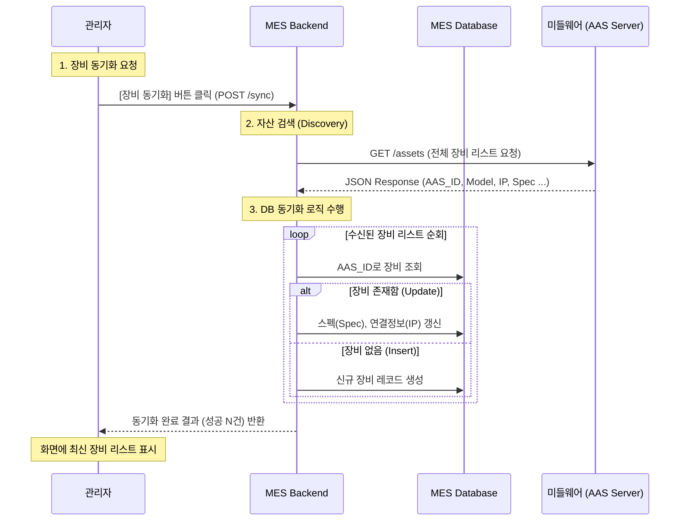
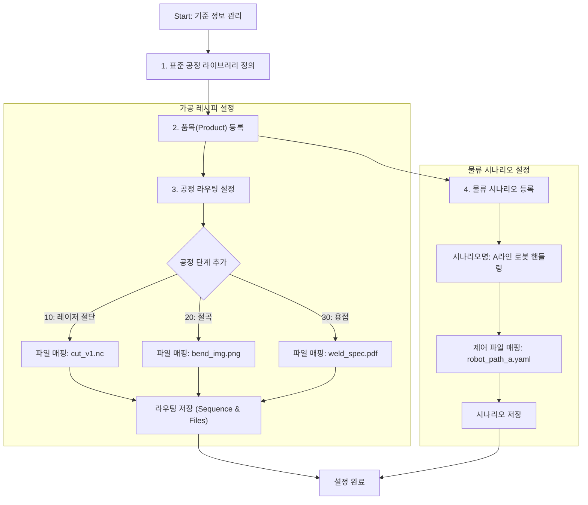
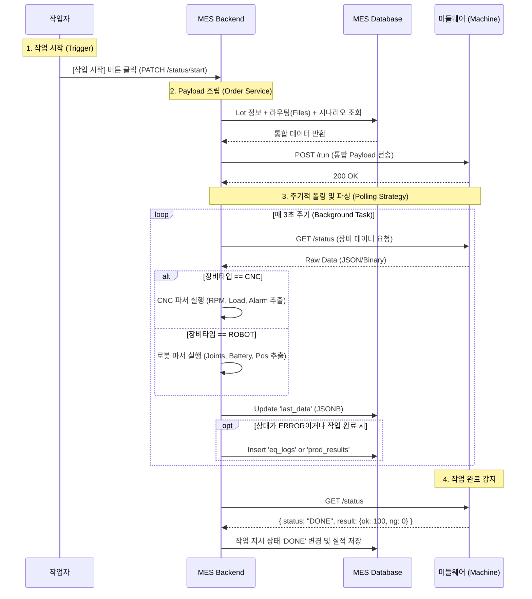

# [MES] 시스템 업무 흐름도 (Business Process Flow) v3.0

## 1. 개요 (Overview)
본 문서는 MES 시스템의 주요 업무 프로세스를 단계별 흐름도(Flowchart)로 정의합니다.
* **Version:** 3.0
* **설계 목표:** AAS 기반의 유연한 자산 연동과 표준 공정 기반의 정밀 제어 시스템 구축.
* **핵심 프로세스:**
    * **Asset Discovery (신규):** 미들웨어와 연동하여 현장 설비(AAS)를 자동으로 검색하고 등록하는 동기화 프로세스.
    * **Type-Specific Polling (신규):** CNC, 로봇 등 장비 타입에 따라 다른 데이터를 수집하고 파싱하는 전략적 폴링 구조.
    * **Advanced Routing:** 공정별 다중 파일(NC, 도면) 매핑을 통한 작업 표준화.
    * **Logistics Separation:** 가공(Routing)과 물류(Scenario)의 로직 분리를 통한 제어 효율화.

---

## 2. 업무 흐름 상세 (Detailed Flows)

### 2.1. 설비 등록 및 동기화 (Asset Discovery & Sync) - **[v3.0 New]**
**목표:** 관리자가 일일이 장비 정보를 입력하지 않고, 미들웨어로부터 연결된 장비 리스트를 받아와 DB를 자동 최신화합니다.



### 2.2. 기준 정보 설정 (Master Data Setup)

**목표:** 품목 생산에 필요한 '가공 레시피(Routing)'와 '물류 시나리오(Logistics)'를 각각 정의합니다.



### 2.3. 생산 실행 및 데이터 수집 (Execution & Data Collection)

**목표:** MES가 미들웨어에 통합 작업 정보를 지시(Push)하고, 장비별 맞춤 전략으로 데이터를 수집(Pull)합니다.



---

## 3. 데이터 흐름 구조 (Data Flow Structure)

### 3.1. 작업 지시 Payload (MES -> Middleware)

작업 시작 시 MES가 미들웨어로 보내는 **통합 JSON 구조**입니다.

```json
{
  "job_id": "LOT-20240101-001",
  "product_code": "ITEM-A",
  "target_qty": 100,
  "logistics": {
    "scenario_name": "Robot Handling A",
    "control_file": "/scenarios/robot_path_v1.yaml"
  },
  "processing_steps": [
    {
      "sequence": 10,
      "process_code": "STD-CUT",
      "files": [
        { "type": "NC", "path": "/files/cut_op1.nc", "order": 1 }
      ]
    },
    {
      "sequence": 20,
      "process_code": "STD-BEND",
      "files": [
        { "type": "IMG", "path": "/files/bend_guide.png", "order": 1 }
      ]
    }
  ]
}

```

### 3.2. 실시간 상태 Payload (Middleware -> MES) - **[v3.0 JSONB]**

미들웨어로부터 수집되어 MES DB(`last_data`)에 저장되는 장비별 상이한 데이터 구조입니다.

**Type A: CNC Machine**

```json
{
  "timestamp": "2024-01-01T10:00:00",
  "status": "RUNNING",
  "spindle_rpm": 15000,
  "load_percent": 45.5,
  "temperature": 80.2,
  "alarm_code": "0"
}

```

**Type B: Robot Arm (AMR)**

```json
{
  "timestamp": "2024-01-01T10:00:00",
  "status": "MOVING",
  "battery_level": 85,
  "current_position": { "x": 120.5, "y": 500.2, "z": 10.0 },
  "joint_angles": [0, 45, 90, -45, 0, 0]
}

```
