# Cell-MES DB ERD 문서

> 작성일: 2026-05-14  
> 대상: `agents/cell-mes` FastAPI 백엔드  
> DB: SQLite (개발) / PostgreSQL (운영)  
> ORM: SQLAlchemy 2.x (asyncio)  
> 마이그레이션: Alembic (6 버전)

---

## 1. 전체 ERD

```mermaid
erDiagram

  %% ── 마스터 ──────────────────────────────────
  process_categories {
    int id PK
    string code UK
    string name
    datetime created_at
  }

  cells {
    int id PK
    string code UK
    string name
    string location
    datetime created_at
  }

  std_processes {
    int id PK
    string code UK
    string name
    string description
    int category_id FK
    string equipment_type
    int cycle_time_sec
    int setup_time_sec
    datetime created_at
  }

  products {
    int id PK
    string code UK
    string name
    string unit
    bool is_deleted
    datetime created_at
  }

  process_routings {
    int id PK
    int product_id FK
    int std_process_id FK
    int sequence
    string revision
    string remarks
    datetime created_at
  }

  process_routing_files {
    int id PK
    int process_routing_id FK
    string file_type
    string file_path
    int sort_order
    datetime created_at
  }

  scenarios {
    int id PK
    string code UK
    int product_id FK
    string name
    string file_path
    bool is_active
    datetime created_at
  }

  %% ── 설비 ──────────────────────────────────
  equipments {
    int id PK
    string eq_code UK
    string aas_id UK
    string eq_name
    string model_name
    string equipment_type
    string location
    int cell_id FK
    json connection_config
    json spec_data
    json last_data
    string current_status
    datetime updated_at
    datetime last_connected_at
    bool is_deleted
  }

  eq_logs {
    int id PK
    int equipment_id FK
    string level
    string message
    datetime occurred_at
  }

  equipment_status_history {
    int id PK
    int equipment_id FK
    string previous_status
    string new_status
    datetime changed_at
    int previous_duration_minutes
    string reason
    int work_order_id FK
    string changed_by
    datetime created_at
  }

  %% ── 생산 ──────────────────────────────────
  work_orders {
    int id PK
    string lot_no UK
    int product_id FK
    int scenario_id FK
    int target_qty
    int qty
    int priority
    datetime due_date
    int completed_qty
    string current_process
    datetime start_time
    datetime end_time
    string remarks
    string status
    datetime created_at
  }

  units {
    int id PK
    int work_order_id FK
    int unit_no
    int scenario_id FK
    string status
    datetime created_at
    datetime started_at
    datetime completed_at
  }

  prod_results {
    int id PK
    int work_order_id FK
    int unit_id FK
    int process_routing_id FK
    int equipment_id FK
    int target_equipment_id FK
    int ok_qty
    int ng_qty
    datetime start_time
    datetime end_time
  }

  %% ── 품질 ──────────────────────────────────
  inspection_plans {
    int id PK
    int product_id FK
    int operation_id FK
    string pmi_source
    string feature_id
    string characteristic
    float nominal
    float usl
    float lsl
    string unit
    string inspection_type
    string sampling_plan
    int frequency
    bool enable_spc
    string spc_control_type
    bool is_active
    datetime created_at
    datetime updated_at
  }

  measurement_devices {
    int id PK
    string name
    string source_type
    int machine_id FK
    string serial_number
    datetime calibration_due
    json connection_config
    datetime created_at
    bool is_active
  }

  inspection_results {
    bigint id PK
    int inspection_plan_id FK
    bigint work_order_id FK
    int equipment_id FK
    string lot_no
    string serial_no
    string nc_program_id
    string source
    int device_id FK
    float measured_value
    float deviation
    bool is_conforming
    json measurement_metadata
    datetime measured_at
    datetime created_at
  }

  spc_charts {
    int id PK
    int inspection_plan_id FK
    float center_line
    float upper_control_limit
    float lower_control_limit
    float upper_warning_limit
    float lower_warning_limit
    float range_center_line
    float range_upper_control_limit
    float range_lower_control_limit
    int sample_count
    datetime last_calculation_date
    string chart_type
    int revision
    bool is_active
    datetime created_at
    datetime updated_at
  }

  spc_data_points {
    bigint id PK
    int spc_chart_id FK
    int subgroup_number
    float mean_value
    float range_value
    float standard_deviation
    int sample_size
    json raw_values
    bool is_out_of_control
    json violation_rules
    bigint work_order_id FK
    string lot_number
    datetime created_at
  }

  non_conformances {
    bigint id PK
    string ncr_no UK
    bigint work_order_id FK
    string lot_no
    string serial_no
    int machine_id FK
    bigint inspection_result_id FK
    int inspection_plan_id FK
    string defect_type
    string characteristic
    float specified_value
    float actual_value
    string disposition
    string status
    string description
    string root_cause
    string corrective_action
    string reported_by
    string assigned_to
    datetime reported_at
    datetime due_date
    datetime closed_at
    bool is_auto_generated
    json trigger_data
    datetime created_at
    datetime updated_at
  }

  %% ── 알람 ──────────────────────────────────
  alarm_definitions {
    int id PK
    string code UK
    string name
    string severity
    string category
    string description
    string recommended_action
    bool auto_stop
    bool is_active
    datetime created_at
  }

  alarms {
    int id PK
    int definition_id FK
    int equipment_id FK
    int work_order_id FK
    string status
    datetime occurred_at
    datetime acknowledged_at
    datetime resolved_at
    string message
    string value
    string acknowledged_by
    string resolved_by
    string resolution_note
    datetime created_at
  }

  %% ── 다운타임 ──────────────────────────────────
  downtime_reasons {
    int id PK
    string code UK
    string name
    string category
    string description
    bool is_active
    datetime created_at
  }

  downtimes {
    int id PK
    int equipment_id FK
    int reason_id FK
    int work_order_id FK
    datetime start_time
    datetime end_time
    int duration_minutes
    string remarks
    string reported_by
    datetime created_at
  }

  %% ── 시스템 ──────────────────────────────────
  users {
    int id PK
    string username UK
    string password_hash
    string role
    datetime created_at
  }

  middleware_config {
    int id PK
    string name
    string ip_address
    int port
  }

  %% ── 관계 정의 ──────────────────────────────────

  %% 마스터
  process_categories ||--o{ std_processes : "category_id"
  cells ||--o{ equipments : "cell_id"
  products ||--o{ process_routings : "product_id"
  products ||--o{ scenarios : "product_id"
  std_processes ||--o{ process_routings : "std_process_id"
  process_routings ||--o{ process_routing_files : "process_routing_id"

  %% 설비
  equipments ||--o{ eq_logs : "equipment_id"
  equipments ||--o{ equipment_status_history : "equipment_id"
  work_orders ||--o{ equipment_status_history : "work_order_id"

  %% 생산
  products ||--o{ work_orders : "product_id"
  scenarios ||--o{ work_orders : "scenario_id"
  work_orders ||--o{ units : "work_order_id"
  scenarios ||--o{ units : "scenario_id"
  work_orders ||--o{ prod_results : "work_order_id"
  units ||--o{ prod_results : "unit_id"
  process_routings ||--o{ prod_results : "process_routing_id"
  equipments ||--o{ prod_results : "equipment_id (actual)"
  equipments ||--o{ prod_results : "target_equipment_id (scheduled)"

  %% 품질
  products ||--o{ inspection_plans : "product_id"
  process_routings ||--o{ inspection_plans : "operation_id"
  equipments ||--o{ measurement_devices : "machine_id"
  inspection_plans ||--o{ inspection_results : "inspection_plan_id"
  work_orders ||--o{ inspection_results : "work_order_id"
  equipments ||--o{ inspection_results : "equipment_id"
  measurement_devices ||--o{ inspection_results : "device_id"
  inspection_plans ||--o{ spc_charts : "inspection_plan_id"
  spc_charts ||--o{ spc_data_points : "spc_chart_id"
  work_orders ||--o{ spc_data_points : "work_order_id"
  work_orders ||--o{ non_conformances : "work_order_id"
  equipments ||--o{ non_conformances : "machine_id"
  inspection_plans ||--o{ non_conformances : "inspection_plan_id"
  inspection_results ||--o{ non_conformances : "inspection_result_id"

  %% 알람
  alarm_definitions ||--o{ alarms : "definition_id"
  equipments ||--o{ alarms : "equipment_id"
  work_orders ||--o{ alarms : "work_order_id"

  %% 다운타임
  downtime_reasons ||--o{ downtimes : "reason_id"
  equipments ||--o{ downtimes : "equipment_id"
  work_orders ||--o{ downtimes : "work_order_id"
```



---

## 2. 도메인별 테이블 설명

### 2.1 마스터 데이터 (Master)

| 테이블 | 역할 |
|:--|:--|
| `process_categories` | 공정 유형 분류 마스터 (예: 선삭, 밀링, 로봇 이송) |
| `cells` | 제조 셀 마스터 — 설비를 논리적으로 그루핑하는 단위 |
| `std_processes` | 표준 공정 라이브러리 — 재사용 가능한 공정 템플릿 (사이클타임, 셋업타임 포함) |
| `products` | 품목 마스터 |
| `process_routings` | 품목별 공정 순서 정의 (sequence 10/20/30… 방식, revision 관리) |
| `process_routing_files` | 라우팅 단계에 첨부된 파일 (NC 프로그램, 도면, 문서) |
| `scenarios` | 물류/로봇 시나리오 정의 — n8n YAML 파일 경로 참조 |

**주요 제약**  
- `process_routings`: `(product_id, sequence, revision)` 복합 유니크 → 동일 품목의 공정 순서 중복 방지

---

### 2.2 설비 (Equipment)

| 테이블 | 역할 |
|:--|:--|
| `equipments` | 설비 마스터. AAS `id` 연동, JSON 컬럼으로 실시간 데이터/스펙/연결정보 저장 |
| `eq_logs` | 설비 이벤트 로그 (INFO / WARN / ERROR) |
| `equipment_status_history` | 상태 변경 이력 — OEE 가동률 분석용. 이전 상태 지속시간(분) 저장 |

**`equipments.equipment_type` 값**  
`CNC` / `ROBOT` / `AMR` / `PLC` — AAS submodel 키로 자동 판별

**`equipments.current_status` 값**  
`RUN` / `IDLE` / `STOP` / `SETUP` / `ERROR` / `MAINTENANCE`

**`equipments.last_data` (JSON)**  
폴링 서비스가 3초 주기로 미들웨어에서 수신한 실시간 데이터 스냅샷  
예: `{"spindle_rpm": 15000, "load_percent": 45.5}`

---

### 2.3 생산 (Production)

| 테이블 | 역할 |
|:--|:--|
| `work_orders` | 작업지시. 상태 머신 기반 전이 (`READY→SCHEDULED→RUNNING→DONE`) |
| `units` | Lot-Size 1 디스패칭 토큰. WO 1건당 N개 unit으로 분리 |
| `prod_results` | 공정별 실적 기록 — `equipment_id`(실제) vs `target_equipment_id`(스케줄 지정) 이원화 |

**`work_orders.status` 전이 규칙**

```
READY ──→ SCHEDULED ──→ RUNNING ──→ DONE
  │            │              │
  └─CANCEL    └─CANCEL     PAUSE / ERROR
```

**`units.status` 값**  
`READY` (MES 큐) → `RUNNING` (미들웨어 전송 중) → `DONE` / `ERROR`

**Lot-Size 1 동작 원리**  
`dispatch_service`가 2초 주기로 실행되어, 활성 WO마다 READY 상태 Unit을 정확히 1개 유지. Unit 소비 완료 시 다음 Unit 생성 및 미들웨어 전송.

---

### 2.4 품질 (Quality)

| 테이블 | 역할 |
|:--|:--|
| `inspection_plans` | 검사 계획 — 품목·공정별 검사 항목(특성치, 규격 상하한, SPC 설정) |
| `measurement_devices` | 측정 장비 마스터 (OMM / EQUATOR / CMM / MANUAL) |
| `inspection_results` | 실측 결과 — 합·부 판정, 편차, 측정 메타데이터 |
| `spc_charts` | SPC 관리도 설정 — UCL/LCL/경고선, X-bar R / P 차트 등 |
| `spc_data_points` | SPC 데이터 포인트 — 서브그룹 통계값, Western Electric Rule 위반 플래그 |
| `non_conformances` | 부적합 보고서(NCR) — SPC 자동 생성 또는 수동 등록, 처리(Disposition) 및 시정조치 관리 |

**`inspection_plans.inspection_type` 값**  
`INCOMING` / `IN_PROCESS` / `FINAL` / `PERIODIC`

**`non_conformances.status` 값**  
`OPEN` → `IN_PROGRESS` → `CLOSED` / `VERIFIED` / `CANCELLED`

**`non_conformances.disposition` 값**  
`PENDING` / `REWORK` / `SCRAP` / `USE_AS_IS` / `RETURN`

---

### 2.5 알람 (Alarm)

| 테이블 | 역할 |
|:--|:--|
| `alarm_definitions` | 알람 정의 마스터 (심각도: INFO / WARNING / CRITICAL / EMERGENCY) |
| `alarms` | 알람 발생·확인·해제 이력 |

**`alarms.status` 값**  
`ACTIVE` → `ACKNOWLEDGED` → `RESOLVED`

---

### 2.6 다운타임 (Downtime)

| 테이블 | 역할 |
|:--|:--|
| `downtime_reasons` | 정지 사유 코드 마스터 (PLANNED / UNPLANNED / SETUP) |
| `downtimes` | 설비 다운타임 기록 — OEE Availability 계산에 사용 |

**OEE Availability 공식**  
`Availability = (계획 가동시간 − 다운타임 합산) / 계획 가동시간`

---

### 2.7 시스템 (System)

| 테이블 | 역할 |
|:--|:--|
| `users` | 사용자 계정 (JWT HS256 인증, 역할: ADMIN / OPERATOR / SERVICE) |
| `middleware_config` | 미들웨어 서버 연결 설정 (IP, Port) — DB 저장으로 런타임 변경 가능 |

---

## 3. 테이블 수 요약

| 도메인 | 테이블 수 | 테이블 목록 |
|:--|:--:|:--|
| 마스터 | 7 | process_categories, cells, std_processes, products, process_routings, process_routing_files, scenarios |
| 설비 | 3 | equipments, eq_logs, equipment_status_history |
| 생산 | 3 | work_orders, units, prod_results |
| 품질 | 6 | inspection_plans, measurement_devices, inspection_results, spc_charts, spc_data_points, non_conformances |
| 알람 | 2 | alarm_definitions, alarms |
| 다운타임 | 2 | downtime_reasons, downtimes |
| 시스템 | 2 | users, middleware_config |
| **합계** | **25** | |

---

## 4. 주요 외래키 관계 요약

```
cells ──────────────────── equipments (1:N)
process_categories ─────── std_processes (1:N)
products ───────────────── process_routings (1:N, CASCADE)
                           scenarios (1:N)
                           work_orders (1:N)
                           inspection_plans (1:N)
std_processes ──────────── process_routings (1:N)
process_routings ───────── process_routing_files (1:N, CASCADE)
                           prod_results (1:N)
                           inspection_plans (1:N)
scenarios ──────────────── work_orders (1:N)
                           units (1:N)
work_orders ────────────── units (1:N, CASCADE)
                           prod_results (1:N, CASCADE)
                           inspection_results (1:N)
                           spc_data_points (1:N)
                           non_conformances (1:N)
                           alarms (1:N)
                           downtimes (1:N)
                           equipment_status_history (1:N)
units ──────────────────── prod_results (1:N, CASCADE)
equipments ─────────────── prod_results × 2 (actual + target)
                           eq_logs (1:N)
                           equipment_status_history (1:N)
                           measurement_devices (1:N)
                           inspection_results (1:N)
                           non_conformances (1:N)
                           alarms (1:N)
                           downtimes (1:N)
inspection_plans ───────── inspection_results (1:N, CASCADE)
                           spc_charts (1:N, CASCADE)
                           non_conformances (1:N)
spc_charts ─────────────── spc_data_points (1:N, CASCADE)
inspection_results ──────── non_conformances (1:N)
measurement_devices ──────── inspection_results (1:N)
alarm_definitions ──────── alarms (1:N)
downtime_reasons ───────── downtimes (1:N)
```

---

## 5. Alembic 마이그레이션 이력

| 버전 | 파일 | 주요 변경 |
|:--|:--|:--|
| 001 | `001_initial_schema.py` | 초기 스키마 (users, equipments, cells, products, std_processes, process_routings, scenarios, work_orders, prod_results, eq_logs, alarm_definitions, alarms, downtime_reasons, downtimes) |
| 002 | `002_add_stdprocess_scheduler_fields.py` | `std_processes`에 `equipment_type`, `cycle_time_sec`, `setup_time_sec` 추가 |
| 003 | `003_add_quality_tables.py` | 품질 관련 테이블 전체 추가 (inspection_plans, inspection_results, spc_charts, spc_data_points, non_conformances, measurement_devices) |
| 004 | `004_add_process_categories_and_cells.py` | `process_categories` 추가, `equipments`에 `cell_id` FK 추가 |
| 005 | *(없음 — 건너뜀)* | — |
| 006 | `006_add_unit_table_for_lot_size_1_.py` | `units` 테이블 추가 (Lot-Size 1 디스패칭), `equipment_status_history` 테이블 추가 |
