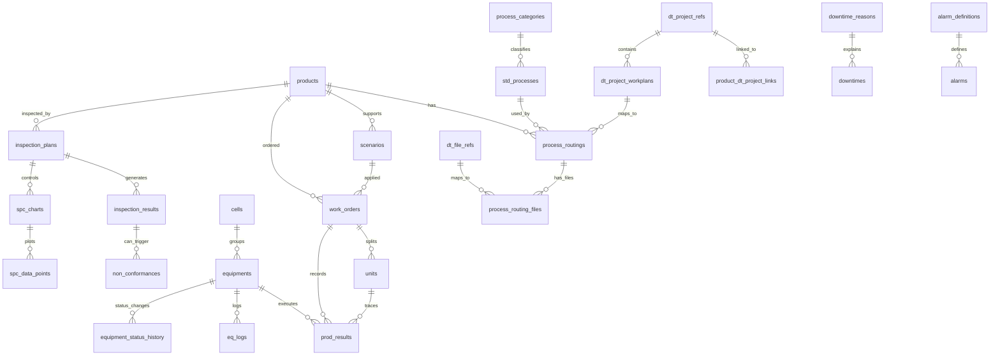

# Cell-MES 테이블 명세서

> 작성일: 2026-08-06  
> 대상: `agents/cell-mes`  
> 기준 소스: Cell-MES 최신 스키마  
> DB: SQLite(개발) / PostgreSQL 호환 설계  

## 1. 작성 기준

본 문서는 Cell-MES에서 외부 시스템 연계와 운영 데이터 이해에 필요한 업무 테이블을 기준으로 작성했다.

업무 테이블은 총 29개이다.

## 2. 스키마 요약

| 영역 | 테이블 | 주요 역할 |
| --- | --- | --- |
| 시스템/인증 | `users`, `middleware_config` | 사용자 인증, 미들웨어 접속 설정 |
| 마스터 | `process_categories`, `cells`, `std_processes`, `products`, `process_routings`, `process_routing_files`, `scenarios` | 공정/품목/라우팅/시나리오 기준정보 |
| Digital Thread 연계 | `dt_project_refs`, `product_dt_project_links`, `dt_project_workplans`, `dt_file_refs` | DT 플랫폼 프로젝트/워크플랜/파일 참조와 MES 품목/라우팅 연결 |
| 설비 | `equipments`, `eq_logs`, `equipment_status_history` | 설비 마스터, 이벤트 로그, 상태 이력 |
| 생산 | `work_orders`, `units`, `prod_results` | 작업지시, Lot-size 1 실행 단위, 공정 실적 |
| 품질 | `inspection_plans`, `measurement_devices`, `inspection_results`, `spc_charts`, `spc_data_points`, `non_conformances` | 검사계획, 측정, SPC, NCR |
| 다운타임 | `downtime_reasons`, `downtimes` | 정지 사유와 설비 정지 이력 |
| 알람 | `alarm_definitions`, `alarms` | 알람 코드 마스터와 발생/확인/해제 이력 |

## 3. 주요 관계

## 4. 코드값 및 상태값

| 항목 | 값 |
| --- | --- |
| 사용자 역할 | `ADMIN`, `OPERATOR` |
| 설비 유형 | `CNC`, `ROBOT`, `AMR`, `PLC`; 테스트/가상 설비에서는 `LATHE` 등 확장 가능 |
| 설비 상태 | `RUN`, `IDLE`, `STOP`, `SETUP`, `ERROR`, `MAINTENANCE`; 일부 테스트에서는 `AVAILABLE` 사용 |
| 작업지시 상태 | `READY`, `SCHEDULED`, `RUNNING`, `PAUSE`, `DONE`, `ERROR`, `CANCEL` |
| Unit 상태 | `READY`, `RUNNING`, `DONE`, `ERROR`, `SCENARIO_HOLD` |
| 파일 유형 | `NC`, `IMAGE`, `DOC` |
| 라우팅 파일 출처 | `LOCAL_UPLOAD`, `DTP` |
| 다운타임 분류 | `PLANNED`, `UNPLANNED`, `SETUP` |
| 알람 심각도 | `INFO`, `WARNING`, `CRITICAL`, `EMERGENCY` |
| 알람 분류 | `EQUIPMENT`, `PROCESS`, `QUALITY`, `SAFETY` |
| 알람 상태 | `ACTIVE`, `ACKNOWLEDGED`, `RESOLVED` |
| 검사 유형 | `INCOMING`, `IN_PROCESS`, `FINAL`, `PERIODIC` |
| SPC 관리도 | `X_BAR_R`, `X_BAR_S`, `P_CHART`, `C_CHART` |
| 측정 소스 | `OMM`, `EQUATOR`, `CMM`, `MANUAL` |
| NCR 상태 | `OPEN`, `IN_PROGRESS`, `CLOSED`, `VERIFIED`, `CANCELLED` |
| NCR 처분 | `PENDING`, `REWORK`, `SCRAP`, `USE_AS_IS`, `RETURN` |
| DT 프로젝트 관계 | `PRIMARY` 기본, 필요 시 보조 관계 확장 |

## 5. 테이블 상세

### 5.1 `users`

사용자 인증/권한 테이블이다.

| 컬럼 | 타입 | Null | 기본값 | 키/인덱스 | 설명 |
| --- | --- | --- | --- | --- | --- |
| `id` | INTEGER | N |  | PK | 사용자 내부 ID |
| `username` | VARCHAR(50) | N |  | UNIQUE, IDX | 로그인 ID |
| `password_hash` | VARCHAR(255) | N |  |  | 해시된 비밀번호 |
| `role` | VARCHAR(20) | Y | `OPERATOR` |  | 권한 역할 |
| `created_at` | DATETIME | Y | `CURRENT_TIMESTAMP` |  | 생성 시각 |

### 5.2 `middleware_config`

MES가 연동할 미들웨어 서버 접속 정보를 저장한다.

| 컬럼 | 타입 | Null | 기본값 | 키/인덱스 | 설명 |
| --- | --- | --- | --- | --- | --- |
| `id` | INTEGER | N |  | PK | 설정 ID |
| `name` | VARCHAR(50) | N |  |  | 설정명 |
| `ip_address` | VARCHAR(45) | N |  |  | IPv4/IPv6 주소 |
| `port` | INTEGER | N |  |  | HTTP/API 포트 |

### 5.3 `process_categories`

표준 공정을 분류하는 마스터다.

| 컬럼 | 타입 | Null | 기본값 | 키/인덱스 | 설명 |
| --- | --- | --- | --- | --- | --- |
| `id` | INTEGER | N |  | PK | 공정 카테고리 ID |
| `code` | VARCHAR(30) | N |  | UNIQUE, IDX | 카테고리 코드 |
| `name` | VARCHAR(50) | N |  |  | 카테고리명 |
| `created_at` | DATETIME | Y | `CURRENT_TIMESTAMP` |  | 생성 시각 |

### 5.4 `cells`

설비를 제조 셀 단위로 그룹화한다.

| 컬럼 | 타입 | Null | 기본값 | 키/인덱스 | 설명 |
| --- | --- | --- | --- | --- | --- |
| `id` | INTEGER | N |  | PK | 셀 ID |
| `code` | VARCHAR(20) | N |  | UNIQUE, IDX | 셀 코드 |
| `name` | VARCHAR(100) | N |  |  | 셀명 |
| `location` | VARCHAR(100) | Y |  |  | 위치 |
| `created_at` | DATETIME | Y | `CURRENT_TIMESTAMP` |  | 생성 시각 |

### 5.5 `std_processes`

재사용 가능한 표준 공정 라이브러리다. 스케줄러는 `equipment_type`, `required_machines`, `cycle_time_sec`, `setup_time_sec`를 사용한다.

| 컬럼 | 타입 | Null | 기본값 | 키/인덱스 | 설명 |
| --- | --- | --- | --- | --- | --- |
| `id` | INTEGER | N |  | PK | 표준 공정 ID |
| `code` | VARCHAR(20) | N |  | UNIQUE, IDX | 표준 공정 코드 |
| `name` | VARCHAR(100) | N |  |  | 공정명 |
| `description` | TEXT | Y |  |  | SOP/설명 |
| `created_at` | DATETIME | Y | `CURRENT_TIMESTAMP` |  | 생성 시각 |
| `equipment_type` | VARCHAR(50) | Y |  | IDX | 기본 필요 설비 유형 |
| `cycle_time_sec` | INTEGER | N | `60` |  | 표준 사이클 타임(초) |
| `category_id` | INTEGER | Y |  | IDX, FK(ORM) | 공정 카테고리 ID |
| `setup_time_sec` | INTEGER | Y | `0` |  | 셋업 시간(초) |
| `required_machines` | JSON | Y |  |  | 기본 후보 설비 코드 배열 |

### 5.6 `products`

생산 품목 마스터다.

| 컬럼 | 타입 | Null | 기본값 | 키/인덱스 | 설명 |
| --- | --- | --- | --- | --- | --- |
| `id` | INTEGER | N |  | PK | 품목 ID |
| `code` | VARCHAR(50) | N |  | UNIQUE, IDX | 품목 코드 |
| `name` | VARCHAR(100) | N |  |  | 품목명 |
| `unit` | VARCHAR(10) | Y | `EA` |  | 단위 |
| `is_deleted` | BOOLEAN | Y | `false` |  | 소프트 삭제 여부 |
| `created_at` | DATETIME | Y | `CURRENT_TIMESTAMP` |  | 생성 시각 |

### 5.7 `process_routings`

품목별 공정 순서와 리비전을 정의한다.

| 컬럼 | 타입 | Null | 기본값 | 키/인덱스 | 설명 |
| --- | --- | --- | --- | --- | --- |
| `id` | INTEGER | N |  | PK | 라우팅 ID |
| `product_id` | INTEGER | N |  | FK, IDX | 품목 ID, 삭제 시 라우팅 cascade |
| `std_process_id` | INTEGER | N |  | FK | 표준 공정 ID |
| `sequence` | INTEGER | N |  | UNIQUE 조합 | 공정 순서 |
| `remarks` | VARCHAR(255) | Y |  |  | 비고 |
| `created_at` | DATETIME | Y | `CURRENT_TIMESTAMP` |  | 생성 시각 |
| `revision` | VARCHAR(10) | Y | `A` | UNIQUE 조합 | 라우팅 리비전 |
| `setup_id` | VARCHAR(50) | Y |  |  | 셋업/치구/작업 준비 식별자 |
| `required_machines` | JSON | Y |  |  | 품목별 후보 설비 코드 배열 |
| `dt_workplan_id` | INTEGER | Y |  | FK, IDX | DT 워크플랜 참조 |

제약조건: `(product_id, sequence, revision)` UNIQUE.

### 5.8 `process_routing_files`

라우팅 단계에 필요한 NC/문서/이미지 파일과 DT 파일 참조를 매핑한다.

| 컬럼 | 타입 | Null | 기본값 | 키/인덱스 | 설명 |
| --- | --- | --- | --- | --- | --- |
| `id` | INTEGER | N |  | PK | 라우팅 파일 ID |
| `process_routing_id` | INTEGER | N |  | FK, IDX | 상위 라우팅 ID, 삭제 시 cascade |
| `file_type` | VARCHAR(20) | Y | `NC` |  | 파일 유형 |
| `file_path` | VARCHAR(255) | N |  |  | 저장 경로 또는 접근 경로 |
| `sort_order` | INTEGER | Y | `1` |  | 사용/전송 순서 |
| `created_at` | DATETIME | Y | `CURRENT_TIMESTAMP` |  | 생성 시각 |
| `original_filename` | VARCHAR(255) | Y |  |  | 업로드 원본 파일명 |
| `compatible_machines` | JSON | Y |  |  | 해당 파일을 사용할 수 있는 설비 코드 배열 |
| `source_type` | VARCHAR(20) | N | `LOCAL_UPLOAD` |  | 파일 출처 |
| `dt_file_ref_id` | INTEGER | Y |  | FK, IDX | DT 파일 참조 ID |

### 5.9 `scenarios`

물류/로봇/미들웨어 실행 시나리오 YAML 파일을 관리한다.

| 컬럼 | 타입 | Null | 기본값 | 키/인덱스 | 설명 |
| --- | --- | --- | --- | --- | --- |
| `id` | INTEGER | N |  | PK | 시나리오 ID |
| `product_id` | INTEGER | Y |  | FK | 적용 품목 ID |
| `name` | VARCHAR(100) | N |  |  | 시나리오명 |
| `file_path` | VARCHAR(255) | N |  |  | YAML 파일 경로 |
| `is_active` | BOOLEAN | Y | `true` |  | 사용 여부 |
| `created_at` | DATETIME | Y | `CURRENT_TIMESTAMP` |  | 생성 시각 |
| `code` | VARCHAR(20) | Y |  | UNIQUE, IDX | 시나리오 코드 |

### 5.10 `dt_project_refs`

Digital Thread 플랫폼의 프로젝트 또는 Project 계열 XML 요소 스냅샷이다.

| 컬럼 | 타입 | Null | 기본값 | 키/인덱스 | 설명 |
| --- | --- | --- | --- | --- | --- |
| `id` | INTEGER | N |  | PK | DT 프로젝트 참조 ID |
| `platform` | VARCHAR(50) | N |  | UNIQUE 조합 | 외부 플랫폼, 기본 `DTP` |
| `external_project_id` | VARCHAR(100) | Y |  | IDX | 외부 프로젝트 ID |
| `asset_global_id` | VARCHAR(255) | N |  | UNIQUE 조합 | DT asset global ID |
| `asset_id` | VARCHAR(255) | N |  | UNIQUE 조합 | DT asset ID |
| `element_id` | VARCHAR(100) | N |  | UNIQUE 조합 | XML 요소 ID |
| `element_full_id` | VARCHAR(255) | Y |  |  | 전체 요소 식별자 |
| `element_category` | VARCHAR(50) | N |  |  | 요소 분류 |
| `display_name` | VARCHAR(255) | Y |  |  | 표시명 |
| `uuid` | VARCHAR(100) | Y |  |  | DT UUID |
| `xml_path` | VARCHAR(255) | Y |  |  | 원본 XML 경로 |
| `raw_metadata` | JSON | Y |  |  | 원본 메타데이터 |
| `synced_at` | DATETIME | N | `CURRENT_TIMESTAMP` |  | 동기화 시각 |
| `created_at` | DATETIME | N | `CURRENT_TIMESTAMP` |  | 생성 시각 |

제약조건: `(platform, asset_global_id, asset_id, element_id)` UNIQUE.

### 5.11 `product_dt_project_links`

MES 품목과 DT 프로젝트 참조의 연결 이력이다.

| 컬럼 | 타입 | Null | 기본값 | 키/인덱스 | 설명 |
| --- | --- | --- | --- | --- | --- |
| `id` | INTEGER | N |  | PK | 연결 ID |
| `product_id` | INTEGER | N |  | FK, IDX | 품목 ID, 삭제 시 cascade |
| `dt_project_ref_id` | INTEGER | N |  | FK, IDX | DT 프로젝트 참조 ID |
| `relation_type` | VARCHAR(30) | N |  | UNIQUE 조건부 | 관계 유형 |
| `is_current` | BOOLEAN | N |  | UNIQUE 조건부 | 현재 연결 여부 |
| `linked_at` | DATETIME | N | `CURRENT_TIMESTAMP` |  | 연결 시각 |
| `unlinked_at` | DATETIME | Y |  |  | 연결 해제 시각 |

인덱스: `is_current = true`인 행에 대해 `(product_id, relation_type)` UNIQUE.

### 5.12 `dt_project_workplans`

DT 프로젝트 XML에서 파싱한 WorkPlan 트리 노드다.

| 컬럼 | 타입 | Null | 기본값 | 키/인덱스 | 설명 |
| --- | --- | --- | --- | --- | --- |
| `id` | INTEGER | N |  | PK | DT 워크플랜 ID |
| `dt_project_ref_id` | INTEGER | N |  | FK, IDX | DT 프로젝트 참조 ID, 삭제 시 cascade |
| `workplan_id` | VARCHAR(100) | N |  | UNIQUE 조합 | 외부 WorkPlan ID |
| `parent_workplan_id` | VARCHAR(100) | Y |  |  | 상위 WorkPlan ID |
| `display_name` | VARCHAR(255) | Y |  |  | 표시명 |
| `source_path` | VARCHAR(500) | N |  | UNIQUE 조합 | XML 내 위치 경로 |
| `level` | INTEGER | N |  |  | 트리 깊이 |
| `sequence` | INTEGER | N |  |  | 형제 노드 순서 |
| `has_direct_steps` | BOOLEAN | N |  |  | 직접 작업 스텝 포함 여부 |
| `raw_fragment` | TEXT | Y |  |  | XML 원문 조각 |
| `created_at` | DATETIME | N | `CURRENT_TIMESTAMP` |  | 생성 시각 |

제약조건: `(dt_project_ref_id, workplan_id, source_path)` UNIQUE.

### 5.13 `dt_file_refs`

DT 플랫폼 파일, 주로 NC 파일 참조 스냅샷이다.

| 컬럼 | 타입 | Null | 기본값 | 키/인덱스 | 설명 |
| --- | --- | --- | --- | --- | --- |
| `id` | INTEGER | N |  | PK | DT 파일 참조 ID |
| `platform` | VARCHAR(50) | N |  | UNIQUE 조합 | 외부 플랫폼 |
| `external_file_id` | VARCHAR(100) | N |  | UNIQUE 조합 | 외부 파일 ID |
| `asset_global_id` | VARCHAR(255) | N |  |  | DT asset global ID |
| `asset_id` | VARCHAR(255) | Y |  |  | DT asset ID |
| `element_id` | VARCHAR(100) | Y |  |  | XML 요소 ID |
| `element_full_id` | VARCHAR(255) | Y |  |  | 전체 요소 식별자 |
| `element_category` | VARCHAR(50) | N |  |  | 요소 분류, 기본 NC 용도 |
| `display_name` | VARCHAR(255) | Y |  |  | 표시명 |
| `path` | VARCHAR(255) | N |  |  | 파일 경로 |
| `references` | JSON | Y |  |  | 관련 참조 정보 |
| `workplan_id` | VARCHAR(100) | Y |  | IDX | 연관 WorkPlan ID |
| `raw_metadata` | JSON | Y |  |  | 원본 메타데이터 |
| `synced_at` | DATETIME | N | `CURRENT_TIMESTAMP` |  | 동기화 시각 |
| `created_at` | DATETIME | N | `CURRENT_TIMESTAMP` |  | 생성 시각 |

제약조건: `(platform, external_file_id)` UNIQUE.

### 5.14 `equipments`

AAS/미들웨어 연동 설비 마스터이며, 다양한 설비 타입을 JSON 컬럼으로 흡수한다.

| 컬럼 | 타입 | Null | 기본값 | 키/인덱스 | 설명 |
| --- | --- | --- | --- | --- | --- |
| `id` | INTEGER | N |  | PK | 설비 ID |
| `aas_id` | VARCHAR(100) | Y |  | UNIQUE, IDX | AAS 식별자 |
| `eq_name` | VARCHAR(100) | N |  |  | 설비명 |
| `model_name` | VARCHAR(100) | Y |  |  | 모델명 |
| `equipment_type` | VARCHAR(20) | N | `CNC` | IDX(ORM) | 설비 유형 |
| `connection_config` | JSON | N | `{}` |  | 접속 정보 |
| `spec_data` | JSON | Y | `{}` |  | 정적 제원, 가상 설비 메타 포함 |
| `last_data` | JSON | Y | `{}` |  | 최근 수집 데이터 캐시 |
| `current_status` | VARCHAR(20) | Y | `STOP` |  | 현재 상태 |
| `updated_at` | DATETIME | Y | `CURRENT_TIMESTAMP` |  | 최근 갱신 시각 |
| `last_connected_at` | DATETIME | Y |  |  | 최근 연결 성공 시각 |
| `is_deleted` | BOOLEAN | Y | `false` |  | 소프트 삭제 여부 |
| `eq_code` | VARCHAR(30) | Y |  | IDX, UNIQUE(ORM) | 표준 설비 코드 |
| `location` | VARCHAR(50) | Y |  |  | 물리 위치 |
| `cell_id` | INTEGER | Y |  | IDX, FK(ORM) | 셀 ID |

### 5.15 `eq_logs`

설비 이벤트 로그다.

| 컬럼 | 타입 | Null | 기본값 | 키/인덱스 | 설명 |
| --- | --- | --- | --- | --- | --- |
| `id` | BIGINT | N |  | PK | 로그 ID |
| `equipment_id` | INTEGER | N |  | FK, IDX | 설비 ID |
| `level` | VARCHAR(10) | Y | `INFO` |  | 로그 레벨 |
| `message` | TEXT | Y |  |  | 로그 내용 |
| `occurred_at` | DATETIME | Y | `CURRENT_TIMESTAMP` |  | 발생 시각 |

### 5.16 `equipment_status_history`

설비 상태 변경 이력이며 가동률/OEE 계산에 사용된다.

| 컬럼 | 타입 | Null | 기본값 | 키/인덱스 | 설명 |
| --- | --- | --- | --- | --- | --- |
| `id` | INTEGER | N |  | PK | 이력 ID |
| `equipment_id` | INTEGER | N |  | FK, IDX | 설비 ID |
| `previous_status` | VARCHAR(20) | Y |  |  | 이전 상태 |
| `new_status` | VARCHAR(20) | N |  | IDX | 변경 후 상태 |
| `changed_at` | DATETIME | N |  | IDX | 상태 변경 시각 |
| `previous_duration_minutes` | INTEGER | Y |  |  | 이전 상태 지속 시간 |
| `reason` | VARCHAR(100) | Y |  |  | 변경 사유 |
| `work_order_id` | INTEGER | Y |  | FK | 관련 작업지시 |
| `changed_by` | VARCHAR(50) | Y |  |  | 변경 주체 |
| `created_at` | DATETIME | Y | `CURRENT_TIMESTAMP` |  | 생성 시각 |

### 5.17 `work_orders`

생산 작업지시이며 로트 추적과 스케줄링 입력의 기준이다.

| 컬럼 | 타입 | Null | 기본값 | 키/인덱스 | 설명 |
| --- | --- | --- | --- | --- | --- |
| `id` | BIGINT | N |  | PK | 작업지시 ID |
| `lot_no` | VARCHAR(50) | N |  | UNIQUE, IDX | Lot 번호 |
| `product_id` | INTEGER | Y |  | FK | 생산 품목 ID |
| `scenario_id` | INTEGER | Y |  | FK | 기본 실행 시나리오 |
| `target_qty` | INTEGER | N |  |  | 목표 수량 |
| `status` | VARCHAR(20) | Y | `READY` |  | 작업지시 상태 |
| `created_at` | DATETIME | Y | `CURRENT_TIMESTAMP` |  | 생성 시각 |
| `qty` | INTEGER | Y | `1` |  | 스케줄러용 주문 수량 |
| `priority` | INTEGER | Y | `5` |  | 우선순위, 1이 가장 높음 |
| `completed_qty` | INTEGER | Y | `0` |  | 완료 수량 |
| `current_process` | VARCHAR(50) | Y |  |  | 현재 공정 코드 |
| `due_date` | DATETIME | Y |  |  | 납기 |
| `start_time` | DATETIME | Y |  |  | 실제 시작 시각 |
| `end_time` | DATETIME | Y |  |  | 실제 종료 시각 |
| `remarks` | VARCHAR(500) | Y |  |  | 비고 |

상태 전이: `READY -> SCHEDULED/RUNNING/CANCEL`, `SCHEDULED -> RUNNING/CANCEL`, `RUNNING -> PAUSE/DONE/ERROR/CANCEL`, `PAUSE -> RUNNING/DONE/CANCEL`, `ERROR -> RUNNING/DONE`.

### 5.18 `units`

Lot-size 1 실행을 위한 개별 큐 토큰이다. 작업지시 수량을 개별 unit으로 나누어 미들웨어에 dispatch한다.

| 컬럼 | 타입 | Null | 기본값 | 키/인덱스 | 설명 |
| --- | --- | --- | --- | --- | --- |
| `id` | INTEGER | N |  | PK | Unit ID |
| `work_order_id` | INTEGER | N |  | FK, IDX | 작업지시 ID |
| `unit_no` | INTEGER | N |  |  | 작업지시 내 순번 |
| `scenario_id` | INTEGER | Y |  | FK | Unit 큐잉 당시 시나리오 스냅샷 |
| `status` | VARCHAR(20) | N |  |  | Unit 상태 |
| `created_at` | DATETIME | N | `CURRENT_TIMESTAMP` |  | 생성 시각 |
| `started_at` | DATETIME | Y |  |  | 실행 시작 시각 |
| `completed_at` | DATETIME | Y |  |  | 완료 시각 |
| `scenario_hold_started_at` | DATETIME | Y |  |  | 시나리오 변경 대기 시작 시각 |
| `scenario_hold_by` | VARCHAR(100) | Y |  |  | 시나리오 hold 요청자 |

### 5.19 `prod_results`

작업지시/Unit/공정/설비 단위 생산 실적과 추적성 레코드다.

| 컬럼 | 타입 | Null | 기본값 | 키/인덱스 | 설명 |
| --- | --- | --- | --- | --- | --- |
| `id` | BIGINT | N |  | PK | 생산 실적 ID |
| `work_order_id` | BIGINT | N |  | FK, IDX | 작업지시 ID |
| `process_routing_id` | INTEGER | Y |  | FK | 수행 공정 라우팅 |
| `equipment_id` | INTEGER | Y |  | FK | 실제 수행 설비 |
| `ok_qty` | INTEGER | Y | `0` |  | 양품 수량 |
| `ng_qty` | INTEGER | Y | `0` |  | 불량 수량 |
| `start_time` | DATETIME | Y |  |  | 공정 시작 시각 |
| `end_time` | DATETIME | Y |  |  | 공정 종료 시각 |
| `target_equipment_id` | INTEGER | Y |  | FK(ORM) | 스케줄러 배정 설비 |
| `unit_id` | INTEGER | Y |  | FK, IDX | Unit ID |

### 5.20 `inspection_plans`

품목/공정별 검사 항목과 공차, 샘플링, SPC 적용 여부를 정의한다.

| 컬럼 | 타입 | Null | 기본값 | 키/인덱스 | 설명 |
| --- | --- | --- | --- | --- | --- |
| `id` | INTEGER | N |  | PK | 검사계획 ID |
| `product_id` | INTEGER | N |  | FK, IDX | 품목 ID |
| `operation_id` | INTEGER | Y |  | FK | 라우팅 공정 ID |
| `pmi_source` | VARCHAR(255) | Y |  |  | PMI/STEP 원천 경로 |
| `feature_id` | VARCHAR(100) | Y |  |  | PMI Feature ID |
| `characteristic` | VARCHAR(100) | N |  |  | 검사 특성명 |
| `nominal` | FLOAT | Y |  |  | 기준값 |
| `usl` | FLOAT | Y |  |  | 상한 규격 |
| `lsl` | FLOAT | Y |  |  | 하한 규격 |
| `unit` | VARCHAR(20) | N |  |  | 측정 단위 |
| `inspection_type` | VARCHAR(20) | N |  |  | 검사 유형 |
| `sampling_plan` | VARCHAR(50) | N |  |  | 샘플링 방식 |
| `frequency` | INTEGER | Y |  |  | 검사 주기 |
| `enable_spc` | BOOLEAN | N |  |  | SPC 적용 여부 |
| `spc_control_type` | VARCHAR(20) | N |  |  | 관리도 유형 |
| `is_active` | BOOLEAN | N |  |  | 사용 여부 |
| `created_at` | DATETIME | N | `CURRENT_TIMESTAMP` |  | 생성 시각 |
| `updated_at` | DATETIME | N | `CURRENT_TIMESTAMP` |  | 수정 시각 |

### 5.21 `measurement_devices`

측정 장비 마스터다.

| 컬럼 | 타입 | Null | 기본값 | 키/인덱스 | 설명 |
| --- | --- | --- | --- | --- | --- |
| `id` | INTEGER | N |  | PK | 측정 장비 ID |
| `name` | VARCHAR(100) | N |  |  | 장비명 |
| `source_type` | VARCHAR(20) | N |  |  | 측정 소스 유형 |
| `machine_id` | INTEGER | Y |  | FK | 연결된 생산 설비 |
| `serial_number` | VARCHAR(100) | Y |  |  | 시리얼 번호 |
| `calibration_due` | DATETIME | Y |  |  | 교정 만료일 |
| `connection_config` | JSON | N |  |  | 측정 파일/API 연결 설정 |
| `created_at` | DATETIME | N | `CURRENT_TIMESTAMP` |  | 생성 시각 |
| `is_active` | BOOLEAN | N |  |  | 사용 여부 |

### 5.22 `inspection_results`

실제 측정값과 판정 결과를 저장한다.

| 컬럼 | 타입 | Null | 기본값 | 키/인덱스 | 설명 |
| --- | --- | --- | --- | --- | --- |
| `id` | BIGINT | N |  | PK | 검사 결과 ID |
| `inspection_plan_id` | INTEGER | N |  | FK, IDX | 검사계획 ID |
| `work_order_id` | BIGINT | N |  | FK, IDX | 작업지시 ID |
| `equipment_id` | INTEGER | Y |  | FK | 생산 설비 ID |
| `lot_no` | VARCHAR(50) | Y |  |  | Lot 번호 스냅샷 |
| `serial_no` | VARCHAR(50) | Y |  | IDX | 개별 추적 번호 |
| `nc_program_id` | VARCHAR(50) | Y |  |  | NC 프로그램 ID |
| `source` | VARCHAR(20) | N |  |  | 측정 소스 |
| `device_id` | INTEGER | Y |  | FK | 측정 장비 ID |
| `measured_value` | FLOAT | N |  |  | 측정값 |
| `deviation` | FLOAT | Y |  |  | 기준값 대비 편차 |
| `is_conforming` | BOOLEAN | N |  |  | 적합 여부 |
| `measurement_metadata` | JSON | Y |  |  | 검사자/방법/조건 등 메타데이터 |
| `measured_at` | DATETIME | N | `CURRENT_TIMESTAMP` |  | 측정 시각 |
| `created_at` | DATETIME | N | `CURRENT_TIMESTAMP` |  | 생성 시각 |

### 5.23 `spc_charts`

SPC 관리도 설정과 관리한계 값을 저장한다.

| 컬럼 | 타입 | Null | 기본값 | 키/인덱스 | 설명 |
| --- | --- | --- | --- | --- | --- |
| `id` | INTEGER | N |  | PK | SPC 차트 ID |
| `inspection_plan_id` | INTEGER | N |  | FK, IDX | 검사계획 ID |
| `center_line` | FLOAT | N |  |  | 중심선 |
| `upper_control_limit` | FLOAT | N |  |  | 상한 관리한계 |
| `lower_control_limit` | FLOAT | N |  |  | 하한 관리한계 |
| `upper_warning_limit` | FLOAT | Y |  |  | 상한 경고한계 |
| `lower_warning_limit` | FLOAT | Y |  |  | 하한 경고한계 |
| `range_center_line` | FLOAT | Y |  |  | R-bar 중심선 |
| `range_upper_control_limit` | FLOAT | Y |  |  | Range UCL |
| `range_lower_control_limit` | FLOAT | Y |  |  | Range LCL |
| `sample_count` | INTEGER | N |  |  | 계산에 사용한 샘플 수 |
| `last_calculation_date` | DATETIME | Y |  |  | 마지막 계산 시각 |
| `chart_type` | VARCHAR(20) | N |  |  | 관리도 유형 |
| `revision` | INTEGER | N |  |  | 차트 리비전 |
| `is_active` | BOOLEAN | N |  |  | 사용 여부 |
| `created_at` | DATETIME | N | `CURRENT_TIMESTAMP` |  | 생성 시각 |
| `updated_at` | DATETIME | N | `CURRENT_TIMESTAMP` |  | 수정 시각 |

### 5.24 `spc_data_points`

SPC 관리도에 표시되는 subgroup 통계 포인트다.

| 컬럼 | 타입 | Null | 기본값 | 키/인덱스 | 설명 |
| --- | --- | --- | --- | --- | --- |
| `id` | BIGINT | N |  | PK | SPC 데이터 포인트 ID |
| `spc_chart_id` | INTEGER | N |  | FK, IDX | SPC 차트 ID |
| `subgroup_number` | INTEGER | N |  |  | subgroup 번호 |
| `mean_value` | FLOAT | N |  |  | 평균값 |
| `range_value` | FLOAT | Y |  |  | 범위값 |
| `standard_deviation` | FLOAT | Y |  |  | 표준편차 |
| `sample_size` | INTEGER | N |  |  | subgroup 샘플 수 |
| `raw_values` | JSON | Y |  |  | 원 측정값 배열 |
| `is_out_of_control` | BOOLEAN | N |  |  | 관리이탈 여부 |
| `violation_rules` | JSON | Y |  |  | 위반 규칙 배열 |
| `work_order_id` | BIGINT | Y |  | FK | 관련 작업지시 |
| `lot_number` | VARCHAR(50) | Y |  |  | Lot 번호 |
| `created_at` | DATETIME | N | `CURRENT_TIMESTAMP` |  | 생성 시각 |

### 5.25 `non_conformances`

부적합 보고서(NCR)와 조치 이력을 저장한다.

| 컬럼 | 타입 | Null | 기본값 | 키/인덱스 | 설명 |
| --- | --- | --- | --- | --- | --- |
| `id` | BIGINT | N |  | PK | NCR ID |
| `ncr_no` | VARCHAR(50) | N |  | UNIQUE, IDX | NCR 번호 |
| `work_order_id` | BIGINT | Y |  | FK | 작업지시 ID |
| `lot_no` | VARCHAR(50) | Y |  |  | Lot 번호 |
| `serial_no` | VARCHAR(50) | Y |  |  | 개별 추적 번호 |
| `machine_id` | INTEGER | Y |  | FK | 발생 설비 ID |
| `inspection_result_id` | BIGINT | Y |  | FK | 원 검사 결과 |
| `inspection_plan_id` | INTEGER | Y |  | FK | 검사계획 ID |
| `defect_type` | VARCHAR(50) | N |  |  | 결함 유형 |
| `characteristic` | VARCHAR(100) | N |  |  | 문제 특성 |
| `specified_value` | FLOAT | Y |  |  | 규격값 |
| `actual_value` | FLOAT | Y |  |  | 실제값 |
| `disposition` | VARCHAR(20) | N |  |  | 처분 |
| `status` | VARCHAR(20) | N |  |  | NCR 상태 |
| `description` | TEXT | N |  |  | 부적합 설명 |
| `root_cause` | TEXT | Y |  |  | 근본 원인 |
| `corrective_action` | TEXT | Y |  |  | 시정 조치 |
| `reported_by` | VARCHAR(50) | N |  |  | 보고자 |
| `assigned_to` | VARCHAR(50) | Y |  |  | 담당자/부서 |
| `reported_at` | DATETIME | N | `CURRENT_TIMESTAMP` |  | 보고 시각 |
| `due_date` | DATETIME | Y |  |  | 조치 기한 |
| `closed_at` | DATETIME | Y |  |  | 종료 시각 |
| `is_auto_generated` | BOOLEAN | N |  |  | SPC 등 자동 생성 여부 |
| `trigger_data` | JSON | Y |  |  | 자동 생성 트리거 데이터 |
| `created_at` | DATETIME | N | `CURRENT_TIMESTAMP` |  | 생성 시각 |
| `updated_at` | DATETIME | N | `CURRENT_TIMESTAMP` |  | 수정 시각 |

### 5.26 `downtime_reasons`

다운타임 사유 코드 마스터다.

| 컬럼 | 타입 | Null | 기본값 | 키/인덱스 | 설명 |
| --- | --- | --- | --- | --- | --- |
| `id` | INTEGER | N |  | PK | 사유 ID |
| `code` | VARCHAR(20) | N |  | UNIQUE, IDX | 사유 코드 |
| `name` | VARCHAR(100) | N |  |  | 사유명 |
| `category` | VARCHAR(20) | N |  | IDX | 사유 분류 |
| `description` | TEXT | Y |  |  | 설명 |
| `is_active` | BOOLEAN | N |  |  | 사용 여부 |
| `created_at` | DATETIME | N | `CURRENT_TIMESTAMP` |  | 생성 시각 |

### 5.27 `downtimes`

설비 정지 시간 기록이다. `end_time`이 없으면 진행 중인 다운타임으로 해석한다.

| 컬럼 | 타입 | Null | 기본값 | 키/인덱스 | 설명 |
| --- | --- | --- | --- | --- | --- |
| `id` | INTEGER | N |  | PK | 다운타임 ID |
| `equipment_id` | INTEGER | N |  | FK, IDX | 설비 ID |
| `reason_id` | INTEGER | Y |  | FK | 다운타임 사유 ID |
| `work_order_id` | INTEGER | Y |  | FK | 관련 작업지시 |
| `start_time` | DATETIME | N |  |  | 시작 시각 |
| `end_time` | DATETIME | Y |  |  | 종료 시각 |
| `duration_minutes` | INTEGER | Y |  |  | 수동 입력 또는 계산된 지속 시간 |
| `remarks` | TEXT | Y |  |  | 비고 |
| `reported_by` | VARCHAR(50) | Y |  |  | 보고자 |
| `created_at` | DATETIME | N | `CURRENT_TIMESTAMP` |  | 생성 시각 |

### 5.28 `alarm_definitions`

알람 코드/심각도/권장 조치 마스터다.

| 컬럼 | 타입 | Null | 기본값 | 키/인덱스 | 설명 |
| --- | --- | --- | --- | --- | --- |
| `id` | INTEGER | N |  | PK | 알람 정의 ID |
| `code` | VARCHAR(30) | N |  | UNIQUE, IDX | 알람 코드 |
| `name` | VARCHAR(100) | N |  |  | 알람명 |
| `severity` | VARCHAR(20) | N |  | IDX | 심각도 |
| `category` | VARCHAR(30) | N |  | IDX | 알람 분류 |
| `description` | TEXT | Y |  |  | 설명 |
| `recommended_action` | TEXT | Y |  |  | 권장 조치 |
| `auto_stop` | BOOLEAN | N |  |  | 자동 설비 정지 여부 |
| `is_active` | BOOLEAN | N |  |  | 사용 여부 |
| `created_at` | DATETIME | N | `CURRENT_TIMESTAMP` |  | 생성 시각 |

### 5.29 `alarms`

알람 발생, 확인, 해제 이력이다.

| 컬럼 | 타입 | Null | 기본값 | 키/인덱스 | 설명 |
| --- | --- | --- | --- | --- | --- |
| `id` | INTEGER | N |  | PK | 알람 ID |
| `definition_id` | INTEGER | N |  | FK, IDX | 알람 정의 ID |
| `equipment_id` | INTEGER | Y |  | FK, IDX | 관련 설비 ID |
| `work_order_id` | INTEGER | Y |  | FK | 관련 작업지시 ID |
| `status` | VARCHAR(20) | N |  | IDX | 알람 상태 |
| `occurred_at` | DATETIME | N |  |  | 발생 시각 |
| `acknowledged_at` | DATETIME | Y |  |  | 확인 시각 |
| `resolved_at` | DATETIME | Y |  |  | 해제 시각 |
| `message` | TEXT | Y |  |  | 발생 메시지 |
| `value` | VARCHAR(100) | Y |  |  | 발생 당시 값 |
| `acknowledged_by` | VARCHAR(50) | Y |  |  | 확인자 |
| `resolved_by` | VARCHAR(50) | Y |  |  | 해제자 |
| `resolution_note` | TEXT | Y |  |  | 조치 메모 |
| `created_at` | DATETIME | N | `CURRENT_TIMESTAMP` |  | 생성 시각 |

## 6. 무결성 및 트랜잭션 메모

| 구분 | 내용 |
| --- | --- |
| 엔티티 무결성 | 모든 업무 테이블은 surrogate PK를 가진다. `products.code`, `work_orders.lot_no`, `users.username`, `alarm_definitions.code`, `downtime_reasons.code`, `non_conformances.ncr_no` 등은 업무 식별자 UNIQUE를 가진다. |
| 참조 무결성 | 주요 FK는 품목-라우팅-작업지시-실적-품질/설비 이력으로 연결된다. `products -> process_routings`, `dt_project_refs -> dt_project_workplans`는 cascade 삭제가 정의되어 있다. |
| 도메인 무결성 | 상태값은 DB CHECK 제약이 아니라 API schema, ORM enum/상수, 서비스 로직에서 검증한다. |
| 업무 무결성 | 라우팅 순서는 `(product_id, sequence, revision)`으로 중복을 막고, 현재 DT 프로젝트 주 연결은 조건부 UNIQUE 인덱스로 제한한다. |
| 트랜잭션 경계 | FastAPI endpoint/service 단위 `AsyncSession` commit/rollback 패턴을 따른다. 생산 Unit claim/complete, 작업지시 상태 변경, 스케줄러 결과 적용은 단일 세션 트랜잭션으로 다루는 것이 안전하다. |
| 격리 수준 | 개발 SQLite는 기본 격리 동작을 사용한다. 운영 PostgreSQL에서는 기본 `READ COMMITTED`를 전제로 하되 Unit claim 같은 경쟁 구간은 행 잠금 또는 낙관적 재시도 정책이 필요하다. |

## 7. 운영/성능 메모

| 항목 | 권장 사항 |
| --- | --- |
| Hot path 인덱스 | 작업지시 조회는 `lot_no`, `status`, `due_date` 조합이 자주 쓰인다. 현재 `status`, `due_date` 단독 인덱스는 없으므로 목록 성능이 문제가 되면 추가 검토한다. |
| 설비 모니터링 | `equipments.current_status`, `equipment_status_history(equipment_id, changed_at)` 조회가 잦다. 현재 단일 인덱스 중심이라 기간 조회용 복합 인덱스가 필요할 수 있다. |
| 품질/SPC | `inspection_results(inspection_plan_id, measured_at)`, `spc_data_points(spc_chart_id, created_at)` 복합 인덱스가 분석 화면에 유리하다. |
| JSON 컬럼 | SQLite에서는 JSON 타입 검증이 약하다. PostgreSQL 운영 시 `JSONB`와 필요한 GIN 인덱스를 고려한다. |
| 소프트 삭제 | `products.is_deleted`, `equipments.is_deleted`는 조회 조건에서 일관되게 제외해야 한다. |
| 백업 | 개발 SQLite는 파일 백업, 운영 PostgreSQL은 일 단위 full backup과 PITR/WAL 보관을 권장한다. 복구 리허설은 최소 월 1회 수행한다. |
