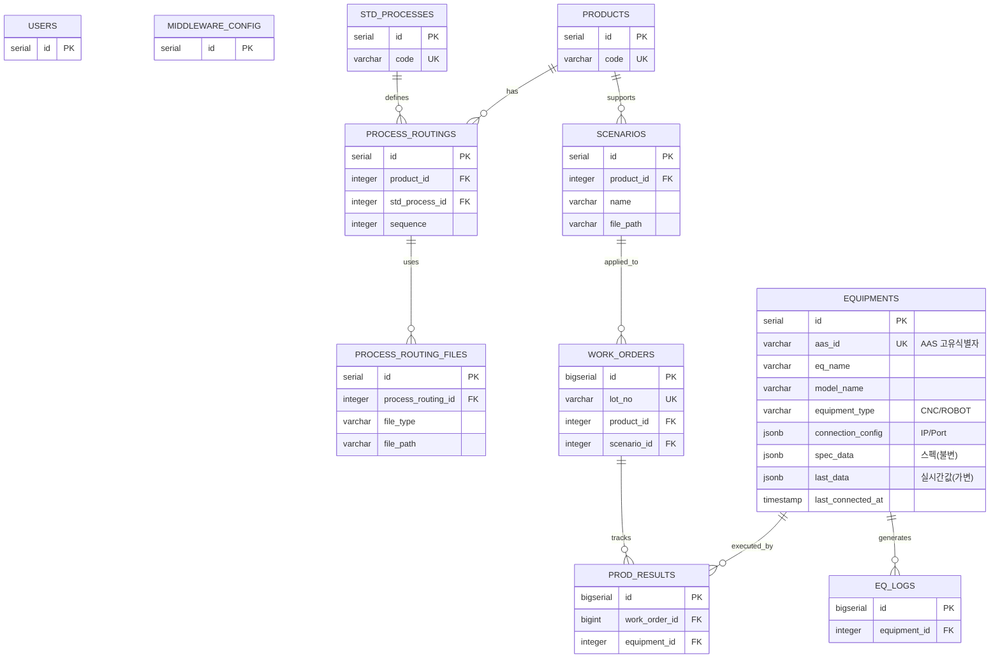

# [MES] 데이터베이스 설계 명세서 (v3.0)

## 1. 개요 (Overview)
* **Version:** 3.0
* **설계 목적:** 스마트 공장 구축을 위한 MES(Manufacturing Execution System) 표준 데이터베이스 설계.
* **주요 특징:**
    * **AAS 기반 장비 연동:** 자산 관리 쉘(Asset Administration Shell) 기반의 장비 자동 식별 및 데이터 동기화 지원.
    * **유연한 데이터 구조:** JSONB 타입을 활용하여 CNC, 로봇, PLC 등 다양한 장비의 상이한 속성 데이터를 단일 테이블에서 통합 관리.
    * **표준 공정 및 라우팅:** 품목별 생산 공정 순서(Routing)와 공정별 필요 파일(NC, 도면 등)의 1:N 매핑 구조 정의.
    * **물류 시나리오 분리:** 생산(Processing)과 물류(Logistics) 로직을 분리하여 AGV/로봇 제어 시나리오 별도 관리.

---

## 2. ERD (Entity Relationship Diagram)



---

## 3. 테이블 상세 명세 (Schema Details)

### A. 시스템 및 설정 (System)

**1. users (사용자)**

| 컬럼명               | 타입           | 설명      | 비고              |
| :---------------- | :----------- | :------ | :-------------- |
| **id**            | SERIAL (PK)  | 고유 ID   | -               |
| **username**      | VARCHAR(50)  | 로그인 ID  | Unique          |
| **password_hash** | VARCHAR(255) | 비밀번호 해시 | -               |
| **role**          | VARCHAR(20)  | 권한      | ADMIN, OPERATOR |

**2. middleware_config (미들웨어 설정)**

| 컬럼명            | 타입          | 설명    | 비고  |
| :------------- | :---------- | :---- | :-- |
| **id**         | SERIAL (PK) | 설정 ID | -   |
| **name**       | VARCHAR(50) | 설정명   | -   |
| **ip_address** | INET        | 접속 IP | -   |
| **port**       | INT         | 포트    | -   |

### B. 기준 정보 (Master Data)

**3. std_processes (표준 공정 라이브러리)**

| 컬럼명             | 타입           | 설명         | 비고                     |
| :-------------- | :----------- | :--------- | :--------------------- |
| **id**          | SERIAL (PK)  | 표준 공정 ID   | -                      |
| **code**        | VARCHAR(20)  | 표준 코드      | Unique (예: STD-CUT-01) |
| **name**        | VARCHAR(100) | 표준 공정명     | (예: 레이저 절단)            |
| **description** | TEXT         | 작업 표준(SOP) | -                      |

**4. products (품목 관리)**

| 컬럼명            | 타입           | 설명    | 비고                 |
| :------------- | :----------- | :---- | :----------------- |
| **id**         | SERIAL (PK)  | 품목 ID | -                  |
| **code**       | VARCHAR(50)  | 품목 코드 | Unique (예: ITEM-A) |
| **name**       | VARCHAR(100) | 품목명   | -                  |
| **unit**       | VARCHAR(10)  | 단위    | EA, SET            |
| **is_deleted** | BOOLEAN      | 삭제 여부 | Soft Delete용       |

**5. process_routings (품목별 공정 순서)**

| 컬럼명 | 타입 | 설명 | 비고 |
| --- | --- | --- | --- |
| **id** | SERIAL (PK) | 라우팅 ID | - |
| **product_id** | INT (FK) | 대상 품목 | - |
| **std_process_id** | INT (FK) | 사용할 표준 공정 | - |
| **sequence** | INT | 진행 순서 | 10, 20, 30... |
| **remarks** | VARCHAR | 비고 | - |

**5-1. process_routing_files (공정별 파일 매핑)**

| 컬럼명                    | 타입           | 설명        | 비고                   |
| ---------------------- | ------------ | --------- | -------------------- |
| **id**                 | SERIAL (PK)  | 파일 매핑 ID  | -                    |
| **process_routing_id** | INT (FK)     | 상위 라우팅 ID | -                    |
| **file_type**          | VARCHAR(20)  | 파일 유형     | 'NC', 'IMAGE', 'DOC' |
| **file_path**          | VARCHAR(255) | **파일 경로** | 실제 파일 위치             |
| **sort_order**         | INT          | 전송/사용 순서  | 1, 2, 3...           |

**6. scenarios (물류/로봇 시나리오)**

| 컬럼명            | 타입           | 설명           | 비고                   |
| -------------- | ------------ | ------------ | -------------------- |
| **id**         | SERIAL (PK)  | 시나리오 ID      | -                    |
| **product_id** | INT (FK)     | 대상 품목        | -                    |
| **name**       | VARCHAR(100) | 시나리오명        | 예: 1라인 로봇 핸들링        |
| **file_path**  | VARCHAR(255) | **제어 파일 경로** | 로봇/AGV 설정 파일 (.yaml) |
| **is_active**  | BOOLEAN      | 사용 여부        | -                    |

**7. equipments (설비 관리)**

| 컬럼명 | 타입 | 설명 | 비고 |
| :--- | :--- | :--- | :--- |
| **id** | SERIAL (PK) | 설비 내부 ID | MES 시스템 관리용 |
| **aas_id** | VARCHAR(100) | **AAS 고유 ID** | Unique, 미들웨어 제공 식별자 |
| **eq_name** | VARCHAR(100) | 설비명 | - |
| **model_name** | VARCHAR(100) | 모델명 | - |
| **equipment_type** | VARCHAR(20) | 장비 타입 | 'CNC', 'ROBOT', 'AMR', 'PLC' |
| **connection_config** | JSONB | **연결 정보** | IP, Port, Protocol |
| **spec_data** | JSONB | **장비 제원(Static)** | 제조사, 스펙, 축 수 등 (불변) |
| **last_data** | JSONB | **실시간 데이터** | 폴링된 최신 값 캐싱 (가변) |
| **current_status** | VARCHAR(20) | 현재 상태 | RUN, STOP, ERROR |
| **updated_at** | TIMESTAMP | 데이터 갱신 시간 | - |
| **last_connected_at**| TIMESTAMP | **최근 연결 시간** | AAS 통신 성공 시점 |
| **is_deleted** | BOOLEAN | 삭제 여부 | - |

### C. 생산 관리 (Transaction Data)

**8. work_orders (작업 지시)**

| 컬럼명             | 타입             | 설명          | 비고                   |
| :-------------- | :------------- | :---------- | :------------------- |
| **id**          | BIGSERIAL (PK) | 지시 ID       | -                    |
| **lot_no**      | VARCHAR(50)    | **Lot 번호**  | Unique Key           |
| **product_id**  | INT (FK)       | 생산 품목       | -                    |
| **scenario_id** | INT (FK)       | **적용 시나리오** | 물류/로봇 제어용            |
| **target_qty**  | INT            | 목표 수량       | -                    |
| **status**      | VARCHAR(20)    | 진행 상태       | READY, RUNNING, DONE |
| **created_at**  | TIMESTAMP      | 지시 시간       | -                    |

**9. prod_results (생산 실적)**

| 컬럼명 | 타입 | 설명 | 비고 |
| :--- | :--- | :--- | :--- |
| **id** | BIGSERIAL (PK) | 실적 ID | - |
| **work_order_id** | BIGINT (FK) | 작업 지시 | - |
| **process_routing_id** | INT (FK) | **수행 라우팅** | 어떤 공정 단계인가? |
| **equipment_id** | INT (FK) | 수행 설비 | - |
| **ok_qty** | INT | 양품 수량 | - |
| **ng_qty** | INT | 불량 수량 | - |
| **start_time** | TIMESTAMP | 시작 시간 | - |
| **end_time** | TIMESTAMP | 종료 시간 | - |

**10. eq_logs (설비 로그)**

| 컬럼명 | 타입 | 설명 | 비고 |
| :--- | :--- | :--- | :--- |
| **id** | BIGSERIAL (PK) | 로그 ID | - |
| **equipment_id** | INT (FK) | 대상 설비 | - |
| **level** | VARCHAR(10) | 로그 레벨 | INFO, WARN, ERROR |
| **message** | TEXT | 로그 내용 | - |
| **occurred_at** | TIMESTAMP | 발생 시간 | - |

---

## 4. SQL 쿼리 (Complete DDL Script)

```sql
-- 1. Users & System Config
CREATE TABLE users (
    id SERIAL PRIMARY KEY,
    username VARCHAR(50) UNIQUE NOT NULL,
    password_hash VARCHAR(255) NOT NULL,
    role VARCHAR(20) DEFAULT 'OPERATOR',
    created_at TIMESTAMP DEFAULT CURRENT_TIMESTAMP
);

CREATE TABLE middleware_config (
    id SERIAL PRIMARY KEY,
    name VARCHAR(50) NOT NULL,
    ip_address INET NOT NULL,
    port INTEGER NOT NULL
);

-- 2. Master Data (Standards)
CREATE TABLE std_processes (
    id SERIAL PRIMARY KEY,
    code VARCHAR(20) UNIQUE NOT NULL, 
    name VARCHAR(100) NOT NULL,       
    description TEXT,                 
    created_at TIMESTAMP DEFAULT CURRENT_TIMESTAMP
);

CREATE TABLE products (
    id SERIAL PRIMARY KEY,
    code VARCHAR(50) UNIQUE NOT NULL,
    name VARCHAR(100) NOT NULL,
    unit VARCHAR(10) DEFAULT 'EA',
    is_deleted BOOLEAN DEFAULT FALSE,
    created_at TIMESTAMP DEFAULT CURRENT_TIMESTAMP
);

-- 3. Equipments (AAS Integrated)
CREATE TABLE equipments (
    id SERIAL PRIMARY KEY,
    aas_id VARCHAR(100) UNIQUE,        -- AAS 식별자
    eq_name VARCHAR(100) NOT NULL,
    model_name VARCHAR(100),
    equipment_type VARCHAR(20) NOT NULL DEFAULT 'CNC',
    
    connection_config JSONB NOT NULL DEFAULT '{}', -- 연결 정보
    spec_data JSONB DEFAULT '{}',                  -- 고정 제원
    last_data JSONB DEFAULT '{}',                  -- 실시간 값
    
    current_status VARCHAR(20) DEFAULT 'STOP',
    updated_at TIMESTAMP DEFAULT CURRENT_TIMESTAMP,
    last_connected_at TIMESTAMP,
    is_deleted BOOLEAN DEFAULT FALSE
);
CREATE INDEX idx_equipments_aas ON equipments(aas_id);

-- 4. Routing & Scenarios
CREATE TABLE process_routings (
    id SERIAL PRIMARY KEY,
    product_id INTEGER NOT NULL REFERENCES products(id),
    std_process_id INTEGER NOT NULL REFERENCES std_processes(id),
    sequence INTEGER NOT NULL,
    remarks VARCHAR(255),
    UNIQUE(product_id, sequence),
    created_at TIMESTAMP DEFAULT CURRENT_TIMESTAMP
);

CREATE TABLE process_routing_files (
    id SERIAL PRIMARY KEY,
    process_routing_id INTEGER NOT NULL REFERENCES process_routings(id) ON DELETE CASCADE,
    file_type VARCHAR(20) DEFAULT 'NC',
    file_path VARCHAR(255) NOT NULL,
    sort_order INTEGER DEFAULT 1,
    created_at TIMESTAMP DEFAULT CURRENT_TIMESTAMP
);

CREATE TABLE scenarios (
    id SERIAL PRIMARY KEY,
    product_id INTEGER REFERENCES products(id),
    name VARCHAR(100) NOT NULL,
    file_path VARCHAR(255) NOT NULL,
    is_active BOOLEAN DEFAULT TRUE,
    created_at TIMESTAMP DEFAULT CURRENT_TIMESTAMP
);

-- 5. Transaction Data
CREATE TABLE work_orders (
    id BIGSERIAL PRIMARY KEY,
    lot_no VARCHAR(50) UNIQUE NOT NULL,
    product_id INTEGER REFERENCES products(id),
    scenario_id INTEGER REFERENCES scenarios(id),
    target_qty INTEGER NOT NULL,
    status VARCHAR(20) DEFAULT 'READY',
    created_at TIMESTAMP DEFAULT CURRENT_TIMESTAMP
);

CREATE TABLE prod_results (
    id BIGSERIAL PRIMARY KEY,
    work_order_id BIGINT REFERENCES work_orders(id),
    process_routing_id INTEGER REFERENCES process_routings(id),
    equipment_id INTEGER REFERENCES equipments(id),
    ok_qty INTEGER DEFAULT 0,
    ng_qty INTEGER DEFAULT 0,
    start_time TIMESTAMP,
    end_time TIMESTAMP
);

CREATE TABLE eq_logs (
    id BIGSERIAL PRIMARY KEY,
    equipment_id INTEGER REFERENCES equipments(id),
    level VARCHAR(10) DEFAULT 'INFO',
    message TEXT,
    occurred_at TIMESTAMP DEFAULT CURRENT_TIMESTAMP
);

-- Indexes
CREATE INDEX idx_routing_product ON process_routings(product_id);
CREATE INDEX idx_routing_files ON process_routing_files(process_routing_id);
CREATE INDEX idx_results_wo ON prod_results(work_order_id);

```
