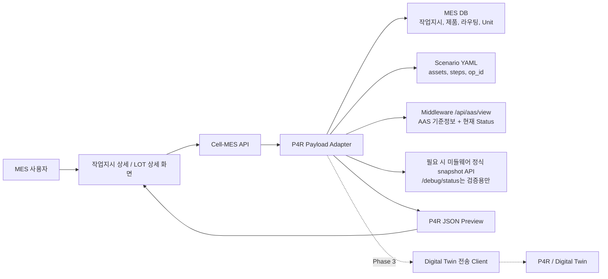

# Digital Twin P4R JSON Adapter 구현 계획

작성일: 2026-08-04  
대상 저장소: `agents/cell-mes`  
연동 대상 미들웨어: `/Users/beomhwanham/Desktop/kitech/robot/middleware/am-middleware`  
대표 테스트 LOT: `LOT-20260730-001`

## 1. 결론 먼저 보기

현재 상태 기준으로 **어댑터 1차 구현은 충분히 가능하다.**

다만 중요한 전제가 있다.

1. MES가 P4R JSON의 생산계획, 제품, 공정, 수량, LOT 정보를 만든다.
2. 미들웨어는 기존 MES 연동 흐름과 동일하게 `/api/aas/view`를 통해 AAS 기준정보와 장비 현재 상태를 제공한다.
3. P4R JSON에 포함할 장비는 MES 전체 장비가 아니라, 해당 작업지시가 실행한 `scenario yaml`의 `assets[].name` 기준으로 선택한다.
4. 1차 구현의 기본 조회 경로는 기존 MES 설비 동기화/폴링과 같은 `/api/aas/view`다.
5. `/api/aas/view`에 없는 값이 P4R에 반드시 필요하면 MES가 디버그 API를 직접 호출하지 않고, 기존 `Queries`는 그대로 둔 채 미들웨어 AAS `Status`에 같은 값을 추가 노출한다.
6. 완료된 LOT의 과거 상태를 정확히 재현하려면 별도 스냅샷 저장이 필요하다. 1차 구현에서는 "현재 시점의 장비 상태 + MES의 완료 LOT 정보"를 조합한다.
7. 기존 시나리오가 사용 중인 AAS `Queries`, `Commands`, Gateway 설정은 P4R 작업 때문에 삭제/이동/이름변경하지 않는다.

따라서 1차 구현의 목표는 다음이다.

> MES에서 특정 LOT를 선택하면, 해당 작업지시와 시나리오에 필요한 장비만 골라 P4R JSON 미리보기 payload를 생성한다. 이때 기준값과 현재 상태는 우선 미들웨어 `/api/aas/view`의 AAS view에서 읽는다.

### 안전 원칙

P4R 연동을 위해 AAS를 보강할 때는 다음 원칙을 지킨다.

| 원칙 | 설명 |
| --- | --- |
| 기존 값 유지 | 기존 `Queries`, `Commands`, `Status`, Gateway extension은 삭제하거나 이름을 바꾸지 않는다. |
| 이동 금지 | `Queries`에 있는 값을 `Status`로 옮기지 않는다. |
| 복제 추가 | P4R에서 실시간으로 필요한 값이 `Status`에 없으면, 기존 `Queries`는 그대로 두고 `Status`에 같은 의미의 Property를 추가한다. |
| 시나리오 보호 | 현재 YAML 시나리오는 `Queries` 경로를 사용하므로, P4R 보강으로 실행 경로가 깨지면 안 된다. |
| 최소 변경 | P4R에 필요한 실시간값만 `Status`에 추가하고, P4R과 무관한 기존 AAS 구조는 건드리지 않는다. |

## 2. 구현 위치 결정

### 권장안

**1차 구현은 Cell-MES 백엔드 내부에 어댑터를 둔다.**

이유:

| 항목 | 판단 |
| --- | --- |
| LOT, 작업지시, 제품, 라우팅, Unit 정보 | MES DB가 원천이다. |
| 어떤 장비를 포함할지 | MES 작업지시에 연결된 scenario yaml을 MES가 알고 있다. |
| JSON 생성 시점 | 사용자가 MES에서 LOT 또는 작업지시를 선택하는 시점이다. |
| UI 미리보기 | MES 화면에서 바로 보여주는 것이 자연스럽다. |
| 초기 구현 영향도 | 별도 서비스보다 배포와 테스트가 단순하다. |

### 별도 서비스가 더 좋은 경우

다음 조건이 생기면 별도 `digital-twin-adapter-service`로 분리하는 것이 좋다.

| 조건 | 이유 |
| --- | --- |
| MES 외의 여러 시스템도 같은 P4R JSON을 요청 | 공통 변환 서비스가 필요하다. |
| 디지털트윈 플랫폼으로 자동 전송, 재시도, 이력 관리가 필요 | 큐와 장애 격리가 필요하다. |
| AAS 상태를 고주기로 별도 수집해야 함 | MES API 요청 흐름과 분리해야 한다. |
| P4R 스키마 버전이 여러 개로 늘어남 | 변환 로직을 별도 도메인으로 관리하는 편이 안전하다. |

현재 단계에서는 별도 서비스가 오히려 복잡도를 키운다. 따라서 **MES 내부 어댑터로 시작하고, 전송 자동화와 이력 저장이 필요해질 때 분리**하는 구조가 가장 적합하다.

## 3. 전체 아키텍처



핵심은 `Adapter`가 데이터를 직접 만들지만, 장비 상태값은 기존 MES 설비 폴링과 같은 AAS view 흐름을 재사용한다는 점이다.

## 4. 데이터 출처 분리

### 4.1 MES에서 가져올 값

| P4R 관점 | MES 출처 | 현재 가능 여부 | 비고 |
| --- | --- | --- | --- |
| `PRODUCT_INFO.PRODUCT_ID` | `products.code` | 가능 | 예: `PLAT-A002` |
| 제품명 | `products.name` | 가능 | P4R 필수키가 아니면 metadata에만 둔다. |
| `PRODUCTION_PLAN_ID` | `work_orders.lot_no` | 가능 | 예: `PPS_LOT-20260730-001` |
| `PRODUCTION_VOLUME` | `work_orders.target_qty` 또는 `qty` | 가능 | 기준 수량. |
| `CURRENT_VOLUME` | `work_orders.completed_qty` | 가능 | 완료 수량. |
| 공정 목록 | `process_routings` | 가능 | LOAD, MILL, UNLOAD 등. |
| 표준 공정 시간 | `process_routings.cycle_time_sec` | 가능 | `PROCESSING_TIME`으로 매핑. |
| NC 프로그램 | `process_routing_files.original_filename` | 가능 | 예: `O0012`. |
| Unit 상태 | `units.status`, `unit_no` | 가능 | WIP 계산 보조. |
| 현재 미들웨어 Unit 상태 | `/middleware-state` API | 가능 | DB 저장 없이 read-through. |

### 4.2 Scenario YAML에서 가져올 값

| 값 | 사용 이유 | 예시 |
| --- | --- | --- |
| `assets[].id` | 시나리오 내부 alias | `NC1`, `ANT`, `UR` |
| `assets[].name` | 실제 AAS asset id | `NX5500`, `ANT_AMR`, `UR_ROBOT` |
| `steps[].op_id` | 공정 operation 흐름 보조 | `OP-B01`, `OP-B02` |
| `steps[].action` | 어떤 장비 Gateway 값을 쓰는지 추적 | `CNC_DIE/HttpGateway/Queries/availableInputSlot` |
| `steps[].acquire` | 자원 점유 흐름 추정 | `FEEDER`, `ANT`, `DIE` |

가장 중요한 규칙:

> P4R JSON에 넣을 장비 목록은 `scenario yaml`의 `assets[].name`에서 뽑는다.

즉, MES에 등록된 모든 장비를 넣지 않는다.

Cell 1 기준 시나리오에서는 다음 장비만 대상이다.

| YAML alias | 실제 AAS asset | P4R 분류 |
| --- | --- | --- |
| `NC1` | `NX5500` | `MACHINE_INSTANCE` |
| `FEEDER` | `FEEDER` | `MACHINE_INSTANCE` |
| `ANT` | `ANT_AMR` | `MM_INSTANCE` |
| `UR` | `UR_ROBOT` | `MHR_INSTANCE` |
| `DIE` | `CNC_DIE` | `BUFFER_INSTANCE` |

### 4.3 `/api/aas/view`에서 가져올 값

AASX는 정적 모델이고, 미들웨어는 이를 로드한 뒤 `/api/aas/view`로 MES가 보기 쉬운 계층형 AAS view를 제공한다. Cell-MES의 기존 설비 동기화와 폴링도 이 API를 사용한다.

```http
GET {MIDDLEWARE_URL}/api/aas/view
```

응답은 미들웨어 공통 규칙을 따른다.

```json
{
  "status": "success",
  "data": [
    {
      "id": "NX5500",
      "idShort": "NX5500",
      "submodels": {
        "cncGateway": {
          "IsConnected": true,
          "Status": {}
        },
        "DtSimulationProfile": {}
      }
    }
  ]
}
```

현재 `assets.aasx`에는 Cell 1 주요 자산에 `DtSimulationProfile`을 추가해두었다.

| 장비 | `DtSimulationProfile` 역할 |
| --- | --- |
| `NX5500` | CNC 타입, capacity, MTTR/MTBF, WIP status key |
| `ANT_AMR` | MM 타입, 속도, capacity, battery, 위치 key |
| `UR_ROBOT` | MHR/CR 타입, capacity, 상태 key |
| `FEEDER` | feeder 타입, capacity, loader/unloader key |
| `CNC_DIE` | buffer 타입, slot capacity, slot status key |

`DtSimulationProfile` 값들은 자주 변하지 않는 기준값이다.

예:

| P4R 키 | AASX 기준값 |
| --- | --- |
| `MACHINE_TYPE_ID` | `DtSimulationProfile.machineTypeId` |
| `RESOURCE_TYPE` | `DtSimulationProfile.resourceType` |
| `CAPACITY` | `DtSimulationProfile.capacity` |
| `MEAN_TIME_TO_REPAIR` | `DtSimulationProfile.meanTimeToRepair` |
| `MEAN_TIME_BETWEEN_FAILURE` | `DtSimulationProfile.meanTimeBetweenFailure` |
| `MM_TYPE.OPERATION_SPEED` | `DtSimulationProfile.operationSpeed` |
| `MM_TYPE.BATTERY_CAPACITY` | `DtSimulationProfile.batteryCapacity` |
| `BUFFER_TYPE.CAPACITY` | `DtSimulationProfile.slotCapacity` |

### 4.4 `/api/aas/view`에서 바로 읽을 수 있는 현재 상태

미들웨어 `/api/aas/view`는 Gateway 서브모델에 대해 `IsConnected`와 `Status`만 포함한다. 따라서 MES가 현재 설비 상태를 읽는 방향은 다음과 같다.

| 값 | 조회 위치 | 비고 |
| --- | --- | --- |
| 연결 상태 | `{gateway}.IsConnected` | 기존 MES polling에서도 사용. |
| CNC 상태 | `cncGateway.Status` | door, vise, execution 등 Status에 들어온 값 기준. |
| Robot 상태 | `robotGateway.Status` | IDLE, BUSY, RUNNING 등 Status에 들어온 값 기준. |
| HTTP/RACK 상태 | `httpGateway.Status` | Status에 포함된 값 기준. |
| DT 기준정보 | `DtSimulationProfile` | 비-gateway submodel이라 `/api/aas/view`에 포함 가능. |

즉, 1차 P4R 어댑터는 `/api/debug/status`가 아니라 `/api/aas/view`를 기본으로 사용한다.

### 4.5 `/api/aas/view`에 없는 값 처리

이전 검토에서 언급한 다음 API는 미들웨어에 존재한다.

```http
GET /api/debug/status?path={asset}/{gateway}/Queries/{queryName}
```

하지만 이 API는 이름 그대로 단일 AAS 요소를 테스트하기 위한 디버그 경로다. MES의 정식 P4R 어댑터가 기본적으로 의존할 경로로 잡으면 방향성이 맞지 않는다.

따라서 `/api/aas/view`에 없는 값이 P4R에 꼭 필요하면 다음 순서로 개선한다.

| 우선순위 | 처리 |
| --- | --- |
| 1 | 이미 `/api/aas/view`의 `Status`에 있는 값이면 그대로 사용 |
| 2 | 장비 현재 상태로 계속 필요한 값이면 기존 `Queries`는 유지하고 미들웨어 AAS `Status`에 같은 의미의 Property를 추가 |
| 3 | `Status`에 넣기 애매한 다중 query 값이면 미들웨어에 read-only `digital-twin snapshot` API 추가 |
| 4 | `/api/debug/status`는 개발/현장 검증용으로만 사용 |

### 4.6 현재 AASX의 Status 포함 여부 점검

2026-08-04에 `/Users/beomhwanham/Desktop/kitech/robot/middleware/am-middleware/aasx/assets.aasx` 파일을 기준으로 Cell 1 관련 자산의 Gateway `Status`/`Queries` 배치를 다시 확인했고, P4R 실시간 후보값을 `Status`에 복제 추가했다.

결론:

> 기존 `Queries`는 그대로 유지했고, P4R에서 실시간으로 확인해야 하는 값은 같은 의미의 `Status` Property로 추가했다. 따라서 MES P4R 어댑터는 `/api/aas/view`의 `Status`에서 이 값을 읽을 수 있다.

| 자산 | 현재 `Status`에 있음 | 현재 `Queries`에 있음 | 판단 |
| --- | --- | --- | --- |
| `NX5500` | `is_door_open`, `is_door_closed`, `is_vise_open`, `is_vise_closed`, `is_M20` | 동일 항목 유지 | 완료 |
| `DH400` | 기존 `ModbusGateway.Status.ViseState` | `CncGateway.Queries.execution_status` | Cell 1 범위 밖. 필요 시 별도 보강 |
| `ANT_AMR` | `availableInputSlot`, `occupiedInputSlot`, `availableOutputSlot`, `occupiedOutputSlot`, `status`, `agvPositionX/Y/Theta`, `batteryCharge`, `velocity` | 동일 항목 유지 | 완료 |
| `UR_ROBOT` | `occupiedInputSlot`, `availableOutputSlot`, `availableInputSlot`, `status`, `batteryCharge`, `manipulatorState` | 동일 항목 유지 | 완료 |
| `FEEDER` | `loaderCount`, `unloaderCount`, `status` | 동일 항목 유지 | 완료 |
| `CNC_DIE` | `availableInputSlot`, `availableOutputSlot`, `allSlots`, `occupiedInputSlot`, `occupiedOutputSlot` | 동일 항목 유지 | 완료 |

정리 기준:

| 분류 | AAS 위치 |
| --- | --- |
| 대시보드, MES, P4R이 계속 참조하는 현재 상태 | `Status` |
| 레시피 스텝이 필요할 때만 읽는 의사결정 값 | `Queries` |
| 상태에서 파생 가능한 값 | 원천 상태를 `Status`에 두고 어댑터에서 계산 |

예를 들어 `availableInputSlot`처럼 "첫 빈 슬롯"을 찾는 값은 레시피 의사결정에는 `Queries`가 맞다. 이 값은 기존 시나리오가 쓰고 있으므로 그대로 두었다. P4R/MES가 `/api/aas/view`에서 상태로 읽을 수 있도록 같은 항목을 `Status`에도 추가했다.

## 5. P4R JSON 매핑 계획

### 5.1 최상위 섹션별 출처

| P4R 섹션 | 생성 여부 | 주 출처 | 비고 |
| --- | --- | --- | --- |
| `PRODUCT_INFO` | 생성 | MES Product | 제품 코드 기준. |
| `MATERIAL_INFO` | 생성 | MES Product + 규칙 | 현재 MES에 MATERIAL 테이블 없음. |
| `PROCESS_INFO` | 생성 | MES Routing | LOAD/MILL/UNLOAD 기준. |
| `MATERIAL_HANDLING_INFO` | 생성 | Scenario + AAS profile | AMR/MM이 있으면 생성. |
| `MACHINE_TYPE` | 생성 | AAS profile | CNC, FEEDER 등. |
| `BUFFER_TYPE` | 생성 | AAS profile | CNC_DIE. |
| `MM_TYPE` | 생성 | AAS profile | ANT_AMR. |
| `MHR_TYPE` | 생성 | AAS profile | UR_ROBOT. |
| `PRODUCTION_PLAN` | 생성 | MES WorkOrder | LOT 단위. |
| `MACHINE_INSTANCE` | 생성 | Scenario assets + AAS view | NX5500, FEEDER. |
| `BUFFER_INSTANCE` | 생성 | Scenario assets + AAS view | CNC_DIE. |
| `MM_INSTANCE` | 생성 | Scenario assets + AAS view | ANT_AMR. |
| `MHR_INSTANCE` | 생성 | Scenario assets + AAS view | UR_ROBOT. |

### 5.2 `MATERIAL_ID` 규칙

현재 MES DB에는 별도 Material/BOM 테이블이 없다. 따라서 1차 구현은 규칙 기반으로 생성한다.

권장 규칙:

```text
MATERIAL_ID = "MT_" + PRODUCT_ID
```

예:

```text
PRODUCT_ID = PLAT-A002
MATERIAL_ID = MT_PLAT-A002
```

향후 개선:

| 개선안 | 필요 시점 |
| --- | --- |
| `materials` 테이블 추가 | 실제 소재 품번, 소재 lot, BOM을 MES에서 관리해야 할 때 |
| 제품별 기본 소재 등록 | 제품 하나가 여러 소재를 소비할 때 |
| Unit별 소재 추적 | 재공품 단위 이력과 품질 추적이 필요할 때 |

1차 구현에서는 DB 변경 없이 규칙 기반 생성이 맞다.

### 5.3 공정 매핑 규칙

MES Routing을 기준으로 `PROCESS_INFO`를 만든다.

| MES Routing | P4R 생성 예 |
| --- | --- |
| `LOAD` | `PROCESS_INFO_ID = PP_{PRODUCT_ID}_LOAD` |
| `MILL` | `PROCESS_INFO_ID = PP_{PRODUCT_ID}_MILL` |
| `UNLOAD` | `PROCESS_INFO_ID = PP_{PRODUCT_ID}_UNLOAD` |

`PROCESS_OPERATION_INFO`는 라우팅의 장비 타입과 시나리오 장비를 조합한다.

예:

| MES 공정 | 장비 후보 | P4R operation |
| --- | --- | --- |
| LOAD | `FEEDER`, `ANT_AMR` | `OR_{PRODUCT_ID}_LOAD_FEEDER` 또는 handling 분리 |
| MILL | `NX5500` | `OR_{PRODUCT_ID}_MILL_NX5500` |
| UNLOAD | `FEEDER`, `ANT_AMR` | `OR_{PRODUCT_ID}_UNLOAD_FEEDER` 또는 handling 분리 |

주의:

`scenario yaml`의 `op_id`는 실제 실행 스텝 묶음이고, MES Routing은 생산계획 관점의 공정이다. 1차 구현에서는 **MES Routing을 P4R 공정의 기준**으로 삼고, `op_id`는 검증/trace metadata로만 사용한다.

## 6. LOT 기준 장비 선택 방식

### 6.1 1차 구현 규칙

1. `work_orders.lot_no` 또는 `order_id`로 작업지시를 찾는다.
2. 작업지시에 연결된 `scenario_id`를 찾는다.
3. `scenarios.file_path`의 YAML 파일을 읽는다.
4. YAML의 `assets[].name`만 추출한다.
5. 추출된 asset만 P4R instance/type에 포함한다.

이렇게 하면 Cell-MES에 등록된 전체 장비가 아니라, 실제 해당 작업지시 시나리오에 쓰인 장비만 JSON에 들어간다.

### 6.2 향후 우선순위

나중에 MES에서 장비 배정 기능이 생기면 다음 순서로 판단한다.

| 우선순위 | 출처 | 설명 |
| --- | --- | --- |
| 1 | MES 장비 배정 테이블 | 작업지시 또는 Unit에 명시 배정된 장비 |
| 2 | 미들웨어 Unit `acq_map` | 실행 중 실제 점유/배정된 장비 |
| 3 | Scenario YAML `assets[].name` | 현재 1차 구현 기준 |

현재는 3번이 가장 현실적이다.

## 7. 신규 API 계획

### 7.1 1차 API

기존 Cell-MES에 `/integrations/dtp` 라우터가 있으므로, 디지털트윈/P4R 관련 API도 이 영역에 붙이는 것이 자연스럽다.

```http
GET /api/v1/integrations/dtp/p4r-payload/preview?lot_no=LOT-20260730-001
```

응답은 운영자가 확인하기 쉽도록 wrapper를 둔다.

```json
{
  "status": "success",
  "lot_no": "LOT-20260730-001",
  "generated_at": "2026-08-04T10:30:00+09:00",
  "payload": {},
  "warnings": [],
  "sources": {
    "mes": {},
    "scenario": {},
    "aas": {}
  }
}
```

`payload` 안에는 실제 P4R JSON을 그대로 넣는다.

이유:

| 필드 | 이유 |
| --- | --- |
| `payload` | 디지털트윈에 넘길 원문 JSON. |
| `warnings` | 누락값, default 적용, 실시간 조회 실패를 사용자에게 보여주기 위함. |
| `sources` | 어떤 DB/시나리오/AAS 값을 사용했는지 검증하기 위함. |

### 7.2 원문 JSON만 필요한 경우

캡처나 파일 저장, 외부 시스템 전달용으로 원문만 받을 수 있게 옵션을 둘 수 있다.

```http
GET /api/v1/integrations/dtp/p4r-payload/preview?lot_no=LOT-20260730-001&raw=true
```

`raw=true`이면 wrapper 없이 P4R JSON만 반환한다.

### 7.3 Phase 3 전송 API

실제 디지털트윈 플랫폼으로 전송해야 할 때 추가한다.

```http
POST /api/v1/integrations/dtp/p4r-payload/send
```

요청:

```json
{
  "lot_no": "LOT-20260730-001",
  "dry_run": false
}
```

응답:

```json
{
  "status": "success",
  "lot_no": "LOT-20260730-001",
  "sent_at": "2026-08-04T10:30:00+09:00",
  "dt_response": {}
}
```

전송 API는 디지털트윈 수신 endpoint와 인증 방식이 확정된 뒤 구현한다. 1차에는 preview까지만 구현하는 것이 안전하다.

## 8. 백엔드 파일 단위 구현 계획

### 8.1 신규 파일

```text
src/app/services/digital_twin/
  __init__.py
  aas_client.py
  p4r_adapter.py
  scenario_asset_parser.py
  p4r_mapping.py

src/app/schemas/digital_twin.py
```

역할:

| 파일 | 역할 |
| --- | --- |
| `aas_client.py` | 미들웨어 `/api/aas/view` 호출과 AAS view 정규화 |
| `scenario_asset_parser.py` | scenario yaml에서 asset, step, op_id 추출 |
| `p4r_mapping.py` | MES/AAS 값을 P4R 키로 변환하는 순수 매핑 함수 |
| `p4r_adapter.py` | 전체 orchestration: DB 조회, YAML 파싱, AAS 조회, payload 조립 |
| `schemas/digital_twin.py` | preview response, warning, source summary schema |

### 8.2 수정 파일

```text
src/app/api/v1/endpoints/dtp.py
src/app/api/v1/api.py
src/app/core/config.py
```

| 파일 | 수정 내용 |
| --- | --- |
| `dtp.py` | P4R preview endpoint 추가 |
| `api.py` | 기존 `/integrations/dtp` 라우터 그대로 사용하므로 큰 변경 없음 |
| `config.py` | 필요 시 `P4R_ADAPTER_TIMEOUT`, `P4R_USE_LIVE_AAS` 정도만 추가 |

### 8.3 기존 AAS 조회 흐름 재사용 기준

Cell-MES에는 이미 다음 AAS 조회 흐름이 있다.

| 파일 | 현재 역할 |
| --- | --- |
| `src/clients/middleware_client.py` | `GET /api/aas/view` 호출 |
| `src/app/services/aas_scheduler_info.py` | AAS 응답 정규화 |
| `src/app/services/sync_service.py` | AAS 기반 설비 동기화 |
| `src/app/services/polling_service.py` | AAS view 기반 설비 상태 폴링 |

따라서 P4R 어댑터는 완전히 다른 통신 경로를 새로 잡지 말고, 기존 `/api/aas/view` 조회 흐름을 우선 재사용한다.

다만 최근 추가한 `src/app/services/middleware_client.py`는 Lot/Unit 제어용 client이고, 미들웨어의 업무 API 응답 규칙을 강제한다.

```json
{
  "status": "success",
  "data": {}
}
```

P4R 어댑터에서는 다음처럼 역할을 나누는 것이 안전하다.

| Client | 대상 |
| --- | --- |
| `MiddlewareClient` | Lot, Unit 상태/제어 API |
| 기존 `src/clients/middleware_client.py` 또는 신규 `AasViewClient` | `/api/aas/view` 기반 AAS 상태 조회 |

1차 구현에서는 기존 client를 재사용해도 되고, 코드 경계를 명확히 하려면 얇은 `AasViewClient` wrapper만 추가한다.

## 9. AAS 조회 상세 계획

### 9.1 기본 조회

1차 구현의 기본 조회는 다음 하나다.

```http
GET {MIDDLEWARE_URL}/api/aas/view
```

이 API는 기존 Cell-MES 설비 동기화/상태 폴링에서 이미 사용 중이다. 따라서 어댑터도 같은 데이터를 기준으로 P4R JSON을 생성한다.

`/api/aas/view`에서 asset을 찾는 기준:

| 기준 | 설명 |
| --- | --- |
| `id` | AAS asset id. 예: `NX5500` |
| `idShort` | 표시명. 예: `NX5500` |
| `submodels` | `cncGateway`, `robotGateway`, `httpGateway`, `DtSimulationProfile` 등 |

### 9.2 기준값 조회

`DtSimulationProfile`은 gateway submodel이 아니므로 `/api/aas/view`의 `submodels`에 포함될 수 있다.

예상 위치:

```text
asset.submodels.DtSimulationProfile
```

이 값을 P4R의 `MACHINE_TYPE`, `MM_TYPE`, `MHR_TYPE`, `BUFFER_TYPE` 기준값으로 사용한다.

### 9.3 현재 상태 조회

`/api/aas/view`는 gateway submodel에서 `IsConnected`와 `Status`를 제공한다.

예상 위치:

```text
asset.submodels.cncGateway.IsConnected
asset.submodels.cncGateway.Status
asset.submodels.robotGateway.IsConnected
asset.submodels.robotGateway.Status
asset.submodels.httpGateway.IsConnected
asset.submodels.httpGateway.Status
```

P4R에 넣을 현재 상태는 여기서 우선 가져온다.

| P4R 목적 | AAS view 출처 |
| --- | --- |
| 장비 연결 여부 | `*.IsConnected` |
| 장비 동작 상태 | `*.Status.status` 또는 장비별 Status 필드 |
| CNC door/vise/M20 등 | `cncGateway.Status`에 포함된 값 |
| Robot 상태 | `robotGateway.Status`에 포함된 값 |
| Rack/Die 상태 | `httpGateway.Status`에 포함된 값 |

### 9.4 `/api/aas/view`에 없는 값

P4R에 필요한데 `/api/aas/view`에 없는 값이 있으면, MES 어댑터가 임의로 `/api/debug/status`를 호출하는 방향으로 가지 않는다.

대신 다음 중 하나를 선택한다.

| 방법 | 적용 기준 |
| --- | --- |
| Gateway `Status`에 복제 추가 | 대시보드/상태조회/P4R에서 계속 필요한 대표 상태값. 기존 `Queries`는 유지 |
| 전용 snapshot API 추가 | P4R 전송 때만 필요한 여러 query 값을 한 번에 읽어야 할 때 |
| warning + 빈 값 | 1차 preview에서 없어도 JSON 생성이 가능한 값 |

### 9.5 운영형 snapshot API 개선안

`Status`에 추가하기 애매한 복합 snapshot이 확정되면 미들웨어에 다음 전용 API를 추가할 수 있다. 다만 Cell 1의 현재 P4R 실시간값은 우선 AAS `Status` 추가로 해결하는 것이 기본 방향이다.

```http
GET /api/digital-twin/assets/{asset_id}/snapshot
```

또는 여러 장비 일괄 조회:

```http
POST /api/digital-twin/assets/snapshot
```

요청:

```json
{
  "assets": ["NX5500", "FEEDER", "ANT_AMR", "UR_ROBOT", "CNC_DIE"]
}
```

응답:

```json
{
  "status": "success",
  "data": {
    "assets": {
      "ANT_AMR": {
        "profile": {},
        "runtime": {}
      }
    }
  }
}
```

이 개선안의 장점:

| 장점 | 설명 |
| --- | --- |
| MES 요청 수 감소 | 장비별 여러 query를 한 번에 처리 가능. |
| 권한 제어 명확 | read-only snapshot만 허용. |
| path injection 방지 | MES가 임의 Gateway command path를 보내지 않음. |
| 미들웨어 책임 명확 | 장비값 해석은 장비와 가까운 미들웨어에서 처리. |

다만 이 API는 미들웨어 코드 수정이 필요하므로, 1차 MES 어댑터 구현의 기본 방향으로 두지 않는다. 1차는 `/api/aas/view` 기준으로 시작하고, 필요한 값은 기존 `Queries`를 보존한 채 `Status`에 추가한다.

## 10. LOT-20260730-001 기준 예시

현재 확인된 DB 기준:

| 항목 | 값 |
| --- | --- |
| LOT | `LOT-20260730-001` |
| 작업지시 ID | `145` |
| 제품 | `PLAT-A002` |
| 제품명 | `드릴 지그 플레이트(cell1)` |
| 목표수량 | `4` |
| 완료수량 | `4` |
| 상태 | `DONE` |
| 시나리오 | `cell1 가공시나리오` |
| 시나리오 파일 | `scenario_cell1_m20.yaml` |
| 사용 장비 | `NX5500`, `FEEDER`, `ANT_AMR`, `UR_ROBOT`, `CNC_DIE` |
| NC 파일 | `O0012` |

주의:

이 LOT는 완료된 LOT다. 따라서 `PRODUCTION_PLAN.CURRENT_VOLUME = 4`는 MES에서 정확히 만들 수 있다. 하지만 `/api/aas/view`에서 읽는 장비 상태값은 "2026-07-30 완료 당시 값"이 아니라 "JSON 생성 시점의 현재값"이다.

과거 완료 시점 상태까지 정확히 남기려면 Phase 4에서 snapshot 테이블을 추가해야 한다.

## 11. 구현 단계

### Phase 1. Preview 어댑터

목표:

LOT 번호를 넣으면 P4R JSON을 생성해서 화면 또는 API에서 확인할 수 있다.

작업:

1. `scenario_asset_parser.py` 추가
2. `aas_client.py` 추가
3. `p4r_mapping.py` 추가
4. `p4r_adapter.py` 추가
5. `GET /api/v1/integrations/dtp/p4r-payload/preview` 추가
6. warnings/sources 포함
7. 테스트 fixture로 LOT, product, routing, scenario asset 매핑 검증

DB 변경:

없음.

컨테이너 영향:

Cell-MES 백엔드 소스가 bind mount + reload 구조이면 backend 코드 수정 즉시 재로딩될 수 있다. 오후 테스트 중인 컨테이너에 영향이 갈 수 있으므로 실제 구현 시점에는 테스트 타이밍을 정하고 반영하는 것이 좋다.

### Phase 2. 작업지시 상세 화면 연결

목표:

MES 작업지시 상세 화면에서 "Digital Twin JSON" 미리보기 버튼을 제공한다.

작업:

1. 작업지시 상세 화면에 DTP/P4R JSON 섹션 추가
2. preview API 호출
3. JSON viewer 표시
4. warnings 표시
5. 다운로드 버튼 추가
6. raw JSON 복사 기능 추가

DB 변경:

없음.

### Phase 3. 전송 기능

목표:

P4R JSON을 실제 디지털트윈 플랫폼으로 보낸다.

작업:

1. 수신 endpoint, 인증 방식 확정
2. `P4R_TARGET_URL`, `P4R_API_KEY` 설정 추가
3. send client 추가
4. `POST /api/v1/integrations/dtp/p4r-payload/send` 추가
5. 실패/성공 응답 표준화

DB 변경:

선택사항. 전송 이력을 남기려면 필요하다.

추천 테이블:

```text
p4r_payload_exports
- id
- lot_no
- work_order_id
- payload_json
- status
- warnings_json
- target_url
- response_json
- created_by
- created_at
- sent_at
```

### Phase 4. Snapshot 저장

목표:

완료된 LOT도 당시 장비 상태를 재현할 수 있게 한다.

작업:

1. 작업지시 완료 시점 또는 주기적으로 AAS snapshot 저장
2. P4R JSON 생성 시 `current` 또는 `historical` 모드 선택
3. 완료 LOT는 기본적으로 완료 시점 snapshot 사용

DB 변경:

필요.

추천 테이블:

```text
dt_asset_snapshots
- id
- lot_no
- unit_no
- asset_id
- snapshot_type
- profile_json
- runtime_json
- created_at
```

이 단계는 1차 어댑터의 필수는 아니지만, 결과의 신뢰도를 높이는 안정화 기능이다.

## 12. 부족한 점과 개선 필요 사항

### 12.1 Material 기준정보 부재

현재 MES에는 `MATERIAL_ID`를 직접 관리하는 테이블이 없다. 1차는 규칙 기반으로 충분하지만, 실제 소재 품번과 소재 lot 추적이 필요하면 DB 확장이 필요하다.

판단:

| 단계 | 처리 |
| --- | --- |
| 1차 | `MT_{PRODUCT_ID}` 생성 |
| 향후 | `materials`, `bom`, `material_lots` 검토 |

### 12.2 완료 LOT의 과거 AAS 상태 부재

`LOT-20260730-001`은 완료 LOT지만, 현재 `/api/aas/view`에서 읽는 장비 상태는 현재 시점 값이다. 완료 당시 장비 위치, 버퍼 슬롯, 고장 상태를 정확히 내려면 완료 시점 snapshot 저장이 필요하다.

판단:

| 단계 | 처리 |
| --- | --- |
| 1차 | 현재 snapshot임을 warnings에 표시 |
| 향후 | `dt_asset_snapshots` 추가 |

### 12.3 `/api/aas/view`에 없는 값

현재 Cell-MES의 AAS 상태조회 방향은 `/api/aas/view`다. 이 API는 gateway submodel에서 `IsConnected`와 `Status`만 내려준다. 따라서 P4R에 필요한 값이 `Queries`에만 있고 `Status`에 없다면 정식 노출 방식이 필요하다.

판단:

| 단계 | 처리 |
| --- | --- |
| 1차 | `/api/aas/view`에 있는 값만 사용하고, 없는 값은 warning 또는 default |
| 향후 | 필요한 값은 기존 `Queries`를 유지한 채 Gateway `Status`에 추가 노출. 복합 snapshot이 필요할 때만 별도 API 검토 |

### 12.4 AASX reload 필요

`assets.aasx`에 추가한 `DtSimulationProfile`은 파일에 반영되어 있지만, 실행 중인 미들웨어가 이미 AASX를 로드한 상태라면 재시작 또는 reload가 필요할 수 있다.

판단:

| 단계 | 처리 |
| --- | --- |
| 구현 전 테스트 | 미들웨어 `/api/aas/view`에서 `DtSimulationProfile` 조회 가능 여부 확인 |
| 불가능할 때 | 미들웨어 재시작 또는 AAS reload 필요 |

### 12.5 P4R 필수 스키마 확정 필요

샘플 JSON에 괄호 주석으로 설명된 값들은 대부분 반영 가능하지만, 수신 시스템이 어떤 키를 필수로 보는지는 최종 검증이 필요하다.

판단:

| 단계 | 처리 |
| --- | --- |
| 1차 | 샘플 기준으로 생성하고 warnings 제공 |
| 향후 | P4R 수신 validator 또는 JSON Schema 도입 |

## 13. 테스트 계획

### 13.1 단위 테스트

| 테스트 | 기대 결과 |
| --- | --- |
| scenario yaml asset 파싱 | `NX5500`, `FEEDER`, `ANT_AMR`, `UR_ROBOT`, `CNC_DIE` 추출 |
| material id 생성 | `PLAT-A002` -> `MT_PLAT-A002` |
| routing -> process info 변환 | LOAD/MILL/UNLOAD 생성 |
| AAS profile 누락 | payload 생성은 계속, warning 추가 |
| AAS view 값 누락 | 빈 값 또는 default 적용, warning 추가 |
| 완료 LOT | current snapshot 경고 추가 |

### 13.2 통합 테스트

| 테스트 | 기대 결과 |
| --- | --- |
| `LOT-20260730-001` preview API 호출 | P4R JSON 생성 |
| 시나리오 asset만 포함 | 전체 AAS 장비가 아니라 Cell 1 장비만 포함 |
| AAS profile 조회 | `DtSimulationProfile` 값이 type section에 반영 |
| AAS view 상태 조회 | `/api/aas/view`의 `IsConnected`, `Status` 값 반영 |
| 인증 없는 호출 | 401 |

### 13.3 현장 테스트 체크리스트

1. 미들웨어가 실행 중인지 확인
2. `MIDDLEWARE_URL`이 실제 미들웨어 주소인지 확인
3. 미들웨어 `/api/aas/view`에서 `DtSimulationProfile` 조회되는지 확인
4. `/api/aas/view`의 Gateway `Status`에 P4R에 필요한 현재 상태값이 있는지 확인
5. Cell-MES preview API 호출
6. JSON의 장비 목록이 시나리오 장비와 일치하는지 확인
7. P4R 수신 시스템이 있으면 dry-run 검증

## 14. 1차 구현 완료 기준

다음이 만족되면 1차 구현 완료로 본다.

| 기준 | 완료 조건 |
| --- | --- |
| LOT 기준 JSON 생성 | `LOT-20260730-001`로 preview API 호출 가능 |
| 장비 필터링 | 시나리오 YAML의 asset만 포함 |
| MES 값 반영 | 제품, 수량, 라우팅, NC 파일 반영 |
| AAS 기준값 반영 | `DtSimulationProfile` 기반 type 정보 반영 |
| 현재 상태값 반영 | `/api/aas/view`의 Gateway `Status` 값 반영 |
| 누락값 처리 | warning으로 표시하고 API 실패로 바로 중단하지 않음 |
| DB 변경 없음 | preview 기능은 migration 없이 동작 |
| 기존 미들웨어 제어 기능 영향 없음 | Unit 상태/제어 API와 독립 동작 |

## 15. 최종 권장 구현 순서

1. `GET /api/v1/integrations/dtp/p4r-payload/preview`부터 구현한다.
2. DB 변경 없이 MES + scenario yaml + `/api/aas/view`의 AAS profile/status를 조합한다.
3. `/api/aas/view`에 없는 값은 기존 `Queries`를 유지한 채 AAS `Status`에 추가하는 작업으로 먼저 해결한다.
4. 작업지시 상세 화면에는 preview 버튼과 warning 표시만 먼저 붙인다.
5. 실제 전송 기능은 P4R 수신 endpoint와 인증 방식이 확정된 뒤 추가한다.
6. 완료 LOT의 정확한 과거 재현이 필요해지면 snapshot 테이블을 추가한다.

## 16. 한 줄 판단

지금 상태에서 어댑터 구현을 시작해도 된다. 단, 1차 목표는 **"P4R JSON preview 생성"**으로 잡고, **전송 자동화와 과거 snapshot 저장은 다음 단계**로 분리하는 것이 가장 안전하다.
