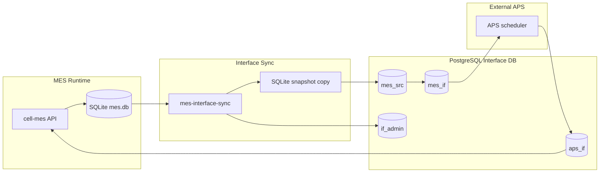

# MES 인터페이스 DB 아키텍처 및 구현 계획

## 1. 문서 목적

이 문서는 MES 데이터를 외부 APS 또는 스케줄링 시스템에 제공하기 위한 Interface DB 아키텍처와 구현 계획을 정의한다.

현재 MES는 SQLite를 기본 로컬 데이터베이스로 사용한다. 외부 시스템이 이 SQLite 파일에 직접 접근하게 하는 방식은 피해야 한다. 대신 MES 데이터를 일정 주기로 서버형 Interface DB 컨테이너에 복사하고, 읽기/쓰기 경계, 동기화 로그, 스키마 변경 대응 체계를 명확히 두는 구조를 권장한다.

## 2. 한 줄 결론

PostgreSQL 기반 Interface DB와 별도 sync worker 컨테이너를 함께 둔다.

```text
MES SQLite
  -> mes-interface-sync worker
  -> PostgreSQL Interface DB
       mes_src       : MES 테이블 자동 미러링 영역
       mes_if        : APS에 제공하는 인터페이스 View
       aps_if        : APS 스케줄 결과 및 반영 요청, 후속 단계
       if_admin      : 동기화 배치, 스키마 스냅샷, 오류 로그
```

이 구조는 SQLite를 직접 외부에 노출하는 방식보다 안전하고, APS가 MES 원본 DB를 읽거나 쓰게 하는 방식보다 운영상 안정적이다.

## 3. 현재 상황

### 3.1 MES 원천 DB

현재 원천 DB:

```text
agents/cell-mes/data/mes.db
```

MES 원천 DB는 SQLite이다. SQLite는 로컬 임베디드 운영, 데모, 단일 서비스 소유 구조에는 적합하다. 하지만 외부 시스템이 네트워크로 접속하는 다중 클라이언트 통합 DB로는 적합하지 않다.

### 3.2 MES 테이블

현재 MES DB에는 제조 기준정보, 실행, 품질, 다운타임, 알람, 디지털 스레드 관련 테이블이 포함되어 있다.

APS 연동에 중요한 핵심 테이블은 다음과 같다.

| 영역 | 테이블 |
| --- | --- |
| 제품 및 공정 기준정보 | `products`, `std_processes`, `process_categories`, `process_routings`, `process_routing_files` |
| 설비 | `equipments`, `cells`, `equipment_status_history`, `eq_logs` |
| 작업지시 및 실행 | `work_orders`, `units`, `prod_results` |
| 품질 및 다운타임 맥락 | `inspection_plans`, `inspection_results`, `non_conformances`, `spc_charts`, `spc_data_points`, `downtime_reasons`, `downtimes`, `alarm_definitions`, `alarms` |
| 디지털 스레드 참조 | `dt_project_refs`, `dt_project_workplans`, `dt_file_refs`, `product_dt_project_links` |

외부 통합 데이터로 원본 그대로 노출하지 않는 것이 좋은 테이블은 다음과 같다.

| 테이블 | 권장 처리 | 이유 |
| --- | --- | --- |
| `users` | 제외 | 인증 및 개인 계정 정보 포함 |
| `middleware_config` | 제외 또는 마스킹 | 내부 접속 정보 포함 가능 |
| `alembic_version` | APS 계정에는 비공개 | 내부 마이그레이션 상태 |

외부 제공 범위에 따라 마스킹 검토가 필요한 컬럼은 다음과 같다.

| 테이블 | 컬럼 | 위험 |
| --- | --- | --- |
| `equipments` | `connection_config` | IP, 포트, 프로토콜 등 설비 접속 정보 |
| `process_routing_files` | `file_path` | 내부 파일 시스템 경로 |
| `dt_file_refs` | `path`, `raw_metadata` | 외부 플랫폼 참조 정보 |
| `dt_project_refs` | `raw_metadata`, 외부 ID | 프로젝트 메타데이터 노출 |

## 4. 선택 아키텍처: PostgreSQL Interface DB와 Sync Worker

MES SQLite는 source of truth로 유지한다. sync worker가 주기적으로 PostgreSQL에 데이터를 복사하고, APS는 PostgreSQL에만 접속한다.

판단: 권장한다.

이유:

- PostgreSQL은 외부 클라이언트가 접속하는 client/server DB로 적합하다.
- 스키마 단위로 읽기/쓰기 권한을 분리할 수 있다.
- 동기화 배치, 스키마 스냅샷, 오류 로그를 감사 가능하게 남길 수 있다.
- MES 스키마 변경은 `mes_src`에서 흡수하고, APS에는 `mes_if` 인터페이스 View로 안정적인 연동 규격을 제공할 수 있다.
- APS 결과 쓰기는 APS 결과 스키마가 확정된 뒤 후속 단계에서 `aps_if`로 연다.

## 5. 권장 목표 아키텍처



## 6. 스키마 설계

### 6.1 `mes_src`

목적: MES 테이블을 원본에 가깝게 미러링한다.

규칙:

- 명시적으로 제외한 테이블을 제외하고 MES 테이블을 복사한다.
- 원본 테이블명과 컬럼명을 유지한다.
- 모든 미러링 테이블에 인터페이스 메타 컬럼을 추가한다.
  - `_if_batch_id`
  - `_if_synced_at`
  - `_if_source_table`
  - `_if_source_pk`
- 스키마 변경에 강하게 대응하기 위해 PostgreSQL 타입은 넓게 잡는다.
  - SQLite `INTEGER` -> PostgreSQL `bigint`
  - SQLite `REAL` -> PostgreSQL `double precision`
  - SQLite `TEXT` 또는 알 수 없는 타입 -> PostgreSQL `text`
  - SQLite `JSON` -> 유효한 JSON이면 PostgreSQL `jsonb`, 아니면 `text`

첫 버전 권장 방식:

- 테이블별 전체 refresh
- `mes_src`에는 외래키 제약을 두지 않음
- 주요 ID 컬럼과 `_if_batch_id`에 인덱스 생성

이유: `mes_src`는 원천 DB가 아니라 복제 스냅샷이다. 엄격한 관계 제약보다 안정적인 수집과 스키마 변화 대응을 우선한다.

### 6.2 `mes_if`

목적: APS에 제공하는 안정적인 인터페이스 View 영역이다.

규칙:

- `mes_src` 위에 view 또는 materialized view를 만든다.
- APS는 `mes_src`가 아니라 이 스키마만 읽는다.
- View 이름은 `if_기존 MES 테이블명` 형식을 기본으로 한다.
- 1차 범위는 제외 대상 테이블을 뺀 MES 기능 관련 테이블 전체이다.
- breaking change가 필요한 경우 기존 View는 유지하고 `_v2` 접미사를 붙인 새 View를 추가한다.
  - `mes_if.if_work_orders`
  - `mes_if.if_process_routings`
  - `mes_if.if_equipments`
  - `mes_if.if_work_orders_v2`

1차 생성 대상 인터페이스 View:

| 영역 | View |
| --- | --- |
| 제품 및 공정 기준정보 | `mes_if.if_products`, `mes_if.if_std_processes`, `mes_if.if_process_categories`, `mes_if.if_process_routings`, `mes_if.if_process_routing_files` |
| 설비 | `mes_if.if_equipments`, `mes_if.if_cells`, `mes_if.if_equipment_status_history`, `mes_if.if_eq_logs` |
| 작업지시 및 실행 | `mes_if.if_work_orders`, `mes_if.if_units`, `mes_if.if_prod_results` |
| 품질 및 다운타임 | `mes_if.if_inspection_plans`, `mes_if.if_inspection_results`, `mes_if.if_non_conformances`, `mes_if.if_spc_charts`, `mes_if.if_spc_data_points`, `mes_if.if_downtime_reasons`, `mes_if.if_downtimes`, `mes_if.if_alarm_definitions`, `mes_if.if_alarms` |
| 디지털 스레드 참조 | `mes_if.if_dt_project_refs`, `mes_if.if_dt_project_workplans`, `mes_if.if_dt_file_refs`, `mes_if.if_product_dt_project_links` |

민감 컬럼이 포함될 수 있는 테이블은 View를 만들되 해당 컬럼을 제외하거나 마스킹한다. 예를 들어 `equipments.connection_config`, `process_routing_files.file_path`, `dt_file_refs.raw_metadata`는 외부 APS가 실제로 필요하다는 합의가 있기 전까지 그대로 노출하지 않는다.

### 6.3 `aps_if`

목적: APS가 계산한 스케줄 결과를 적재하는 영역이다.

1차 구축에서는 APS 결과 컬럼과 반영 방식이 확정되어 있지 않으므로 외부 쓰기 권한을 열지 않는다. `aps_if`는 후속 확장을 위한 이름과 경계만 먼저 정의하고, 실제 테이블과 write role 제공은 APS 결과 스키마 확정 이후 진행한다.

권장 테이블:

| 테이블 | 목적 |
| --- | --- |
| `aps_if.if_schedule_runs` | APS solve/run 1회에 대한 요청 및 결과 메타데이터 |
| `aps_if.if_schedule_operations` | 공정 operation 단위 스케줄 결과 |
| `aps_if.if_schedule_apply_requests` | MES 반영 요청 및 승인 상태 |
| `aps_if.if_schedule_errors` | APS 검증 또는 solve 오류 |

후속 단계에서 APS는 결과를 `aps_if`에 insert한다. MES는 이 데이터를 직접 신뢰해서 원본 테이블에 반영하지 않고, 자체 서비스 로직에서 검증한 뒤 반영한다.

### 6.4 `if_admin`

목적: 관측성, 감사, 운영 제어를 위한 관리 영역이다.

권장 테이블:

| 테이블 | 목적 |
| --- | --- |
| `sync_batches` | 동기화 시도 1회당 1행 |
| `sync_table_stats` | 테이블별 row count와 소요 시간 |
| `schema_snapshots` | 배치별 원천 스키마 hash |
| `schema_changes` | 감지된 테이블/컬럼 변경 |
| `sync_errors` | 상세 오류와 실패 테이블 |
| `sync_locks` | 필요 시 중복 실행 방지 |

## 7. 동기화 전략

### 7.1 1차 전략: 전체 Refresh

가장 빠르고 신뢰하기 쉬운 첫 구현은 전체 refresh 방식이다.

배치 흐름:

```text
1. sync batch를 시작하고 batch_id를 생성한다.
2. 일관된 임시 SQLite 스냅샷을 만든다.
3. 스냅샷에서 SQLite 스키마를 조회한다.
4. 직전 성공 배치의 스키마 hash와 비교한다.
5. 안전한 스키마 변경은 mes_src에 자동 반영한다.
6. 포함 대상 mes_src 테이블을 truncate 후 reload한다.
7. materialized view를 쓴다면 mes_if를 refresh한다.
8. row count, 소요 시간, 오류를 기록한다.
9. batch를 SUCCESS 또는 FAILED로 종료한다.
```

이 방식은 단순하고 설명하기 쉬우며, MES 데이터가 크지 않은 현재 단계에 적합하다.

### 7.2 이후 전략: 증분 동기화

전체 refresh 파이프라인이 안정화된 뒤 증분 동기화를 검토한다.

증분 동기화에 필요한 조건:

- 원천 테이블에 신뢰할 수 있는 `updated_at` 컬럼이 있거나
- trigger 기반 change table이 있거나
- 애플리케이션 이벤트 발행이 안정적으로 동작해야 한다.

현재 MES 테이블은 모든 테이블에 일관된 변경 추적 컬럼이 있는 구조가 아니다. 따라서 첫 버전은 전체 refresh가 더 적절하다.

### 7.3 SQLite 스냅샷 안전성

sync worker가 운영 중인 SQLite 파일을 오래 직접 읽지 않도록 한다.

권장 방식:

- MES data 디렉터리를 sync 컨테이너에 read-only로 mount한다.
- SQLite backup API를 사용해 live DB를 임시 스냅샷 파일로 복사한다.
- sync worker는 임시 스냅샷 파일만 읽는다.
- `busy_timeout`을 설정한다.
- 원천 DB는 read-only mode로 연다.

이렇게 하면 MES 쓰기 작업과의 lock 충돌을 줄이고, 각 동기화 배치가 일관된 원천 스냅샷을 기준으로 동작할 수 있다.

## 8. 스키마 변경 대응

MES는 아직 개발 중이므로 Interface DB는 원천 DB 변경을 부드럽게 처리해야 한다.

### 8.1 자동 허용 변경

| 변경 | 처리 |
| --- | --- |
| 새 테이블 추가 | 제외 대상이 아니면 `mes_src`에 테이블 생성 |
| nullable 컬럼 추가 | `mes_src`에 컬럼 추가 |
| 더 넓은 타입으로 변경 | 가능한 경우 안전한 넓은 타입으로 변환 |
| 데이터 값 추가 | 그대로 복사 |

### 8.2 검토가 필요한 변경

| 변경 | 처리 |
| --- | --- |
| 컬럼 삭제 | `mes_src`의 기존 컬럼은 유지하고 스키마 변경 로그 기록 |
| 컬럼명 변경 | 새 컬럼으로 취급하고 rename 가능성 로그 기록 |
| 타입 충돌 | `text`로 저장하거나 해당 테이블 실패 처리 후 오류 기록 |
| 민감해 보이는 새 테이블 | 검토 전까지 `mes_if`에 노출하지 않음 |
| 민감해 보이는 새 컬럼 | 정책에 따라 `mes_src`에만 복사하고 인터페이스 View에는 노출하지 않음 |

### 8.3 인터페이스 안정성

외부 APS는 `mes_src`가 아니라 `mes_if`에 의존해야 한다.

이유:

- `mes_src`는 MES 내부 스키마 변화를 따라간다.
- `mes_if`는 외부 연동용 인터페이스 View 영역이다.
- MES 내부 테이블이 바뀌어도 인터페이스 View를 안정적으로 유지할 수 있다.

## 9. 보안 모델

### 9.1 DB Role

권장 PostgreSQL role:

| Role | 권한 |
| --- | --- |
| `if_owner` | 스키마와 DDL 소유, 외부 공유 금지 |
| `if_sync_writer` | `mes_src`, `if_admin` 쓰기 |
| `aps_user` | `mes_if` 읽기 전용 |
| `aps_writer` | `aps_if` insert 전용 |
| `mes_result_reader` | MES가 `aps_if`를 읽어 검증/반영 |

1차 구축에서는 `MES_INTERFACE_APS_READER_USER` 계정만 외부 APS에 제공한다. 기본 계정명은 `aps_user`이다. `aps_writer`와 `mes_result_reader`는 APS 결과 스키마가 확정된 뒤 생성하거나 잠금 해제한다.

APS 접속 정보는 PostgreSQL 접속 정보 형태로 제공한다.

| 항목 | 1차 권장값 |
| --- | --- |
| Host | APS에 IP 주소로 전달 |
| Port | `MES_INTERFACE_DB_PORT`, `15433` 확정 |
| Database | `mes_interface` |
| Username | `MES_INTERFACE_APS_READER_USER`, 기본 `aps_user` |
| Password | `.env` 또는 별도 보안 채널로 전달 |
| 권한 | `mes_if` read-only |
| 허용 네트워크 | 1차 구축에서는 별도 제한 없음, 후속으로 공유기/방화벽 source IP 제한 검토 |
| 금지 | `MES_INTERFACE_DB_ADMIN_USER`, `MES_INTERFACE_SYNC_USER`, PostgreSQL superuser 공유 |

### 9.2 네트워크 노출

권장 노출 순서:

1. 1차 구축에서는 `15433:5432` 포트 매핑과 `MES_INTERFACE_APS_READER_USER` read-only 계정으로 시작한다.
2. 공유기 또는 방화벽에서 source IP 제한 기능을 제공하는지 확인한다.
3. 가능하면 후속 단계에서 VPN, private LAN, SSH tunnel, 또는 source IP allowlist를 적용한다.

PostgreSQL을 장기간 공개 인터넷에 직접 노출하는 방식은 피한다.

### 9.3 민감 데이터 규칙

최소 제외:

```text
users
middleware_config
alembic_version
```

추가 권장 통제:

- APS 계정에는 `if_admin`을 공개하지 않는다.
- APS reader는 `mes_if`만 읽게 한다.
- MES 접속 계정, 인증, 세션, 토큰, 비밀번호, API key 성격의 테이블은 이름이 바뀌거나 새로 생겨도 기본 제외 대상으로 둔다.
- 외부 업체가 필요로 하지 않는 설비 접속 정보는 마스킹한다.
- PostgreSQL superuser 계정을 제공하지 않는다.
- 파일럿 테스트 이후 계정 비밀번호를 회전한다.

## 10. Docker Compose 계획

### 10.1 서비스

추가 서비스는 2개이다.

```yaml
mes-interface-db:
  image: postgres:16-alpine
  ports:
    - "${MES_INTERFACE_DB_PORT:-15433}:5432"
  environment:
    - POSTGRES_DB=${MES_INTERFACE_DB_NAME:-mes_interface}
    - POSTGRES_USER=${MES_INTERFACE_DB_ADMIN_USER:-if_owner}
    - POSTGRES_PASSWORD=${MES_INTERFACE_DB_ADMIN_PASSWORD:-change-me}
    - MES_INTERFACE_SYNC_USER=${MES_INTERFACE_SYNC_USER:-if_sync_writer}
    - MES_INTERFACE_SYNC_PASSWORD=${MES_INTERFACE_SYNC_PASSWORD}
    - MES_INTERFACE_APS_READER_USER=${MES_INTERFACE_APS_READER_USER:-aps_user}
    - MES_INTERFACE_APS_READER_PASSWORD=${MES_INTERFACE_APS_READER_PASSWORD}
  volumes:
    - mes_interface_db_data:/var/lib/postgresql/data
    - ./agents/mes-interface-db/init:/docker-entrypoint-initdb.d:ro
  restart: unless-stopped

mes-interface-sync:
  build:
    context: agents/mes-interface-sync
    dockerfile: Dockerfile
  volumes:
    - ./agents/cell-mes/data:/source/mes:ro
  environment:
    - SOURCE_SQLITE_PATH=/source/mes/mes.db
    - TARGET_DB_HOST=mes-interface-db
    - TARGET_DB_PORT=5432
    - TARGET_DB_NAME=${MES_INTERFACE_DB_NAME:-mes_interface}
    - MES_INTERFACE_SYNC_USER=${MES_INTERFACE_SYNC_USER:-if_sync_writer}
    - MES_INTERFACE_SYNC_PASSWORD=${MES_INTERFACE_SYNC_PASSWORD}
    - MES_INTERFACE_APS_READER_USER=${MES_INTERFACE_APS_READER_USER:-aps_user}
    - MES_INTERFACE_SYNC_SCHEDULE=${MES_INTERFACE_SYNC_SCHEDULE:-02:00,14:00}
    - MES_INTERFACE_SYNC_TIMEZONE=${MES_INTERFACE_SYNC_TIMEZONE:-Asia/Seoul}
    - MES_INTERFACE_SYNC_RUN_ON_START=${MES_INTERFACE_SYNC_RUN_ON_START:-true}
    - EXCLUDED_TABLES=users,middleware_config,alembic_version
  depends_on:
    - mes-interface-db
  restart: unless-stopped
```

추가 volume:

```yaml
volumes:
  mes_interface_db_data:
```

### 10.2 환경변수

`.env.example`에 추가할 값:

```text
MES_INTERFACE_DB_PORT=15433
MES_INTERFACE_DB_NAME=mes_interface
MES_INTERFACE_DB_ADMIN_USER=if_owner
MES_INTERFACE_DB_ADMIN_PASSWORD=change-this-password
MES_INTERFACE_SYNC_USER=if_sync_writer
MES_INTERFACE_SYNC_PASSWORD=change-this-password
MES_INTERFACE_APS_READER_USER=aps_user
MES_INTERFACE_APS_READER_PASSWORD=change-this-password
MES_INTERFACE_SYNC_SCHEDULE=02:00,14:00
MES_INTERFACE_SYNC_TIMEZONE=Asia/Seoul
MES_INTERFACE_SYNC_RUN_ON_START=true
```

수동 즉시 동기화를 위해 sync worker는 one-shot 실행 모드를 함께 제공한다.

```text
docker compose run --rm mes-interface-sync sync-once
```

상시 실행 컨테이너는 `MES_INTERFACE_SYNC_SCHEDULE`에 정의된 고정 시각 기준으로 실행하고, `sync-once` 명령은 운영자가 필요할 때 즉시 1회 동기화를 실행하는 용도로 사용한다.

## 11. 제안 파일 구조

```text
agents/
  mes-interface-db/
    init/
      001_init_schemas.sql
      002_roles.sql
      003_interface_views.sql
    README.md

  mes-interface-sync/
    Dockerfile
    pyproject.toml
    src/
      main.py
      config.py
      sqlite_snapshot.py
      schema_reader.py
      postgres_schema.py
      table_sync.py
      sync_service.py
    tests/
      test_schema_mapping.py
      test_excluded_tables.py
      test_interface_views.py
```

가장 빠른 구현을 위해 `mes-interface-sync`는 기존 Python 스택을 활용하고 다음을 사용한다.

- Python 표준 `sqlite3`
- PostgreSQL 접속용 `asyncpg`
- 원본 미러링 적재에는 ORM 없이 parameterized SQL 사용

sync worker는 사용자 입력을 받는 API가 아니라 데이터 파이프라인이므로, 파라미터 바인딩을 지킨 raw SQL 방식도 적절하다.

## 12. 구현 단계

### 12.1 Phase 0: 의사결정 및 접근 방식 확정

산출물:

- 외부 APS 접속 방식: PostgreSQL `MES_INTERFACE_APS_READER_USER` 계정 기반 read-only 접속
- 외부 APS 접속 Host: IP 주소로 전달
- 외부 APS 접속 Port: `15433` 확정
- 제외 테이블: MES 접속 계정, 인증, 세션, 토큰, 내부 설정 관련 테이블
- 외부 제공 View 범위: 제외 대상과 민감 컬럼을 뺀 MES 기능 관련 테이블 전체
- 동기화 스케줄: 하루 2회, `02:00,14:00`
- 즉시 동기화: 운영자용 `sync-once` 명령 제공
- 1차 단계에서 APS 결과 쓰기: 보류

완료 기준:

- 외부 제공 스키마/테이블 목록이 문서화되어 있다.
- 외부 DB 계정 정책이 문서화되어 있다.
- 네트워크 노출 방식과 접속 포트가 합의되어 있다.
- APS 결과 쓰기 범위가 후속 단계로 분리되어 있다.

### 12.2 Phase 1: PostgreSQL Interface DB

작업:

1. Docker Compose에 `mes-interface-db` 서비스를 추가한다.
2. 스키마와 role을 만드는 init SQL을 추가한다.
3. 기본 `if_admin` 테이블을 추가한다.
4. DB가 정상 기동되고 Docker 내부 네트워크에서 접속되는지 확인한다.

완료 기준:

- `mes-interface-db`가 Docker Compose로 기동된다.
- `mes_src`, `mes_if`, `aps_if`, `if_admin` 스키마가 존재한다.
- `aps_user`는 `mes_src`를 읽을 수 없다.
- 1차 단계에서는 외부 APS에 `aps_writer` 권한을 제공하지 않는다.

### 12.3 Phase 2: 전체 Refresh Sync Worker

작업:

1. `mes-interface-sync` 서비스를 추가한다.
2. SQLite 스냅샷 생성 로직을 구현한다.
3. `sqlite_master`와 `PRAGMA table_info` 기반 스키마 조회를 구현한다.
4. SQLite 타입을 PostgreSQL 타입으로 안전하게 매핑한다.
5. `mes_src`로 전체 refresh 적재를 구현한다.
6. batch 상태와 테이블별 row count를 기록한다.
7. 운영자용 즉시 동기화 명령 `sync-once`를 구현한다.

완료 기준:

- worker가 포함 대상 MES 테이블을 `mes_src`로 복사한다.
- 제외 테이블은 복사되지 않는다.
- 동기화 실패가 `if_admin.sync_errors`에 기록된다.
- 반복 실행해도 중복 데이터가 생기지 않는다.
- worker는 MES SQLite에 쓰지 않는다.
- 정기 배치와 별도로 `sync-once` 명령으로 즉시 동기화할 수 있다.

### 12.4 Phase 3: APS용 인터페이스 View

작업:

1. 제외 대상 테이블을 뺀 MES 기능 관련 테이블 전체에 대해 `mes_if.if_<원본테이블명>` View를 생성한다.
2. `users`, `middleware_config`, `alembic_version` 및 계정/인증/토큰/API key 성격 테이블은 View를 만들지 않는다.
3. 민감 컬럼은 View에서 제외하거나 마스킹한다.
4. APS가 우선 사용할 가능성이 높은 `if_work_orders`, `if_process_routings`, `if_equipments`, `if_downtimes`, `if_prod_results`는 수동 검증 쿼리를 추가한다.
5. breaking change가 필요한 경우 기존 View를 유지하고 `_v2` 접미사를 붙인 새 View를 추가한다.

완료 기준:

- APS가 `mes_if`만 보고 스케줄링 입력을 만들 수 있다.
- 인터페이스 View는 내부 사용자/시스템 테이블을 노출하지 않는다.
- MES 기능 관련 포함 테이블은 모두 `mes_if.if_<원본테이블명>` 형태로 조회할 수 있다.
- View 컬럼이 문서화되어 있다.
- breaking change가 필요한 View는 `_v2` 접미사로 버전 관리된다.

### 12.5 Phase 4: APS 결과 Write-Back Staging

이 단계는 1차 구축 범위에서 제외한다. APS가 어떤 결과 데이터를 어떤 컬럼으로 저장할지 확정된 뒤 별도 설계와 검증을 거쳐 진행한다.

작업:

1. `aps_if.if_schedule_runs`를 만든다.
2. `aps_if.if_schedule_operations`를 만든다.
3. `aps_if.if_schedule_apply_requests`를 만든다.
4. 승인된 결과를 MES가 읽는 프로세스 또는 API를 만든다.
5. APS 결과 row를 MES 원본에 반영하기 전에 검증한다.

완료 기준:

- APS가 스케줄 결과를 insert할 수 있다.
- MES는 해당 결과가 어떤 원천 `batch_id` 기준인지 알 수 있다.
- MES는 외부 DB write를 무조건 신뢰하지 않는다.
- 유효하지 않은 설비, 라우팅, 시간 겹침은 거부하거나 검토 대기로 둔다.

### 12.6 Phase 5: 스키마 변경 자동 대응

작업:

1. 동기화 배치별 schema hash를 저장한다.
2. 감지된 테이블/컬럼 변경을 기록한다.
3. 안전한 변경은 `mes_src`에 자동 반영한다.
4. 위험한 변경은 검토 대상으로 보류한다.
5. 로그와 sync status로 변경 사실을 알린다.

완료 기준:

- MES에 nullable 컬럼이 추가되어도 sync가 깨지지 않는다.
- MES에서 컬럼이 삭제되어도 APS 인터페이스 View가 즉시 깨지지 않는다.
- 위험한 스키마 변경은 `if_admin.schema_changes`에서 확인된다.

### 12.7 Phase 6: 운영 안정화

작업:

1. health check를 추가한다.
2. Interface DB 백업 계획을 추가한다.
3. restore 테스트 절차를 추가한다.
4. credential rotation 메모를 추가한다.
5. source IP 방화벽 또는 VPN 가이드를 추가한다.
6. sync lag 모니터링을 추가한다.

완료 기준:

- 운영자가 마지막 성공 동기화 시각을 확인할 수 있다.
- 실패한 sync가 보인다.
- DB credential이 코드에 commit되지 않는다.
- restore 절차가 문서화되고 1회 이상 검증된다.

## 13. 테스트 계획

최소 테스트:

| 테스트 | 목적 |
| --- | --- |
| 제외 테이블 테스트 | `users`, `middleware_config`, `alembic_version` 및 계정/인증 성격 테이블이 복사되지 않는지 확인 |
| 스키마 컬럼 추가 테스트 | 새 컬럼이 `mes_src`에 자동 추가되는지 확인 |
| 타입 매핑 테스트 | SQLite 타입이 PostgreSQL 타입으로 안전하게 매핑되는지 확인 |
| 전체 refresh 멱등성 테스트 | 반복 sync 시 중복 row가 생기지 않는지 확인 |
| batch logging 테스트 | 성공/실패가 기록되는지 확인 |
| 권한 테스트 | APS 계정이 제한 스키마에 접근하지 못하는지 확인 |
| 인터페이스 View 테스트 | APS View가 필요한 스케줄링 필드를 반환하는지 확인 |
| 전체 View 생성 테스트 | 포함 대상 MES 기능 테이블마다 `mes_if.if_<원본테이블명>` View가 존재하는지 확인 |

수동 검증 예시:

```text
docker compose up -d mes-interface-db mes-interface-sync
docker compose logs -f mes-interface-sync
psql -h localhost -p 15433 -U aps_user -d mes_interface
select * from mes_if.if_work_orders limit 10;
```

## 14. 운영 메모

### 14.1 동기화 스케줄

초기 권장 스케줄:

```text
02:00,14:00
```

이는 하루 2회 동기화에 해당한다. MES를 수정하지 않는 전체 refresh 방식에서는 고정 시각 기준 실행이 운영 복잡도와 데이터 최신성 사이의 균형이 좋다.

긴급 테스트, APS 검증, 수동 재동기화가 필요할 때는 정기 배치를 기다리지 않고 `sync-once` 명령으로 즉시 1회 동기화한다.

동기화 소요 시간이 측정된 뒤에 더 짧은 주기를 검토한다. 다만 주기를 짧게 줄일수록 SQLite 스냅샷 생성과 PostgreSQL 재적재 비용이 증가하므로, 실제 데이터량과 APS 최신성 요구를 함께 확인한다.

### 14.2 Source of Truth 경계

MES SQLite가 MES 데이터의 source of truth이다.

Interface DB 데이터는 다음 성격을 가진다.

- 복사된 데이터
- 파생된 데이터
- 외부 조회 가능한 데이터
- MES가 명시적으로 검증하고 import하기 전까지는 MES 상태의 권위 있는 원천이 아님

### 14.3 실패 시 동작

동기화 배치가 실패하면 다음 원칙을 따른다.

- 직전 성공 Interface DB 스냅샷은 유지한다.
- 실패 내용을 `if_admin.sync_batches`에 기록한다.
- 부분 적재된 데이터를 최신 성공 배치로 노출하지 않는다.

구현 세부 방향:

- 임시 테이블 또는 batch-partitioned row에 먼저 적재한다.
- 모든 필수 테이블 적재가 끝난 뒤에만 해당 batch를 current로 publish한다.

## 15. 리스크와 대응

| 리스크 | 영향 | 대응 |
| --- | --- | --- |
| MES 스키마 변경으로 APS 쿼리 실패 | 높음 | `mes_if` 인터페이스 View와 `_v2` 버전 접미사 사용 |
| 외부 DB 포트가 과도하게 노출됨 | 높음 | 1차는 non-superuser read-only role로 제한하고, 후속으로 VPN 또는 방화벽 allowlist 적용 |
| MES 쓰기 중 SQLite 읽기 충돌 | 중간 | 배치마다 SQLite backup API 기반 스냅샷 사용 |
| 전체 refresh가 점점 느려짐 | 중간 | 안정화 후 `updated_at` 기반 증분 동기화 도입 |
| 설비 접속 정보 유출 | 높음 | 인터페이스 View에서 민감 컬럼 제외 또는 마스킹 |
| APS가 잘못된 스케줄 결과 작성 | 높음 | 1차 단계에서는 APS 쓰기 권한을 열지 않고, 후속 단계에서 `aps_if` staging과 MES-side validation 사용 |
| 부분 동기화로 APS 입력 불일치 | 높음 | batch metadata와 성공 batch publish 정책 적용 |

## 16. 표준 관점의 계획 메모

### 16.1 ISO 21500 관점

범위:

- MES-to-APS 연동을 위한 Interface DB와 sync pipeline을 추가한다.
- APS 조회용 인터페이스 View와 APS 결과 수신 테이블을 제공한다.

1차 릴리스 제외 범위:

- 실시간 CDC
- APS의 MES 원천 DB 직접 수정
- APS 결과 write-back
- MES API 전체 대체

이해관계자:

- MES 개발팀
- APS/스케줄러 연동팀
- 공장 또는 운영 IT 담당자
- 보안/네트워크 담당자

### 16.2 ISO 31000 관점

주요 리스크:

- 민감 내부 데이터 노출
- MES 개발 중 스키마 변경
- 잘못된 APS 스케줄 결과 반영

대응:

- least privilege DB 계정
- `mes_if` 인터페이스 View와 `_v2` 버전 접미사
- sync log와 schema change log
- staged result apply workflow

### 16.3 ISO 38500 관점

의사결정 책임:

- MES 기술 책임자가 원천 스키마와 동기화 정책을 소유한다.
- APS 책임자가 `mes_if` 인터페이스 View 필드에 대해 확인한다.
- 네트워크/보안 책임자가 외부 DB 노출을 승인한다.

거버넌스 체크포인트:

1. DB 포트를 외부에 열기 전
2. `aps_if` write 권한을 제공하기 전
3. APS 결과를 MES 운영 테이블에 반영하기 전

## 17. 최종 권장안

가장 좋은 구조는 Interface DB 컨테이너 하나가 SQLite를 직접 읽고 자기 자신을 갱신하는 방식이 아니다.

권장 구조는 다음과 같다.

```text
PostgreSQL Interface DB 컨테이너
+ 전용 sync worker 컨테이너
+ mes_src 원본 미러링 스키마
+ mes_if 인터페이스 View
+ aps_if APS 결과 수신 스키마
+ if_admin audit 및 schema drift 로그
```

이 구조는 1차 구현을 빠르게 시작할 수 있으면서도, 이후 운영 수준의 안정성과 보안으로 확장하기 쉽다.
