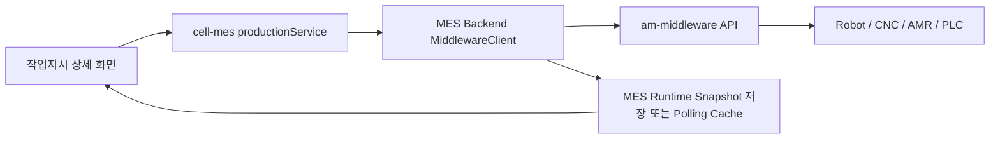

# MES 작업지시 상세 화면 - 미들웨어 Unit 상태 연동 구현 계획

## 1. 이 문서의 목적

이 문서는 `cell-mes`의 작업지시 상세 화면에서 미들웨어의 Unit 실행 상태를 어떻게 보여주고, 어떤 제어 기능을 연결할지 정리한 구현 기준 문서이다.

현재 목표는 다음과 같다.

1. MES 작업지시 상세 화면에서 미들웨어 Unit 상태를 이해하기 쉽게 보여준다.
2. 미들웨어 대시보드에 있는 주요 제어 기능을 MES 작업지시 상세 화면에서도 사용할 수 있게 한다.
3. MES DB 상태와 미들웨어 런타임 상태가 서로 달라지는 문제를 줄인다.
4. 구현자가 API, 화면, 상태 동기화 범위를 헷갈리지 않도록 단계별 기준을 세운다.

## 2. 한 줄 결론

작업지시 상세 화면에 `실행 모니터링` 섹션을 추가하고, MES 백엔드가 미들웨어 API를 프록시 호출하는 구조로 연결한다.

프론트가 미들웨어를 직접 호출하지 않는다.



## 3. 현재 구조 요약

### 3.1 MES의 현재 역할

MES는 작업지시와 Unit을 관리한다.

- 작업지시 생성
- 작업지시 시작
- READY Unit 생성
- 미들웨어가 Unit을 claim
- 미들웨어가 완료 callback
- 완료 수량 증가

하지만 현재 MES Unit 모델은 런타임 실행 정보를 충분히 가지고 있지 않다.

현재 MES Unit에 가까운 정보:

- `unit_no`
- `scenario_id`
- `status`
- `created_at`
- `started_at`
- `completed_at`
- `scenario_hold_started_at`
- `scenario_hold_by`

부족한 정보:

- 현재 실행 step
- 알람 메시지
- 알람이 발생한 step
- 정지 예약 여부
- 점유 중인 자원
- step 실행 이력
- 미들웨어와 마지막으로 동기화된 시간

### 3.2 미들웨어의 현재 역할

미들웨어는 실제 하드웨어 실행을 담당한다.

- MES에서 READY Unit 조회
- Unit claim
- YAML scenario 기반 step 실행
- 장비 자원 점유
- 알람/정지/재개 처리
- 완료 시 MES에 complete callback

미들웨어 대시보드에는 MES보다 훨씬 자세한 런타임 상태가 있다.

주요 필드:

- `status`
- `current_step_id`
- `alarm_message`
- `alarm_step_id`
- `pending_stop`
- `acq_map`
- `step_history`
- `activity`
- `unit_var`, `unit_res`, `unit_loc`, `unit_pos`

## 4. 왜 작업지시 상세 화면에 넣는가

MES 사용자는 작업지시 단위로 판단한다.

따라서 미들웨어 기능을 별도 대시보드처럼 그대로 복사하기보다, 작업지시 상세 화면 안에서 다음 질문에 답할 수 있어야 한다.

1. 이 작업지시가 MES 기준으로는 어떤 상태인가?
2. 실제 미들웨어에서는 어떤 Unit이 실행 중인가?
3. 현재 어떤 step에서 멈췄는가?
4. 알람이 있다면 어느 Unit, 어느 step에서 발생했는가?
5. 정지된 Unit을 현재 step에서 다시 실행할지, 특정 step부터 실행할지, 현재 step을 건너뛸지 선택할 수 있는가?
6. 제어 요청이 성공했는지 실패했는지 MES 화면에서 알 수 있는가?

## 5. 화면 설계 방향

### 5.1 화면 위치

기존 작업지시 상세 모달 안에 `실행 모니터링` 섹션을 추가한다.

권장 배치:

1. 작업지시 기본 정보
2. 진척률
3. 실행 모니터링
4. 생산실적
5. 작업지시 액션

기존 `Unit Queue Monitor`는 단순 DB Unit 목록에 가깝기 때문에, 이를 확장하거나 대체해서 `MES Unit + Middleware Unit`을 함께 보여주는 구조가 좋다.

### 5.2 상단 요약 영역

작업지시 상세 상단에는 MES와 미들웨어 상태를 동시에 보여준다.

표시 항목:

- Lot No
- 제품
- 시나리오 YAML
- MES 작업지시 상태
- 미들웨어 Lot 상태
- 전체 Unit 수
- 완료 Unit 수
- 알람 Unit 수
- 정지 예약 Unit 수
- 마지막 동기화 시간

예시:

```text
작업지시 상세 - LOT-20260723-014

MES RUNNING    Middleware RUNNING    알람 1    정지예약 1
제품: BRK-120 / 브래킷 어셈블리
시나리오: bracket_cell_v7.yaml
마지막 동기화: 2026-07-23 14:28:15
```

### 5.3 동기화 상태 표시

MES 상태와 미들웨어 상태가 다르면 화면에서 바로 보여줘야 한다.

예시:

```text
MES DB: Unit 014-003 RUNNING
Middleware: Unit 014-003 ALARM
판정: 상태 불일치 - MES snapshot 갱신 필요
```

상태 불일치를 숨기면 운영자가 잘못된 판단을 할 수 있다.

### 5.4 Unit 실행 모니터링 표

작업지시 상세 화면의 핵심 표이다.

권장 컬럼:

| 컬럼 | 설명 |
| --- | --- |
| Unit | Unit 번호 |
| MES 상태 | MES DB에 저장된 Unit 상태 |
| 미들웨어 상태 | 실제 실행 런타임 상태 |
| 현재 Step | `current_step_id`와 step 이름 |
| 점유 자원 | `acq_map` 기반 자원 lock 정보 |
| 알람 | `alarm_step_id`, `alarm_message` |
| 정지 예약 | `pending_stop` 여부 |
| 빠른 제어 | 상태별 주요 버튼 |

상태별 표시 기준:

| 미들웨어 상태 | 화면 색상 | 운영 의미 |
| --- | --- | --- |
| READY | 회색 | 아직 실행 전 |
| RUNNING | 녹색 | 실행 중 |
| WAITING | 주황 | 자원 대기 중, 현재 미들웨어 UI에는 직접 resume/skip 액션 없음 |
| STOPPED | 노랑 | 정지됨, 재개 가능 |
| ALARM | 빨강 | 알람 처리 필요 |
| DONE / COMPLETED | 파랑 또는 녹색 | 완료 |
| CANCELED | 회색 | 폐기됨 |

### 5.5 선택 Unit 제어 패널

행마다 버튼을 많이 넣으면 위험하다.

따라서 행에는 빠른 액션만 두고, 상세 제어는 선택 Unit 패널에서 처리한다.

선택 Unit 패널에 둘 기능:

- 알람 해제
- 점유 자원 해제
- 즉시 정지
- 현재 step 완료 후 정지
- 정지 예약 취소
- STOPPED 상태에서 resume 모달 열기
- resume 모달 안에서 현재 step 재실행
- resume 모달 안에서 현재 step 건너뛰기
- resume 모달 안에서 특정 step부터 재실행

중요한 제약:

- `skip_step`은 독립적인 상시 버튼이 아니다.
- 현재 미들웨어 화면에서는 `STOPPED` 상태의 `Resume` 버튼을 눌렀을 때 열리는 스텝 선택 모달 안의 옵션이다.
- `ALARM` 상태에서는 먼저 `clear-alarm`을 호출해야 한다.
- `clear-alarm` 성공 후 Unit이 `STOPPED`가 되면 `Resume`을 통해 현재 step 재개, 다음 step으로 건너뛰기, 특정 step 재개를 선택할 수 있다.
- `WAITING` 상태는 현재 미들웨어 UI의 action 분기에 별도 버튼이 없다. MES에서도 바로 skip/resume 버튼을 만들기보다 운영 정책을 먼저 정해야 한다.

중요한 제어는 확인 모달을 띄운다.

특히 다음 액션은 확인이 필요하다.

- 즉시 정지
- resume 모달에서 현재 step skip 선택
- resume 모달에서 특정 step부터 재실행 선택
- 점유 자원 해제
- Unit cancel/delete

## 6. 목업 파일

정적 HTML 목업은 아래 파일에 있다.

```text
docs/mes-middleware-order-detail-mockup.html
```

목업은 구현 코드가 아니라 화면 방향을 설명하기 위한 참고 자료이다.

## 7. API 설계 기준

### 7.1 기본 원칙

프론트는 미들웨어 API를 직접 호출하지 않는다.

반드시 아래 흐름을 따른다.

```text
Frontend -> MES Backend -> Middleware API
```

이유:

1. 인증/권한을 MES에서 통제해야 한다.
2. 누가 어떤 제어를 했는지 감사 로그를 남겨야 한다.
3. 미들웨어 응답을 MES 기준으로 정규화해야 한다.
4. MES DB 상태와 미들웨어 상태를 함께 갱신해야 한다.

### 7.2 MES Backend에 추가할 권장 API

작업지시 기준 API:

```http
GET /api/v1/production/orders/{order_id}/middleware-state
```

역할:

- 미들웨어 `GET /api/lots/{lot_no}` 호출
- MES Unit 목록과 병합
- 프론트가 표시하기 좋은 형태로 반환

Unit 제어 API:

```http
POST /api/v1/production/orders/{order_id}/middleware/units/{unit_no}/commands/stop
POST /api/v1/production/orders/{order_id}/middleware/units/{unit_no}/commands/stop-after-step
POST /api/v1/production/orders/{order_id}/middleware/units/{unit_no}/commands/cancel-pending-stop
POST /api/v1/production/orders/{order_id}/middleware/units/{unit_no}/commands/clear-alarm
POST /api/v1/production/orders/{order_id}/middleware/units/{unit_no}/commands/release-resources
POST /api/v1/production/orders/{order_id}/middleware/units/{unit_no}/resume
```

`resume` 요청 body:

```json
{
  "mode": "CURRENT_STEP",
  "resume_step_id": null,
  "skip_step": false,
  "clear_retry": false
}
```

지원할 `mode`:

| mode | 의미 | 미들웨어 호출 |
| --- | --- | --- |
| `CURRENT_STEP` | 현재 step 재실행 | `resume` |
| `SKIP_CURRENT_STEP` | 현재 step 건너뛰기 | `resume?skip_step=true` |
| `SPECIFIC_STEP` | 특정 step부터 재실행 | `resume?resume_step_id={step_id}` |

### 7.3 응답 형식

MES Backend는 프론트에 통일된 응답을 줘야 한다.

성공 예시:

```json
{
  "status": "success",
  "message": "Unit resumed",
  "order_id": 1001,
  "lot_no": "LOT-20260723-014",
  "unit_no": "014-003",
  "middleware_status": "RUNNING",
  "current_step_id": "step_030",
  "synced_at": "2026-07-23T14:28:15+09:00"
}
```

실패 예시:

```json
{
  "status": "error",
  "message": "Middleware rejected resume request",
  "reason": "Unit status is ALARM. Clear alarm first.",
  "order_id": 1001,
  "lot_no": "LOT-20260723-014",
  "unit_no": "014-003"
}
```

## 8. 가장 중요한 구현 주의사항

### 8.1 HTTP 200만 보고 성공 처리하면 안 된다

미들웨어 API 응답 처리 방향은 코드 확인 결과 아래 기준으로 확정한다.

미들웨어 라우터는 업무 실패 시 `HTTPException`을 던지기보다 `ValueError`를 잡아서 아래 형태의 dict를 반환하는 패턴을 사용한다.

```json
{
  "status": "error",
  "message": "Unit is not stopped"
}
```

FastAPI에서 별도 status code를 지정하지 않고 dict를 반환하면 HTTP status는 기본적으로 200이다.

따라서 MES Backend는 반드시 다음을 모두 확인해야 한다.

1. HTTP status가 성공 범위인가?
2. JSON body의 `status`가 `success`인가?

둘 중 하나라도 실패면 MES Unit 상태를 바꾸면 안 된다.

확정된 성공 판정:

```text
Middleware API 성공 = HTTP 2xx + JSON status == "success"
Middleware API 실패 = HTTP non-2xx 또는 JSON status != "success"
```

권장 helper:

```python
def parse_middleware_response(response: httpx.Response) -> dict:
    if response.status_code < 200 or response.status_code >= 300:
        raise MiddlewareCallError(
            message="Middleware HTTP request failed",
            status_code=response.status_code,
            body=response.text,
        )

    try:
        payload = response.json()
    except ValueError as exc:
        raise MiddlewareCallError(
            message="Middleware returned invalid JSON",
            status_code=response.status_code,
            body=response.text,
        ) from exc

    if payload.get("status") != "success":
        raise MiddlewareBusinessError(
            message=payload.get("message") or "Middleware command rejected",
            error=payload.get("error"),
            payload=payload,
        )

    return payload
```

제어 API에서 이 helper가 실패를 던지면 반드시 다음을 지킨다.

- MES Unit 상태를 변경하지 않는다.
- 작업지시 상태를 임의로 변경하지 않는다.
- 프론트에는 미들웨어의 `message`를 포함한 실패 응답을 반환한다.
- audit log를 도입한 뒤에는 실패 요청도 기록한다.
- 성공한 경우에만 최신 `middleware-state`를 다시 조회해서 화면을 갱신한다.

현재 cell-mes에 이미 있는 미들웨어 프록시 구현 중 일부는 HTTP status만 보고 성공 처리하는 흐름이 있으므로, 새 구현에서는 이 패턴을 그대로 확장하지 않는다.

### 8.2 MES 상태와 미들웨어 상태는 다를 수 있다

예시:

```text
MES Unit.status = RUNNING
Middleware unit.status = ALARM
```

이 경우 MES 화면은 둘 중 하나만 보여주면 안 된다.

권장 표시:

```text
MES: RUNNING
Middleware: ALARM
동기화: 불일치
```

### 8.3 미들웨어 대시보드 직접 조작도 고려해야 한다

운영자가 미들웨어 대시보드에서 직접 stop/resume/clear alarm을 누르면 MES DB는 모를 수 있다.

따라서 MES는 주기적으로 미들웨어 상태를 가져와야 한다.

초기 구현은 polling으로 충분하다.

권장:

```text
RUNNING / PAUSE / ERROR 작업지시는 3초 또는 5초 주기로 middleware-state 조회
```

## 9. 상태 동기화 설계

### 9.1 1단계: Read-through 방식

초기에는 DB migration 없이 시작한다.

작업지시 상세 화면을 열 때마다 MES Backend가 미들웨어에서 최신 상태를 가져와서 화면에 반환한다.

장점:

- 구현이 빠르다.
- DB 변경이 적다.
- 미들웨어 원본 상태를 그대로 볼 수 있다.

단점:

- 과거 상태 이력이 MES DB에 남지 않는다.
- 미들웨어가 꺼져 있으면 최신 상태를 못 본다.

### 9.2 2단계: Snapshot 저장

운영 안정성을 위해 나중에는 MES DB에 미들웨어 snapshot을 저장한다.

권장 테이블:

```text
middleware_unit_snapshots
```

권장 컬럼:

| 컬럼 | 설명 |
| --- | --- |
| id | PK |
| work_order_id | MES 작업지시 ID |
| lot_no | Lot 번호 |
| unit_no | Unit 번호 |
| mes_status | MES Unit 상태 |
| middleware_status | 미들웨어 Unit 상태 |
| current_step_id | 현재 step |
| alarm_step_id | 알람 발생 step |
| alarm_message | 알람 메시지 |
| pending_stop | 정지 예약 여부 |
| acq_map | 점유 자원 JSON |
| raw_payload | 미들웨어 원본 JSON |
| last_seen_at | 마지막 수신 시간 |
| created_at | 생성일 |
| updated_at | 수정일 |

### 9.3 3단계: 이벤트/감사 로그

제어 명령은 반드시 기록한다.

권장 테이블:

```text
middleware_control_audit_logs
```

권장 컬럼:

| 컬럼 | 설명 |
| --- | --- |
| id | PK |
| work_order_id | 작업지시 ID |
| lot_no | Lot 번호 |
| unit_no | Unit 번호 |
| action | stop, resume, clear-alarm 등 |
| request_payload | 요청 JSON |
| response_payload | 응답 JSON |
| result | success / error |
| requested_by | 사용자 |
| requested_at | 요청 시간 |

## 10. 프론트 구현 계획

### 10.1 수정 대상

주요 수정 대상:

```text
frontend/app/(main)/production/orders/page.tsx
frontend/services/production.ts
frontend/types/index.ts
```

추가를 권장하는 컴포넌트:

```text
frontend/components/production/OrderRuntimeMonitor.tsx
frontend/components/production/RuntimeUnitTable.tsx
frontend/components/production/RuntimeUnitControlPanel.tsx
frontend/components/production/ResumeUnitModal.tsx
```

### 10.2 프론트 데이터 타입

권장 타입:

```ts
export interface MiddlewareUnitState {
  unit_no: string;
  mes_status?: string;
  middleware_status: string;
  current_step_id?: string | null;
  alarm_step_id?: string | null;
  alarm_message?: string | null;
  pending_stop?: boolean;
  acq_map?: Record<string, string>;
  step_history?: Array<Record<string, unknown>>;
  raw?: Record<string, unknown>;
}

export interface OrderMiddlewareState {
  order_id: number;
  lot_no: string;
  mes_status: string;
  middleware_lot_status?: string;
  sync_status: "SYNCED" | "MISMATCHED" | "MIDDLEWARE_NOT_FOUND" | "ERROR";
  last_synced_at?: string;
  units: MiddlewareUnitState[];
}
```

### 10.3 프론트 화면 상태

필요한 UI 상태:

- 선택된 Unit
- 선택된 resume mode
- 선택된 resume step
- 제어 요청 중 여부
- 마지막 새로고침 시간
- 미들웨어 연결 실패 여부

### 10.4 프론트 액션 버튼 노출 기준

| 미들웨어 상태 | 보여줄 액션 |
| --- | --- |
| READY | 투입 또는 시작 |
| RUNNING | 즉시 정지, 현재 step 후 정지 |
| RUNNING + pending_stop | 정지 예약 취소 |
| WAITING | 기본 제어 없음. 필요 시 운영 정책에 따라 stop 계열 제어만 별도 검토 |
| STOPPED | Resume 모달, 자원 해제 |
| ALARM | 알람 해제, 자원 해제 |
| DONE | 제어 없음 |
| CANCELED | 제어 없음 |

STOPPED 상태의 `Resume` 모달 안에서만 다음 옵션을 제공한다.

| Resume 옵션 | 미들웨어 API 호출 |
| --- | --- |
| 현재 step에서 재개 | `POST /resume` |
| 현재 step 건너뛰기 | `POST /resume?skip_step=true` |
| 특정 step부터 재개 | `POST /resume?resume_step_id={step_id}` |

ALARM 상태에서는 바로 resume을 노출하지 않는다. 먼저 알람 해제를 유도하고, 알람 해제 성공 후 STOPPED 상태가 확인되면 Resume 모달을 열 수 있게 한다.

## 11. 백엔드 구현 계획

### 11.1 수정 대상

주요 수정 대상:

```text
src/app/api/v1/endpoints/production.py
src/app/services/
src/app/schemas/
src/app/models/
```

추가 권장:

```text
src/app/services/middleware_client.py
src/app/schemas/middleware_control.py
```

Snapshot을 도입할 경우:

```text
src/app/models/middleware_snapshot.py
src/app/migrations/
```

### 11.2 MiddlewareClient 책임

`MiddlewareClient`는 route 함수 안에 흩어진 `httpx` 호출을 모으는 역할이다.

책임:

1. 미들웨어 base URL 관리
2. timeout 관리
3. 인증 또는 header 관리
4. `X-Caller` 설정
5. HTTP status 검증
6. JSON `status` 검증
7. 에러 메시지 정규화
8. audit log 기록

HTTP status 검증과 JSON `status` 검증은 각 route에서 직접 반복하지 않고, `MiddlewareClient` 내부의 공통 helper로 처리한다.

모든 제어 API는 이 helper를 통과한 경우에만 성공으로 간주한다.

### 11.3 백엔드 제어 요청 처리 순서

예시: Unit resume

```text
1. MES에서 order_id로 WorkOrder 조회
2. lot_no 확인
3. unit_no 확인
4. 사용자가 해당 제어 권한을 갖는지 확인
5. resume mode 검증
6. MiddlewareClient.resume_unit 호출
7. 미들웨어 응답의 HTTP status 확인
8. 미들웨어 응답 JSON status 확인
9. 성공이면 최신 middleware-state 재조회
10. snapshot/audit 갱신
11. 프론트에 통일 응답 반환
```

## 12. 단계별 구현 로드맵

### Phase 1. 화면 표시와 read-through 조회

목표:

- 작업지시 상세 화면에서 미들웨어 Unit 상태를 볼 수 있게 한다.

작업:

1. `GET /middleware-state` API 추가
2. 기존 미들웨어 monitoring 응답 정규화
3. 프론트 `OrderRuntimeMonitor` 추가
4. Unit별 상태, 현재 step, 알람, 자원 점유 표시
5. MES 상태와 미들웨어 상태 불일치 표시

완료 기준:

- 작업지시 상세 화면에서 Unit별 `current_step_id`를 볼 수 있다.
- ALARM Unit은 빨간색으로 표시된다.
- `pending_stop` Unit은 정지예약으로 표시된다.
- 미들웨어 연결 실패 시 화면에 명확한 에러가 보인다.

### Phase 2. 제어 API 연결

목표:

- MES 화면에서 미들웨어의 주요 Unit 제어 기능을 사용할 수 있게 한다.

작업:

1. `stop` 연결
2. `stop-after-step` 연결
3. `cancel-pending-stop` 연결
4. `clear-alarm` 연결
5. `release-resources` 연결
6. `STOPPED` 상태 전용 `resume` 모달에 `CURRENT_STEP`, `SKIP_CURRENT_STEP`, `SPECIFIC_STEP` 지원
7. 프론트 제어 패널과 확인 모달 추가

완료 기준:

- STOPPED Unit을 현재 step에서 재개할 수 있다.
- STOPPED Unit을 특정 step에서 재개할 수 있다.
- STOPPED Unit의 Resume 모달에서 현재 step을 skip할 수 있다.
- RUNNING Unit에 현재 step 후 정지를 예약할 수 있다.
- 정지 예약을 취소할 수 있다.
- ALARM Unit의 알람을 해제할 수 있다.
- ALARM Unit에는 Resume 버튼을 바로 보여주지 않는다.
- WAITING Unit에는 현재 미들웨어 UI와 동일하게 직접 skip/resume 버튼을 보여주지 않는다.
- 미들웨어가 `{status: "error"}`를 반환하면 MES 상태가 바뀌지 않는다.

### Phase 3. Snapshot 저장과 상태 불일치 관리

목표:

- 미들웨어 대시보드에서 직접 조작해도 MES가 상태 변화를 감지할 수 있게 한다.

작업:

1. `middleware_unit_snapshots` 테이블 추가
2. active 작업지시 polling job 추가
3. 작업지시 상세 화면에서 snapshot 기반 마지막 상태 표시
4. 미들웨어 연결 실패 시 마지막 snapshot 표시
5. 상태 불일치 rule 추가

완료 기준:

- 미들웨어 대시보드에서 직접 stop해도 MES 화면이 polling 후 STOPPED를 보여준다.
- MES DB와 미들웨어 상태가 다르면 불일치 표시가 뜬다.
- 미들웨어가 일시적으로 꺼져 있어도 마지막 수신 상태를 볼 수 있다.

### Phase 4. Audit log와 운영 안정화

목표:

- 누가 어떤 제어를 했는지 추적 가능하게 한다.

작업:

1. `middleware_control_audit_logs` 테이블 추가
2. 모든 제어 API에 audit 기록
3. 실패 응답도 기록
4. 작업지시 상세 화면에 최근 제어 이력 표시
5. 권한별 제어 제한 적용

완료 기준:

- Unit resume/stop/clear alarm 요청자가 기록된다.
- 실패한 제어 요청도 기록된다.
- 작업지시 상세 화면에서 최근 제어 이력을 볼 수 있다.

## 13. 우선순위별 작업 목록

### P0 - 반드시 먼저 해야 함

1. `MiddlewareClient` 공통화
2. 미들웨어 JSON `status` 검증
3. `GET /middleware-state` 정규화 API
4. 작업지시 상세 화면에 미들웨어 상태 표시

### P1 - 실제 운영 제어에 필요

1. `resume` mode 확장
2. `stop-after-step`
3. `cancel-pending-stop`
4. `clear-alarm`
5. `release-resources`
6. 제어 확인 모달

### P2 - 안정성과 추적성

1. Snapshot 저장
2. Audit log
3. 상태 불일치 표시
4. 미들웨어 연결 실패 fallback

### P3 - 고급 운영 기능

1. 자원 수동 assign/unassign
2. variables 수정
3. recipe 교체
4. NC upload
5. Unit cancel/delete

P3 기능은 강력하지만 위험도가 높으므로, 운영 정책이 정해진 뒤 연결하는 것이 좋다.

## 14. 권장하지 않는 방식

### 14.1 미들웨어 대시보드를 iframe으로 넣기

권장하지 않는다.

이유:

- MES 권한 체계와 분리된다.
- 작업지시 문맥이 약해진다.
- 감사 로그를 남기기 어렵다.
- UI가 중복되고 운영자가 헷갈린다.

### 14.2 프론트에서 미들웨어 API 직접 호출

권장하지 않는다.

이유:

- 인증/권한을 우회할 수 있다.
- CORS, 네트워크, 환경 설정 문제가 생긴다.
- MES DB와 상태 동기화가 어렵다.
- 누가 제어했는지 추적하기 어렵다.

### 14.3 MES Unit.status 하나에 모든 상태를 넣기

권장하지 않는다.

이유:

- MES의 생산 상태와 미들웨어의 런타임 상태는 성격이 다르다.
- `RUNNING`, `PAUSE`, `ALARM`, `STOPPED`, `SCENARIO_HOLD`가 섞이면 상태 전이가 복잡해진다.
- 별도 snapshot으로 관리하는 편이 안전하다.

## 15. 검수 체크리스트

### 화면 검수

- [ ] 작업지시 상세에서 미들웨어 상태가 보인다.
- [ ] Unit별 현재 step이 보인다.
- [ ] 알람 메시지가 보인다.
- [ ] 정지 예약 상태가 보인다.
- [ ] 점유 자원이 보인다.
- [ ] MES 상태와 미들웨어 상태가 다르면 불일치 표시가 보인다.
- [ ] 모바일 또는 작은 화면에서도 표가 깨지지 않는다.

### API 검수

- [ ] 프론트는 MES API만 호출한다.
- [ ] MES Backend는 미들웨어 HTTP status를 검증한다.
- [ ] MES Backend는 미들웨어 JSON `status`를 검증한다.
- [ ] 실패 시 MES Unit 상태가 임의로 바뀌지 않는다.
- [ ] timeout, connection error가 사용자에게 명확히 전달된다.

### 제어 검수

- [ ] STOPPED Unit을 현재 step에서 재개할 수 있다.
- [ ] STOPPED Unit을 특정 step에서 재개할 수 있다.
- [ ] STOPPED Unit의 Resume 모달에서 현재 step을 skip할 수 있다.
- [ ] RUNNING Unit을 즉시 정지할 수 있다.
- [ ] RUNNING Unit에 step 후 정지를 예약할 수 있다.
- [ ] 정지 예약을 취소할 수 있다.
- [ ] ALARM Unit의 알람을 해제할 수 있다.
- [ ] ALARM 상태에서는 Resume 버튼을 바로 보여주지 않는다.
- [ ] ALARM 해제 후 STOPPED가 되면 Resume 모달을 사용할 수 있다.
- [ ] WAITING 상태에서는 직접 skip/resume 버튼을 보여주지 않는다.

### 동기화 검수

- [ ] 미들웨어 대시보드에서 직접 조작한 상태가 MES 화면에 반영된다.
- [ ] 미들웨어 연결 실패 시 마지막 상태 또는 에러 상태가 보인다.
- [ ] 완료 callback 실패 가능성을 운영자가 인지할 수 있다.

## 16. 최종 구현 기준

최종적으로 구현은 아래 기준을 만족해야 한다.

1. MES 작업지시 상세 화면이 운영자의 중심 화면이 된다.
2. 미들웨어 대시보드는 고급 정비/개발자용 화면으로 남긴다.
3. MES는 미들웨어 상태를 숨기지 않고 그대로 보여준다.
4. MES 상태와 미들웨어 상태가 다르면 다르다고 표시한다.
5. 모든 제어는 MES Backend를 통해 호출한다.
6. 제어 성공 여부는 HTTP status가 아니라 JSON `status`까지 확인한다.
7. 위험한 제어는 확인 모달과 audit log를 거친다.
8. 초기 구현은 read-through로 빠르게 시작하고, 운영 안정화 단계에서 snapshot/audit를 추가한다.
