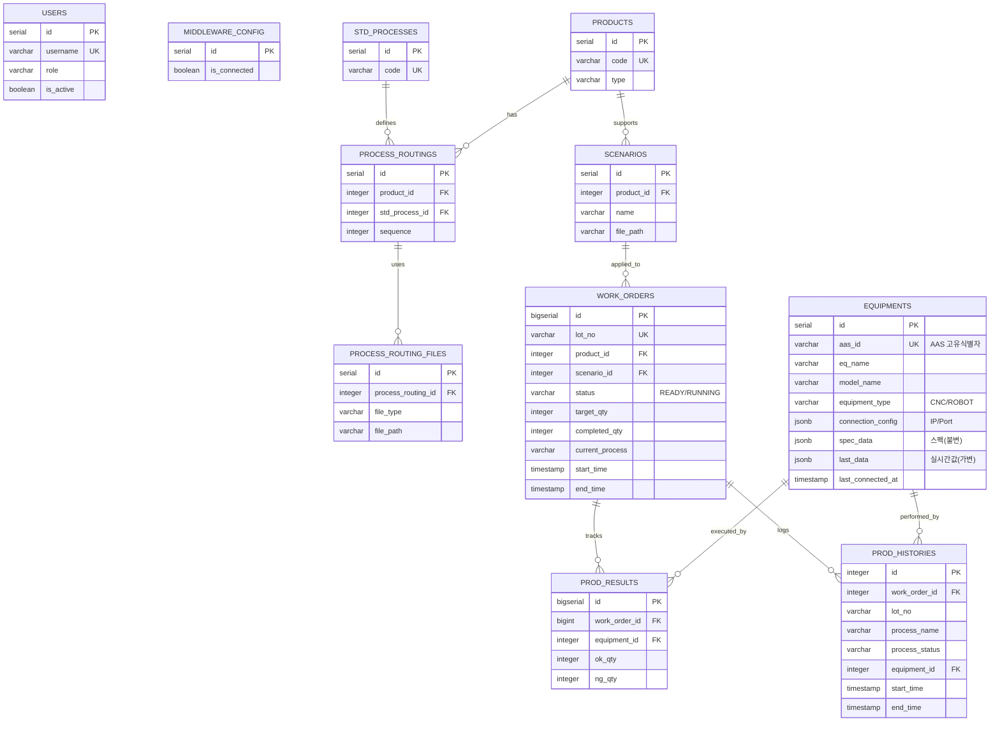

# [MES] 데이터베이스 설계 명세서 (v5.0)

## 1. 개요 (Overview)
* **Version:** 5.0 (Final Integration)
* **DBMS:** PostgreSQL 15+
* **설계 목적:** 스마트 공장 구축을 위한 MES(Manufacturing Execution System) 표준 데이터베이스 설계.
* **주요 특징:**
    * **AAS 기반 장비 연동:** 자산 관리 쉘(Asset Administration Shell) 기반의 장비 자동 식별 및 데이터 동기화 지원.
    * **Time Tracking:** 작업 지시(`WorkOrder`) 및 생산 이력(`ProductionHistory`) 단위의 정밀 시간 기록.
    * **유연한 데이터 구조:** JSONB 타입을 활용하여 이기종 장비 데이터를 단일 테이블에서 통합 관리.
    * **표준 공정 및 라우팅:** 품목별 생산 공정 순서(Routing) 관리.
    * **실시간 이력 추적:** `prod_histories`를 통한 Lot별 공정 상세 이력(Traceability) 확보.

---

## 2. ERD (Entity Relationship Diagram)



---

## 3. 테이블 상세 명세 (Schema Details)

### A. 시스템 및 설정 (System)

**1. users (사용자)**
| 컬럼명 | 타입 | 설명 | 비고 |
| :--- | :--- | :--- | :--- |
| **id** | SERIAL (PK) | 고유 ID | - |
| **username** | VARCHAR(50) | 로그인 ID | Unique |
| **password_hash** | VARCHAR(255) | 비밀번호 해시 | - |
| **role** | VARCHAR(20) | 권한 | ADMIN, OPERATOR |
| **is_active** | BOOLEAN | **[New] 활성화 여부** | Default: True |
| **created_at** | TIMESTAMP | 생성 일시 | - |

**2. middleware_config (미들웨어 설정)**
| 컬럼명 | 타입 | 설명 | 비고 |
| :--- | :--- | :--- | :--- |
| **id** | SERIAL (PK) | 설정 ID | - |
| **name** | VARCHAR(50) | 설정명 | - |
| **ip_address** | VARCHAR(50) | 접속 IP | - |
| **port** | INT | 포트 | - |
| **is_connected** | BOOLEAN | **[New] 연결 상태** | Default: False |

### B. 기준 정보 (Master Data)

**3. std_processes (표준 공정 라이브러리)**
| 컬럼명 | 타입 | 설명 | 비고 |
| :--- | :--- | :--- | :--- |
| **id** | SERIAL (PK) | 표준 공정 ID | - |
| **code** | VARCHAR(20) | 표준 코드 | Unique (예: STD-CUT-01) |
| **name** | VARCHAR(100) | 표준 공정명 | (예: 레이저 절단) |
| **description** | TEXT | 작업 표준(SOP) | - |

**4. products (품목 관리)**
| 컬럼명 | 타입 | 설명 | 비고 |
| :--- | :--- | :--- | :--- |
| **id** | SERIAL (PK) | 품목 ID | - |
| **code** | VARCHAR(50) | 품목 코드 | Unique (예: ITEM-A) |
| **name** | VARCHAR(100) | 품목명 | - |
| **unit** | VARCHAR(10) | 단위 | EA, SET |
| **type** | VARCHAR(20) | **[New] 품목 유형** | Default: '완제품' |
| **is_deleted** | BOOLEAN | 삭제 여부 | Soft Delete용 |

**5. process_routings (품목별 공정 순서)**
*v5.0 Update: remarks 컬럼 삭제 (코드 미반영)*
| 컬럼명 | 타입 | 설명 | 비고 |
| --- | --- | --- | --- |
| **id** | SERIAL (PK) | 라우팅 ID | - |
| **product_id** | INT (FK) | 대상 품목 | - |
| **std_process_id** | INT (FK) | 사용할 표준 공정 | - |
| **sequence** | INT | 진행 순서 | 10, 20, 30... |

**5-1. process_routing_files (공정별 파일 매핑)**
| 컬럼명 | 타입 | 설명 | 비고 |
| --- | --- | --- | --- |
| **id** | SERIAL (PK) | 파일 매핑 ID | - |
| **process_routing_id** | INT (FK) | 상위 라우팅 ID | - |
| **file_type** | VARCHAR(20) | 파일 유형 | 'NC', 'IMAGE', 'DOC' |
| **file_path** | VARCHAR(255) | **파일 경로** | 실제 파일 위치 |
| **sort_order** | INT | 전송/사용 순서 | 1, 2, 3... |

**6. scenarios (물류/로봇 시나리오)**
| 컬럼명 | 타입 | 설명 | 비고 |
| --- | --- | --- | --- |
| **id** | SERIAL (PK) | 시나리오 ID | - |
| **product_id** | INT (FK) | 대상 품목 | - |
| **name** | VARCHAR(100) | 시나리오명 | 예: 1라인 로봇 핸들링 |
| **file_path** | VARCHAR(255) | **제어 파일 경로** | 로봇/AGV 설정 파일 (.yaml) |
| **is_active** | BOOLEAN | 사용 여부 | - |

**7. equipments (설비 관리)**
| 컬럼명 | 타입 | 설명 | 비고 |
| :--- | :--- | :--- | :--- |
| **id** | SERIAL (PK) | 설비 내부 ID | MES 시스템 관리용 |
| **aas_id** | VARCHAR(100) | **AAS 고유 ID** | Unique, 미들웨어 제공 식별자 |
| **eq_name** | VARCHAR(100) | 설비명 | - |
| **model_name** | VARCHAR(100) | 모델명 | - |
| **equipment_type** | VARCHAR(20) | 장비 타입 | 'CNC', 'ROBOT', 'AMR', 'PLC' |
| **connection_config** | JSONB | **연결 정보** | IP, Port, Protocol |
| **spec_data** | JSONB | **장비 제원(Static)** | 제조사, 스펙, 축 수 등 (불변) |
| **last_data** | JSONB | **실시간 데이터** | 폴링된 최신 값 캐싱 (가변) |
| **current_status** | VARCHAR(20) | 현재 상태 | RUN, STOP, ERROR |
| **updated_at** | TIMESTAMP | 데이터 갱신 시간 | - |
| **last_connected_at**| TIMESTAMP | **최근 연결 시간** | AAS 통신 성공 시점 |
| **is_deleted** | BOOLEAN | 삭제 여부 | - |

### C. 생산 관리 (Transaction Data)

**8. work_orders (작업 지시)**
*v5.0 Update: completed_qty, current_process 추가*
| 컬럼명 | 타입 | 설명 | 비고 |
| :--- | :--- | :--- | :--- |
| **id** | BIGSERIAL (PK) | 지시 ID | - |
| **lot_no** | VARCHAR(50) | **Lot 번호** | Unique Key |
| **product_id** | INT (FK) | 생산 품목 | - |
| **scenario_id** | INT (FK) | **적용 시나리오** | 물류/로봇 제어용 |
| **target_qty** | INT | 목표 수량 | - |
| **completed_qty** | INT | **[New] 완료 수량** | Default: 0 |
| **status** | VARCHAR(20) | 진행 상태 | READY, RUNNING, DONE |
| **current_process** | VARCHAR(50) | **[New] 현재 공정** | 예: 1차가공 |
| **start_time** | TIMESTAMP | 시작 시간 | RUNNING 전환 시 기록 |
| **end_time** | TIMESTAMP | 종료 시간 | DONE 전환 시 기록 |
| **created_at** | TIMESTAMP | 지시 생성 시간 | - |

**9. prod_results (생산 실적 & 배정)**
*v5.1 Update: 스케줄러가 배정한 설비(`target_equipment_id`) 저장*
| 컬럼명 | 타입 | 설명 | 비고 |
| :--- | :--- | :--- | :--- |
| **id** | BIGSERIAL (PK) | 실적 ID | - |
| **work_order_id** | BIGINT (FK) | 작업 지시 | - |
| **process_routing_id** | INT (FK) | **수행 라우팅** | 어떤 공정 단계인가? |
| **target_equipment_id** | INT (FK) | **[New] 배정 설비** | 스케줄러가 지정한 설비 |
| **equipment_id** | INT (FK) | **수행 설비** | 실제 작업한 설비 (완료 후 기록) |
| **ok_qty** | INT | 양품 수량 | - |
| **ng_qty** | INT | 불량 수량 | - |
| **start_time** | TIMESTAMP | 시작 시간 | - |
| **end_time** | TIMESTAMP | 종료 시간 | - |

**10. prod_histories (생산 상세 이력)**
*v5.1 Update: 개별 소재 식별을 위한 `unit_no` 추가*
| 컬럼명 | 타입 | 설명 | 비고 |
| :--- | :--- | :--- | :--- |
| **id** | SERIAL (PK) | 이력 ID | - |
| **work_order_id** | INTEGER (FK) | 작업 지시 ID | - |
| **lot_no** | VARCHAR | Lot 번호 | - |
| **unit_no** | VARCHAR | **[New] Unit 번호** | 미들웨어 관리 ID (예: 1, 2...) |
| **process_name** | VARCHAR | 공정명 | 1차가공, 2차가공... |
| **process_status** | VARCHAR | 공정 상태 | RUNNING, PASS, FAIL |
| **equipment_id** | INTEGER (FK) | 수행 설비 ID | Optional |
| **equipment_name** | VARCHAR | 설비명 | 중복 저장 |
| **message** | VARCHAR | 상세 메시지 | - |
| **start_time** | TIMESTAMP | 시작 시간 | - |
| **end_time** | TIMESTAMP | 종료 시간 | - |
| **created_at** | TIMESTAMP | 생성 시간 | - |

*(Note: eq_logs 테이블은 코드 구현에서 제외되어 v5에서 삭제됨)*

---

## 4. SQL 쿼리 (Complete DDL Script)

```sql
-- 1. Users & System Config
CREATE TABLE users (
    id SERIAL PRIMARY KEY,
    username VARCHAR(50) UNIQUE NOT NULL,
    password_hash VARCHAR(255) NOT NULL,
    role VARCHAR(20) DEFAULT 'OPERATOR',
    is_active BOOLEAN DEFAULT TRUE,
    created_at TIMESTAMP DEFAULT CURRENT_TIMESTAMP
);

CREATE TABLE middleware_config (
    id SERIAL PRIMARY KEY,
    name VARCHAR(50) NOT NULL,
    ip_address VARCHAR(50) NOT NULL,
    port INTEGER NOT NULL,
    is_connected BOOLEAN DEFAULT FALSE
);

-- 2. Master Data (Standards)
CREATE TABLE std_processes (
    id SERIAL PRIMARY KEY,
    code VARCHAR(20) UNIQUE NOT NULL, 
    name VARCHAR(100) NOT NULL,       
    description TEXT
);

CREATE TABLE products (
    id SERIAL PRIMARY KEY,
    code VARCHAR(50) UNIQUE NOT NULL,
    name VARCHAR(100) NOT NULL,
    unit VARCHAR(10) DEFAULT 'EA',
    type VARCHAR(20) DEFAULT '완제품',
    is_deleted BOOLEAN DEFAULT FALSE
);

-- 3. Equipments (AAS Integrated)
CREATE TABLE equipments (
    id SERIAL PRIMARY KEY,
    aas_id VARCHAR(100) UNIQUE,        -- AAS 식별자
    eq_name VARCHAR(100) NOT NULL,
    model_name VARCHAR(100),
    equipment_type VARCHAR(20) NOT NULL DEFAULT 'CNC',
    
    connection_config JSONB NOT NULL DEFAULT '{}', -- 연결 정보
    spec_data JSONB DEFAULT '{}',                  -- 고정 제원
    last_data JSONB DEFAULT '{}',                  -- 실시간 값
    
    current_status VARCHAR(20) DEFAULT 'STOP',
    updated_at TIMESTAMP,
    last_connected_at TIMESTAMP,
    is_deleted BOOLEAN DEFAULT FALSE
);
CREATE INDEX idx_equipments_aas ON equipments(aas_id);

-- 4. Routing & Scenarios
CREATE TABLE process_routings (
    id SERIAL PRIMARY KEY,
    product_id INTEGER NOT NULL REFERENCES products(id),
    std_process_id INTEGER NOT NULL REFERENCES std_processes(id),
    sequence INTEGER NOT NULL,
    UNIQUE(product_id, sequence)
);

CREATE TABLE process_routing_files (
    id SERIAL PRIMARY KEY,
    process_routing_id INTEGER NOT NULL REFERENCES process_routings(id) ON DELETE CASCADE,
    file_type VARCHAR(20) DEFAULT 'NC',
    file_path VARCHAR(255) NOT NULL,
    sort_order INTEGER DEFAULT 1
);

CREATE TABLE scenarios (
    id SERIAL PRIMARY KEY,
    product_id INTEGER REFERENCES products(id),
    name VARCHAR(100) NOT NULL,
    file_path VARCHAR(255) NOT NULL,
    is_active BOOLEAN DEFAULT TRUE
);

-- 5. Transaction Data
CREATE TABLE work_orders (
    id BIGSERIAL PRIMARY KEY,
    lot_no VARCHAR(50) UNIQUE NOT NULL,
    product_id INTEGER REFERENCES products(id),
    scenario_id INTEGER REFERENCES scenarios(id),
    target_qty INTEGER NOT NULL,
    completed_qty INTEGER DEFAULT 0,
    status VARCHAR(20) DEFAULT 'READY',
    current_process VARCHAR(50),
    start_time TIMESTAMP,
    end_time TIMESTAMP,
    created_at TIMESTAMP DEFAULT CURRENT_TIMESTAMP
);

CREATE TABLE prod_results (
    id BIGSERIAL PRIMARY KEY,
    work_order_id BIGINT REFERENCES work_orders(id),
    process_routing_id INTEGER REFERENCES process_routings(id),
    target_equipment_id INTEGER REFERENCES equipments(id), -- [New] 배정된 설비
    equipment_id INTEGER REFERENCES equipments(id),        -- 수행한 설비
    ok_qty INTEGER DEFAULT 0,
    ng_qty INTEGER DEFAULT 0,
    start_time TIMESTAMP,
    end_time TIMESTAMP
);

CREATE TABLE prod_histories (
    id SERIAL PRIMARY KEY,
    work_order_id INTEGER REFERENCES work_orders(id),
    lot_no VARCHAR NOT NULL,
    unit_no VARCHAR,  -- [New] 개별 단위 식별
    process_name VARCHAR NOT NULL,
    process_status VARCHAR NOT NULL,
    equipment_id INTEGER REFERENCES equipments(id),
    equipment_name VARCHAR,
    start_time TIMESTAMP,
    end_time TIMESTAMP,
    message VARCHAR,
    created_at TIMESTAMP DEFAULT CURRENT_TIMESTAMP
);

-- Indexes
CREATE INDEX idx_routing_product ON process_routings(product_id);
CREATE INDEX idx_routing_files ON process_routing_files(process_routing_id);
CREATE INDEX idx_results_wo ON prod_results(work_order_id);
CREATE INDEX idx_histories_wo ON prod_histories(work_order_id);
CREATE INDEX idx_histories_lot ON prod_histories(lot_no);
```
