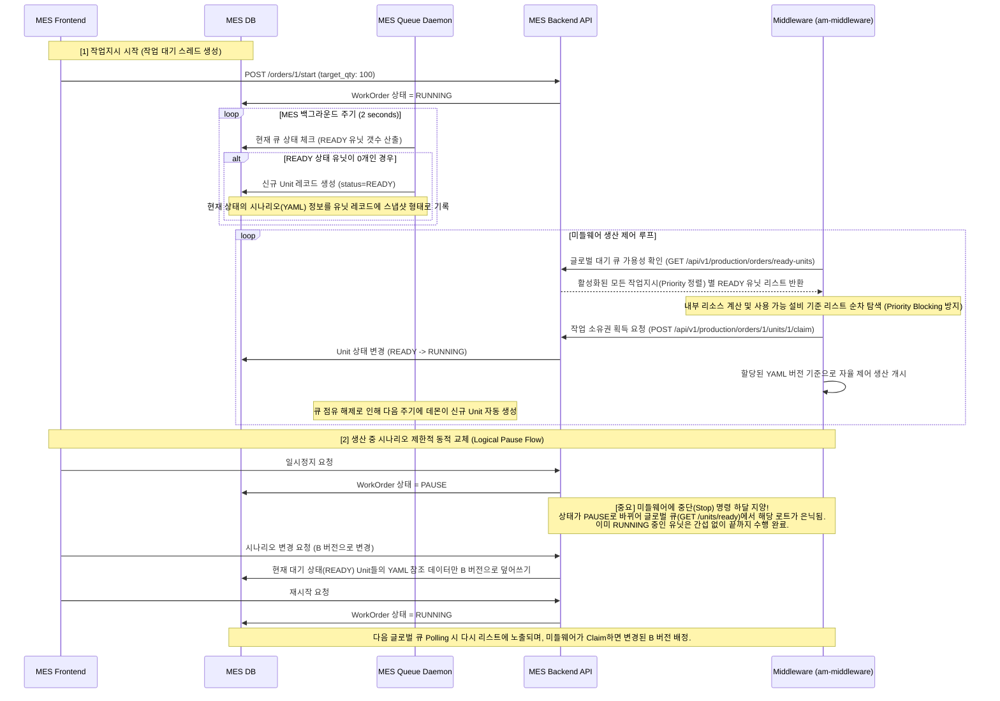

# MES 다중 유닛 지능형 큐(Pull) 아키텍처 구현 상세 계획서

본 문서는 기존의 Push 방식(MES 주도 투입)의 한계점을 개선하고, 미들웨어가 작업 대기 큐에서 스스로 작업을 가져가는 생산자-소비자(Producer-Consumer) 구조로 재설계한 아키텍처의 최종 기획안입니다.

---

## 1. 아키텍처 개요 및 데이터 흐름도

MES 측은 1개의 대기(READY) 유닛만을 큐에 할당하여 유지하며, 미들웨어 측이 자율적인 리소스 스케줄링 판단 후 큐의 유닛 소유권을 획득(Claim)하여 제어를 시작하는 구조를 갖습니다.

---

## 2. 백엔드 신규 추가 인터페이스(API) 명세서

시스템 간 결합도를 낮추고 미들웨어 팀과의 원활한 연동을 위하여 총 4개의 핵심 End-Point가 신설됩니다.

1. **`GET /api/v1/production/orders/ready-units` (글로벌 큐 리스트 반환)**
   - 역할: 미들웨어가 병렬 생산을 위한 대상들을 전체 대기열에서 탐색할 때 주기적으로 호출합니다.
   - 처리 로직: 특정 로트 번호에 종속되지 않고, 현재 `RUNNING` 상태인 **모든 작업지시들로부터 각각 1개씩의 READY 유닛을 뽑아 우선순위(Priority) 기반 리스트(Array)로 반환**합니다.
   - 동시성 및 병목 방지(User Insight): 맨 상단 1순위 유닛의 필수 설비가 점유되어 있더라도, 미들웨어가 다음 순위 유닛의 자원 가용성을 자율적으로 체크하여 하위 유닛을 병렬로 처리할 수 있도록 보장합니다 (Priority Blocking 원천 차단).
2. **`POST /api/v1/production/orders/{order_id}/units/{unit_id}/claim`**
   - 역할: 대기 큐 소유권 획득 지정
   - 처리 로직: 데이터베이스 내 해당 유닛의 진행 상태를 `RUNNING`으로 전환하고 `started_at` 항목에 처리 개시 시점을 기록 (검증 시 WorkOrder와 Unit의 매핑 건전성 교차 검증)
3. **`POST /api/v1/production/orders/{order_id}/units/{unit_id}/complete`**
   - 역할: 단위 제어 사이클 종료 보고
   - 처리 로직: 데이터베이스 내 유닛의 상태를 `DONE` 마킹 처리
4. **`PATCH /api/v1/production/orders/{order_id}/scenario`**
   - 역할: 생산(`PAUSE`) 상태 중 신규 시나리오로 데이터 갱신 처리 (대기 큐 정보 자동 동기화 기능 포함)

---

## 3. 작업 디스패칭 제어기 (Queue Daemon) 세부 로직

`dispatch_service.py` 데몬 객체는 기존의 외부 의존적인 하드웨어 직접 폴링 방식을 탈피하여, MES 내부 상태 머신 관리용 초경량 백그라운드 태스크로 설계되었습니다.

- **실행 컨텍스트**: 어플리케이션 구동 시 비동기 메인 루프에 정기 실행 태스크로 등록 (1~2초 간격 가동)
- **제어 프레임워크 로직**: 
  1. 전체 진행 상태가 `RUNNING`인 `WorkOrder` 목록 선택
  2. 생산 진행 요건 검토: `(완료된 단위 수량) + (실행 중인 단위 수량) < (전체 설정 목표 수량)` 조건을 만족하는 대상 추출
  3. 활성 WorkOrder별 `READY` 상태 산하 `Unit` 레코드 수량 연산 수행
  4. 도출 수량이 **0건**인 경우: 신규 Unit 데이터를 `INSERT` 처리하며, 생성 당시의 `WorkOrder.current_scenario_id` 값을 반영하여 영구 속성화(Snapshot) 처리
  5. 도출 수량이 **1건 이상**인 경우: 별도 동작 없이 루프 종료 (미들웨어 측 리소스 미확보 상태를 의미함)

---

## 4. 프론트엔드 시스템 현황 점검 및 추가 개발 소요

기존 작성된 소스코드(`agents/cell-mes/frontend/app/(main)/production/orders/page.tsx` 및 백엔드 측 `update_work_order_status` API)의 구조 진단 결과입니다.

### [사전 검증 1] 조작 패널 구현부 현황
- **진단 결과**: 조회 테이블 내의 "상태 액션" 컴포넌트를 기반으로 `PAUSE(일시정지)` 및 `RUNNING(재시작)` 구동 버튼이 누락 없이 구현되어 있음을 검증함.

### [사전 검증 2] 현행 미들웨어 제어 연동 구조
- **진단 결과**: 백엔드 `update_work_order_status` 내부 처리를 통해 상태 변경 단말 호출 시 미들웨어 종단 API(`POST /lots/{lot_no}/stop` 및 `resume`)에 연계되는 시스템간 통신 트리거가 완벽히 구성/동작하고 있음을 확인함. (분산 환경에 대한 상충성 결함 없음)

### [추가 개발 필요 내역: UI/UX 구조화]
- **조작 모달창 확충**: 작업지시가 `PAUSE` 상태일 경우에 한하여 액션 컬럼에 **[시나리오 파일 갱신]** 드롭다운 버튼 뷰 노출.
- **제어 로트(Lot-Size 1) 트래커 추가**: `OrderDetailModal` 컴포넌트 내부에 [단위 유닛 처리 현황] 대시보드 포함. 개별 `Unit` 의 현행 상태(`READY`, `RUNNING`) 표기 및 대상 시나리오 야믈 파일의 버전 등을 텍스트 테이블 리스트로 출력.

---

## 5. 데이터베이스 스키마 안정성 분석 (`ProdResult` 및 신설 `Unit` 관계성 조사)

**종합 의견: 도출된 신규 엔티티의 상호 충돌은 일절 발생하지 않으며, 이상적인 계층 분산을 통한 데이터 정합성을 확보할 수 있습니다.**

*   **현행 `ProdResult` 엔티티 역할 한계**: 이 테이블 구조는 "단일 공정(NC 등)이 목표 기기(Target Equipment)에서 처리되었는지"를 관장하는 **공정 스케줄 단위 생산 실적 기록부** 성향을 가짐. (개별 물리 물품의 총 라이프사이클을 추적하는 기능 부재).
*   **신설 `Unit` 엔티티 도입 목적**: MES 플랫폼 차원에서 식별하는 **"단일 로트 크기의 실물 제품 토큰(Physical Product Token)"** 역량을 수행.
*   **시스템 결합 방법론 설계**: 
    - `ProdResult(생산실적)` 엔티티에 **`unit_id (Foreign Key)`** 릴레이션 참조키만을 추가하여 맵핑시킴.
    - 이에 따라, *"특정 Unit 고유물이 ➝ 할당된 시나리오 V2를 기준으로 스냅샷화되어 ➝ EQ-3 호기에서 생산이 발생하였다"* 라는 완벽한 데이터 사슬 구조 **(Full Traceability)** 구축 완성.
    - 본 설계는 기존의 엔티티 활용 구문을 파괴하지 않으면서도 제조 실행 관리(MES)의 트래킹 정밀도를 고도화(레벨업)시키는 정석적인 아키텍처임.

---

## 6. (Phase 3) 개별 유닛 물리적 제어(Physical Control) 확장

작업지시(Order) 단위의 **"논리적 일시정지(Logical Pause)"**와는 별도로, **현재 미들웨어가 물리적으로 제어(RUNNING) 중인 개별 유닛에 대한 긴급 정지/재개** 기능이 요구됩니다.

### A. 백엔드 제어 프록시(Proxy) API 추가
`RUNNING` 상태의 단일 유닛을 미들웨어단에서 즉시 멈추도록 HTTP 통신을 수행합니다.

1. **`POST /api/v1/production/orders/{order_id}/units/{unit_id}/stop`**
   - 역할: 현재 동작 중인 유닛에 대한 물리적 정지 신호 하달
   - 로직: `Unit`의 상태를 `RUNNING` ➔ `PAUSED`로 변경. 미들웨어 종단(예: `/api/lots/{lot_no}/units/{unit_no}/stop`)으로 제어 신호 HTTP POST.
2. **`POST /api/v1/production/orders/{order_id}/units/{unit_id}/resume`**
   - 역할: 정지된 유닛에 대한 조업 재개 신호 하달
   - 로직: `Unit`의 상태를 `PAUSED` ➔ `RUNNING`으로 복귀. 미들웨어 종단으로 재개 신호 전송.

### B. 프론트엔드 액션 제어 UI/UX 구성
`단위 생산 유닛 현황 (Unit Tracker)` 컴포넌트 내의 테이블에 **[개별 제어(Action)]** 컬럼을 추가합니다.
- 조업 상태가 `RUNNING`인 경우: **[⏸ 일시정지]** 버튼 노출
- 조업 상태가 `PAUSED`인 경우: **[▶ 재시작]** (초록색) 버튼 노출

> [!WARNING] User Review Required
> 1. 미들웨어가 받을 통신 API 주소를 가안으로 `POST /api/lots/{lot_no}/units/{unit_no}/stop` 으로 설정하여 구현할 예정입니다. (추후 MW 상황에 맞게 유동적 변경 가능)
> 2. `Unit` 엔티티 내에 `PAUSED` 상태 값을 추가 적용하여 프론트엔드가 이를 인식하게 합니다.
> 위 기획 내용으로 실행 모드(Phase 3)에 돌입할지 확인 부탁드립니다.
