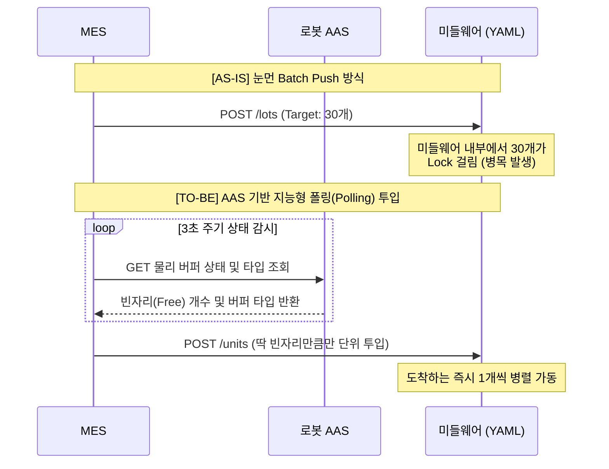

# [MES 개발팀] 자율제조 Lot-Size 1 디스패칭(Dispatching) 구현 가이드라인

본 가이드라인은 MES가 미들웨어에 유닛 단위(Lot-Size 1) 제조를 지시하는 "디스패치(Dispatch)" 아키텍처 개편안입니다. 기존의 30개 일괄 푸시(Push) 방식을 버리고, **로봇의 통합 AAS 상태 및 버퍼 구조(Buffer Type)**에 맞춰 유닛을 하나씩 투입하는 **풀(Pull) 방식의 다중 동승(Taxi) 모델**을 구현하는 것이 핵심입니다.

---

## 1. 디스패칭 방식의 변화 (As-Is vs To-Be)



## 2. 핵심 로직: 로봇 버퍼 구조(Buffer Type)에 따른 투입 룰 분기
로봇마다 "인풋/아웃풋 통합형(공용)" 버퍼를 쓸 수도 있고, "인풋/아웃풋 전용(분리형)" 버퍼를 쓸 수도 있습니다. 이 구조 차이에 따라 MES가 다음 유닛(예: 4번 유닛)을 언제 미들웨어로 던질지 결정하는 룰(Rule)이 달라져야 중간에 **승객 납치(Deadlock)**가 발생하지 않습니다.

**유닛 투입/생성의 판단 통제권은 미들웨어가 아닌 MES가 전적으로 통제합니다.**

### 전략 A. `SHARED` (공용 버퍼형 로봇) $\rightarrow$ "택시 합승" 방식
인풋과 아웃풋을 구분 없이 쓰는 로봇입니다. 가공을 마친 1번 유닛을 데리로 갈 때 빈자리가 필수적이므로, 성급히 4번 승객을 태우면 빈 공간이 없어 데드락에 빠집니다.
*   **MES 디스패치 조건**: **"사이클 완료 후 텅 빌 때까지 배차 대기"**
    먼저 투입된 N개의 유닛(1,2,3번)이 **전원 가공을 완수하고 출하 랙(RACK)에 하차하여 Occupied=0 상태(텅 빔)**가 될 때까지 절대 다음 번호를 투입하지 않습니다.

### 전략 B. `SEPARATED` (인풋/아웃풋 분리형 버퍼 로봇) $\rightarrow$ "회전문 연속 투입" 방식
로봇에 원소재 칸과 가공완료품 칸이 이미 분리되어 자리 쟁탈전이 없는 기종입니다.
*   **MES 디스패치 조건**: **"인풋 슬롯 공간만 비면 무한 투입"**
    전원 귀환할 때까지 안 기다려도 됩니다. 1번 유닛이 NC 가공기에 원소재 위치를 내려놓아 **"인풋 슬롯" 자리가 1개 났다는 AAS 상태가 뜨자마자, MES는 지체 없이 4번 유닛을 즉각 투입**하여 효율을 극대화합니다.

---

## 3. 통합 AAS JSON 구조 및 파싱(Parsing) 실무 가이드
MES는 유닛을 개별 투입하기 전, 로봇의 통합 AAS JSON 상태값을 미들웨어로부터 요청하여 주기적으로 파싱(Parsing)해야 합니다. 이를 위해 서버 백그라운드에 동작할 파서(Parser)의 로직안은 다음과 같습니다.

### 📝 예상 통합 AAS JSON 응답 구조 (예시)
```json
{
  "asset_id": "DOOSAN_MOMA",
  "submodels": {
    "robotGateway": {
      "status": {
        "BufferType": "SEPARATED",    // Rack 등 공용 버퍼는 "SHARED"
        "FreeInputSlots": 1,          // MES가 4번 유닛을 쏴 줄 "인풋" 빈자리 개수
        "FreeOutputSlots": 1,
        "TotalOccupiedSlots": 0       // 현재 차 안에 타고 있는 승객 수 (만차 대기용)
      }
    }
  }
}
```

### 🧩 MES 상태 판단 파싱 코어 로직 (의사코드 예시)
위 JSON을 넘겨받은 MES 규칙엔진(디스패처)은 단순히 `BufferType` 값 분기를 통해 유닛 API의 호출을 유연하게 제어하면 됩니다. 이 코드를 통해 MES는 **로봇 기종과 상관 없이 무조건 최적의 사이클 투입을 보장**받습니다.

```python
def check_and_dispatch(aas_json):
    aas_status = aas_json["submodels"]["robotGateway"]["status"]
    buffer_type = aas_status["BufferType"]

    if buffer_type == "SHARED":
        # 공용 모델 (택시 방어 운전 필요)
        if aas_status["TotalOccupiedSlots"] == 0:
            target_amount = 3 # (예시) 전 좌석인 3개 수량만큼 유닛 동시 생성
            dispatch_units(target_amount)
        else:
            print("택시가 아직 운행 중입니다. 텅 빌 때까지 새 유닛 생성 금지.")

    elif buffer_type == "SEPARATED":
        # 분리형 모델 (빈 인풋 좌석만큼 즉시 밀어넣기)
        free_input = aas_status["FreeInputSlots"]
        if free_input > 0:
            dispatch_units(free_input)
            print(f"인풋 자리가 비었습니다! {free_input}개 즉시 추가 투입.")
```

---

## 4. 구현 필수 태스크 (MES 백엔드 사이드)
1.  **AAS 폴링 데몬**: MES 백그라운드에는 로봇의 위 AAS JSON 속성(`BufferType`, `Free_Input_Slots` 등)을 지속 감시하고 파싱해오는 데몬 루프(Daemon)가 개발되어야 합니다.
2.  **규칙 엔진 분기 모듈**: 위 파이썬/스크립트 예제처럼, 로봇의 스펙 변화(JSON)를 감지하고 **상황 A(Batch)**와 **상황 B(무한 투입)**를 자동으로 조율(Dispatch)하는 함수를 탑재하십시오.
3.  **단위 API 구조 전환**: 새로운 디스패처가 투입을 결정하면, 미들웨어의 API로 로트수(Total Target) 전체를 넘기는 대신, "계산된 빈자리 개수"만큼 API를 나누어 분할 호출하는 파이프라인으로 전환해야 합니다.
