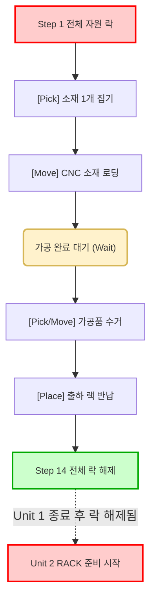
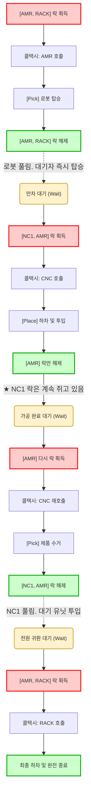

# [미들웨어 개발팀] 다중 버퍼 자율제조 제어 구현 가이드라인

본 가이드라인은 박사님의 수석 아키텍처 리뷰("당장 병렬로 도는 게 우선", "택시 3명 동승", "어렵게 가지 마라")를 바탕으로, 미들웨어 코어 코드 수정 없이 **YAML 구조 개편 및 최소한의 Async 분리**만으로 완벽한 다중 버퍼 자율제조를 달성하기 위한 실무 개발 문서입니다.

---

## 1. 아키텍처 변경 흐름도 (`sample4.yaml` 명령어 기준)

### 🔴 [AS-IS] 기존 `sample4.yaml`: 전체 자원 무한 독점 (병목 가중)

<br/>

### 🟢 [TO-BE] 락 큐잉(Queueing) 기반의 무분기 동승 모델
유닛별로 운전수/승객 역할을 나누어 분기(`routing`)할 필요가 없습니다. 락(Lock)을 차지하기 위한 선착순 대기열(Queue) 구조와 콜택시 전략을 통해 충돌 없이 안전하게 순차 동작합니다.



---

## 2. 파이썬(Python) 코어 수정 액션 아이템 : 개발팀 필독
동승 처리를 위해 시스템 아키텍처 수준의 거창한 구조 변경은 필요 없습니다. 단 **두 군데의 파이썬 파일**만 만져주시면 됩니다.

### [Task 1] 단일 유닛 단위의 완전한 비동기 스레드 분리 (`LotManager.py` 등)
*   **배경**: 기존은 유닛들이 한 로트 안에서 묶여서 돌거나, 앞 유닛이 끝나야 뒤 유닛이 동작하는 동기적 종속성이 존재할 수 있습니다. 
*   **수정 목표**: FastAPI의 단위 호출(`POST /lots (Target:1)`)이 3번 들어오거나, 3개 생성을 명령받았을 때, **유닛별 YAML 실행기(Executor)를 무조건 파이썬 `asyncio.create_task()` 또는 `BackgroundTasks`에 담아 각자 별도의 비동기 스레드로 던져버리십시오.**
*   **효과**: 스레드를 독립시키면 미들웨어는 "누가 앞번호인지" 알 필요가 없습니다. 완전히 남남인 유닛 실행 스레드들이 야믈의 락 엔진(`acquire`) 앞에서 자율적으로 대기표를 뽑고 순서를 지키게 됩니다.

### [Task 2] 동승 출발 동기화용 폴링 액션 추가 (`RobotGateway.py`)
*   **배경**: 택시에 1명 탔다고 출발하지 않고 3명 탈 때까지 다 같이 기다리게 만들 야믈용 지연(Wait) 함수가 필요합니다.
*   **수정 내용 예시**: `RobotGateway`에 다음과 같은 로직의 함수를 하나 뚫어주십시오.
    ```python
    async def waitUntilBufferReady(self, target_count: int = 3):
        while True:
            # 로봇 AAS 또는 상태 API에서 현재 Occupied(할당된) 슬롯 개수를 읽어옴
            occupied_count = await self._get_occupied_slots()
            if occupied_count >= target_count:
                return "OK"  # 만차 시 Block을 풀고 리턴
            await asyncio.sleep(1.0) # 1초마다 재확인
    ```
    이 함수를 `action: AMR/waitUntilBufferReady` 처럼 야믈에서 호출하게 연결해두면 됩니다.

---

## 3. 기종 독립성을 보장하는 AAS 서브모델 표준화 가이드
어떤 로봇 버퍼는 공용(Shared) 기능이고, 다른 로봇 버퍼는 인풋/아웃풋 전용(Separated) 설정을 가질 수 있습니다. 장비가 바뀔 때마다 미들웨어 야믈(YAML)을 수정하는 불상사를 막기 위해, 외부 하드웨어 Yaml Config 속성을 읽어 백엔드에서 다음의 **표준 AAS 구조**로 엔드포인트를 맵핑해주시기 바랍니다.

### 🧩 AAS `robotGateway` 서브모델 표준 구조
백엔드 로직에 다음과 같이 **MES 상태 폴링용(status)**과 **미들웨어 야믈 조회용(queries)** 라우터를 분리하여 개설합니다.

```text
AAS "DOOSAN_MOMA" (또는 범용 로봇)
  SM "robotGateway"
    
    # [1] 구조 판단 (MES 디스패처가 투입 타이밍을 결정하기 위해 읽어가는 데이터)
    SMC "status"
      Prop "BufferType"        @{value="SEPARATED"} # 공용(Rack 등) 기종은 "SHARED"로 설정
      Prop "FreeInputSlots"    @{endpoint=/slots/input/free_count}   # 남은 인풋 전용 자리수
      Prop "FreeOutputSlots"   @{endpoint=/slots/output/free_count}  # 남은 아웃풋 자리수
      Prop "TotalOccupiedSlots" @{endpoint=/slots/occupied_count}    # 차 있는 슬롯 전체 개수

    # [2] 위치 추적 (미들웨어 YAML 단위 유닛들이 자기 슬롯 번호를 확보(set_var)하기 위한 통신)
    SMC "queries"
      Prop "firstEmptyInputSlot"     @{endpoint=/slots/input/first_empty}     # (원소재 적재 시)
      Prop "firstEmptyOutputSlot"    @{endpoint=/slots/output/first_empty}    # (가공품 적재 시)
      Prop "firstOccupiedInputSlot"  @{endpoint=/slots/input/first_occupied}  # (인풋 소재 꺼낼 때)
      Prop "firstOccupiedOutputSlot" @{endpoint=/slots/output/first_occupied} # (가공품 꺼낼 때)
```

**[파이썬 백엔드 개발 시 핵심 팁: 다형성 확보]**
*   로봇 Config 파일에 적힌 `slot_config: "INPUT_ONLY"` 속성을 파싱하여, 야믈 내부에서 `firstEmptyInputSlot`를 호출하면 **해당 성격의 슬롯 중 첫 빈자리 번호만 리턴**하도록 맵핑해 주십시오.
*   만약 장비가 인/아웃 구분 없는 **공용(SHARED) 버퍼** 장비라면?
    👉 백엔드에서 `firstEmptyInputSlot`이든 `firstEmptyOutputSlot`이든 호출이 들어옵니다. 백엔드에서 **둘 다 똑같이 뭉뚱그려진 범용 `firstEmptySlot`을 찾아 응답하도록 함수를 리다이렉트(통합)해 버리면 됩니다.** 이렇게만 해두면 기종마다 야믈을 갈아끼우지 않아도 로봇의 종류(분리/공용)와 무관하게 모든 공정이 에러 없이 넘어갑니다!

---

## 4. 의사결정 책임 및 로봇 제어 원칙
1. **의사결정 책임은 MES 전담**: "지금 4번 유닛 쏘면 데드락 날까? 이 로봇 공용 맞나?" 등의 생각은 파이썬 코어의 IF문으로 고민할 대상이 아닙니다. 야믈이 AAS 속성을 투명하게 조회할 수 있도록 함수(SMC)만 뚫어주시면, MES가 해당 포트를 열어보고 `Target API` 투입 간격을 알아서 조절합니다.
2. **로봇 티칭 동결 원칙**: 로봇 박치기를 막기 위해 "문 열기 / 분리 / 닫기"로 쪼개는 일은 하지 않으며 묶음 매크로 원본을 그대로 씁니다.

---

## 5. 무분기(No Branching) 다중 버퍼 YAML 작성 가이드
복잡한 운전수/승객 분기 제어를 걷어버리고, **순수 락(Lock) 대기열 메커니즘**을 이용해 극도로 단순화한 완벽한 독립형 야믈 템플릿입니다.

### 💡 YAML 수정 4대 원칙
1. **지독한 치고 빠지기**: `acquire`로 락을 잡으면, 상하차(`pick/place`)가 끝나는 즉시 1초도 안 쉬고 `release: AMR` 로 로봇을 놔주어야 합승이 진행됩니다.
2. **운전수/승객 분기 완전 삭제**: 똑같은 야믈을 가진 유닛들이 락 획득 스텝에서 서로 선착순으로 경쟁합니다. 이 과정에서 발생하는 이동 명령의 중복은 제어기의 '중복 이동 시 무시(Idempotency)' 특성이 알아서 넘겨줍니다.
3. **★ 로봇 콜택시 (`move`) 무조건 호출**: 로봇 락을 풀어주면 로봇이 도망가 있습니다. 따라서 `pick` 및 `place` 액션 직전에는 **무조건 내가 있는 곳으로 찾아오라는 로봇 `move` 액션**이 포함되어야 합니다.
4. **목적에 맞는 첫 빈자리 호출**: 앞에서 설계한 `firstEmptyInputSlot`과 같은 구체적 함수를 호출하여 확보한 내 슬롯 번호를 로컬 폴더(변수)에 `{{var}}`로 묶어두고 계속 써먹어야 유닛 간 소지품 꼬임이 발생하지 않습니다.

### 📝 다중 버퍼 기반 `sample4.yaml` 핵심 골격 템플릿
```yaml
steps:
  # ==========================================
  # [구간 1: 탑승 (RACK -> 로봇의 INPUT 구역)]
  # ==========================================
  - id: "10"
    name: "로봇에 실을 빈 인풋 슬롯 번호 확보"
    action: "AMR/firstEmptyInputSlot" 
    # 결과가 반환되면 야믈이 알아서 {{var}}에 저장함

  - id: "20"
    name: "[락 획득] RACK 및 AMR 쟁탈전"
    acquire: { main: ["RACK"], sub1: ["AMR"] }
  
  - id: "30"
    name: "★콜택시: 탑승하러 AMR 호출"
    action: "AMR/move"
    params: { "location": "START" } 

  - id: "40"
    name: "RACK(소재)를 내 슬롯 번호에 싣기"
    action: "AMR/pick"
    params: { "slotId": "{{var}}" }

  - id: "50"
    name: "[락 해제] 타인 탑승을 위한 로봇 방출"   
    release: ["RACK", "AMR"]

  # ==========================================
  # [구간 2: 택시 출발 및 CNC 원소재 투입]
  # ==========================================
  - id: "60"
    name: "만차 동기화 대기"
    action: "AMR/waitUntilBufferReady"

  - id: "70"
    name: "[락 획득] NC1 전투"
    acquire: { main: ["NC1"], sub1: ["AMR"] }

  - id: "80"
    name: "★콜택시: 내 로봇(AMR) CNC로 호출"
    action: "AMR/move"
    params: { "location": "CNC" }
  
  - id: "90"
    name: "내 번호(var)의 소재를 CNC에 투입 (묶음 매크로)"
    action: "AMR/place"
    params: { "slotId": "{{var}}", "location": "CNC" }

  - id: "100"
    name: "[락 해제] 타인 배차를 돕기 위한 AMR 방출"
    release: ["AMR"]
    # ★NC1 락은 타인 난입을 방어하기 위해 절대 풀지 않음!

  # ==========================================
  # [구간 3: CNC 가공 대기 및 아웃풋 수거]
  # ==========================================
  - id: "110"
    name: "가공 완료 대기"
    action: "NC1/ncStatus"

  - id: "115"
    name: "로봇에 실을 구역(아웃풋 슬롯) 변경"
    action: "AMR/firstEmptyOutputSlot" 
    # 기존 원소재를 넣었던 Input 번호 대신 Output 번호로 {{var}} 갱신

  - id: "120"
    name: "[락 획득] 배회하던 AMR 다시 쟁탈"
    acquire: { sub1: ["AMR"] }

  - id: "130"
    name: "★콜택시: 멀리 도망간 AMR을 CNC로 강제 리콜"
    action: "AMR/move"
    params: { "location": "CNC" }

  - id: "140"
    name: "가공완료품을 새 번호(Output)에 싣기"
    action: "AMR/pick"
    params: { "slotId": "{{var}}", "location": "CNC" }

  - id: "150"
    name: "[락 해제] 할 일 끝! NC1 완전 놔줌"
    release: ["NC1", "AMR"]
```
